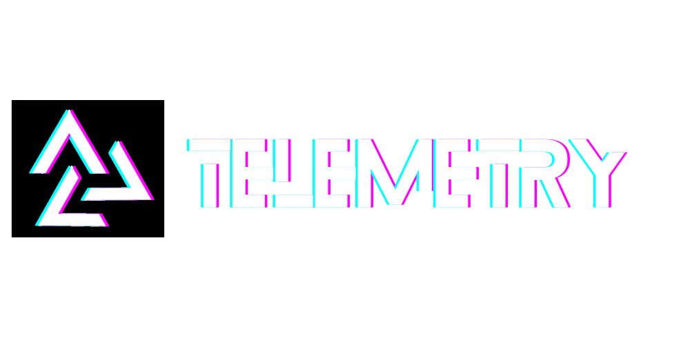
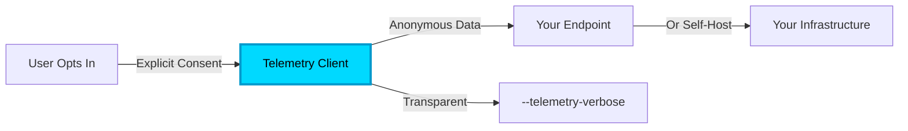

<p align="center">
  
</p>
<h2 align="center">Privacy-First, Opt-In Telemetry for the Automagik Ecosystem</h2>

<p align="center">
  <strong>🎯 Understand Your Users While Respecting Their Privacy</strong><br>
  Standardized telemetry SDKs for all Automagik projects with transparency,<br>
  user control, and self-hosting built-in from day one
</p>

<p align="center">
  <a href="https://github.com/namastexlabs/automagik-telemetry/actions"></a>
  <a href="https://github.com/namastexlabs/automagik-telemetry/blob/main/LICENSE"></a>
  <a href="https://discord.gg/xcW8c7fF3R"></a>
  <a href="https://github.com/orgs/namastexlabs/projects/9/views/1?filterQuery=project%3Atelemetry"></a>
</p>

<p align="center">
  <a href="#-what-is-automagik-telemetry">What is Telemetry?</a> •
  <a href="#-key-features">Features</a> •
  <a href="#-quick-start">Quick Start</a> •
  <a href="#-privacy--control">Privacy</a> •
  <a href="https://github.com/orgs/namastexlabs/projects/9/views/1?filterQuery=project%3Atelemetry">Roadmap</a> •
  <a href="#-contributing">Contributing</a>
</p>

---

## 🚀 What is Automagik Telemetry?

**Automagik Telemetry** provides standardized, privacy-first telemetry SDKs for all Automagik projects (Omni, Hive, Forge, Tools, Genie, Spark). It enables data-driven development while respecting user privacy and maintaining open-source transparency.

### 💔 The Problem: Flying Blind vs. Privacy Invasion

Building open-source tools creates a dilemma:

- 🕶️ **No telemetry** = Flying blind, can't prioritize features, fix bugs users actually encounter
- 👁️ **Traditional telemetry** = Privacy nightmares, users don't trust you, compliance headaches
- 🤷 **Half-baked solutions** = Inconsistent across projects, no transparency, hard to self-host

**The result?** Either you don't know how users actually use your tool, or you collect data in ways that violate their trust.

### ✨ The Automagik Telemetry Solution

**Privacy-first by design, transparent by default, controllable by users:**



**What you get:**
- ✅ **Disabled by default** - Users must explicitly opt-in
- 🔒 **No PII collected** - Phone numbers, emails, messages never sent
- 🔍 **Transparent** - Users can see exactly what's sent
- 🏠 **Self-hostable** - Run your own telemetry infrastructure
- 📊 **Actionable insights** - Feature usage, error rates, performance metrics
- 🛠️ **Easy integration** - 5 lines of code to add to any project

### 🌟 The Vision: Ethical Data-Driven Development

Imagine building features based on real usage data, fixing bugs users actually encounter, all while maintaining their complete trust:

> *"I know users love the Discord integration but struggle with WhatsApp - and they trust me with this data because I've been transparent from day one"*

**Today:** Privacy-first telemetry for Automagik projects
**Tomorrow:** The gold standard for open-source telemetry that respects users

---

## 🌟 Key Features

### ✅ Production-Ready Today

- **🔐 Privacy-First Design**: Disabled by default, no PII collected, anonymous by design
- **📦 Dual SDKs**: Python and TypeScript SDKs for the entire Automagik ecosystem
- **🔍 Complete Transparency**: `--telemetry-verbose` flag shows exactly what's sent
- **🏠 Self-Hostable**: Run your own OpenTelemetry infrastructure
- **📊 Pre-Built Dashboards**: Grafana templates for instant insights
- **🚫 Auto-Disabled in CI**: Respects CI environments and development mode
- **🎯 Standardized Events**: Consistent schema across all projects
- **⚡ Zero Performance Impact**: Async by default, fire-and-forget

### 📦 Supported Projects

| Project | SDK | Status | Events Tracked |
|---------|-----|--------|----------------|
| **Automagik Omni** | Python | ✅ Ready | Message volume, channel health, error rates |
| **Automagik Hive** | Python | ✅ Ready | Agent usage, workflow execution, RAG performance |
| **Automagik Spark** | Python | ✅ Ready | Job scheduling, execution metrics, failures |
| **Automagik Genie** | Python | ✅ Ready | Command usage, template updates, MCP calls |
| **Automagik Forge** | TypeScript | ✅ Ready | Task execution, agent performance, worktree usage |
| **Automagik Tools** | TypeScript | ✅ Ready | Tool invocations, MCP usage, integration health |

---

## 🔒 Privacy & Control

### Privacy-First Design

- **Disabled by default** - Users must explicitly opt-in
- **No PII collected** - Phone numbers, emails, messages are never sent
- **Anonymous by default** - User IDs are hashed with SHA-256
- **Transparent** - `--telemetry-verbose` flag shows exactly what's sent before sending
- **Self-hostable** - Run your own telemetry infrastructure
- **Open source** - Audit every line of code

### What We Collect

✅ **Safe to collect:**
- Feature usage (which commands/APIs are used)
- Error rates (anonymous error codes and categories)
- Performance metrics (latency, response times)
- System info (OS, Python/Node version)
- Aggregated counts (number of agents, tasks, messages)

❌ **Never collected:**
- Message content
- User credentials or API keys
- Phone numbers or email addresses (unless hashed)
- File contents or business logic
- Personal identifiable information (PII)
- IP addresses (stripped at collection)

### User Control

**Opt-in prompt on first run:**
```
Help Improve Automagik! 🚀

Enable anonymous telemetry to help us improve? [y/N]: _

You can:
  • See what's sent: --telemetry-verbose
  • Disable anytime: AUTOMAGIK_TELEMETRY_ENABLED=false
  • Self-host: https://docs.automagik.ai/telemetry/self-hosting
```

**Disable globally:**
```bash
export AUTOMAGIK_TELEMETRY_ENABLED=false
```

**Disable per-command:**
```bash
AUTOMAGIK_TELEMETRY_ENABLED=false omni instance list
```

**Create permanent opt-out:**
```bash
touch ~/.automagik-no-telemetry
```

**Auto-disabled in:**
- CI environments (GitHub Actions, GitLab CI, Jenkins, etc.)
- Development mode (`ENVIRONMENT=dev`)
- Test environments
- Docker containers (unless explicitly enabled)

---

## 📦 Quick Start

### Prerequisites

- **Python 3.12+** (for Python SDK)
- **Node.js 18+** (for TypeScript SDK)
- (Optional) **Docker** for self-hosting infrastructure

### Installation

#### Python SDK

```bash
# Install via uv (recommended)
uv add automagik-telemetry

# Or install via pip
pip install automagik-telemetry
```

#### TypeScript SDK

```bash
# Install via pnpm (recommended)
pnpm add @automagik/telemetry

# Or install via npm
npm install @automagik/telemetry
```

### Python Usage

```python
from automagik_telemetry import TelemetryClient, StandardEvents

# Initialize once at startup (disabled by default)
telemetry = TelemetryClient(
    project_name="omni",
    version="1.0.0"
)

# Track feature usage
telemetry.track_event(StandardEvents.FEATURE_USED, {
    "feature_name": "list_contacts",
    "feature_category": "api_endpoint"
})

# Track errors with context
telemetry.track_error(error, {
    "error_code": "OMNI-1001",
    "operation": "message_send"
})

# Track performance
telemetry.track_metric(StandardEvents.OPERATION_LATENCY, {
    "operation_type": "api_request",
    "duration_ms": 123
})
```

### TypeScript Usage

```typescript
import { TelemetryClient, StandardEvents } from '@automagik/telemetry';

// Initialize
const telemetry = new TelemetryClient({
  projectName: 'forge',
  version: '1.0.0'
});

// Track events
telemetry.trackEvent(StandardEvents.FEATURE_USED, {
  feature_name: 'workflow_execution',
  feature_category: 'orchestration'
});

// Track errors
telemetry.trackError(error, {
  error_code: 'FORGE-2001',
  context: 'task_execution'
});

// Track performance
telemetry.trackMetric(StandardEvents.OPERATION_LATENCY, {
  operation_type: 'git_worktree_create',
  duration_ms: 456
});
```

---

## 🏗️ Repository Structure

```
automagik-telemetry/
├── python/              # Python SDK
│   ├── src/
│   │   └── automagik_telemetry/
│   │       ├── __init__.py
│   │       ├── client.py
│   │       ├── config.py
│   │       ├── opt_in.py
│   │       ├── privacy.py
│   │       └── schema.py
│   ├── tests/
│   ├── pyproject.toml
│   └── README.md
│
├── typescript/          # TypeScript SDK
│   ├── src/
│   │   ├── client.ts
│   │   ├── config.ts
│   │   ├── opt-in.ts
│   │   ├── privacy.ts
│   │   └── schema.ts
│   ├── tests/
│   ├── package.json
│   └── README.md
│
├── docs/
│   ├── IMPLEMENTATION_GUIDE.md    # For maintainers
│   ├── SELF_HOSTING.md            # For users
│   ├── PRIVACY_POLICY.md          # Legal/transparency
│   ├── EVENT_SCHEMA.md            # Standard events reference
│   └── FAQ.md
│
├── examples/
│   ├── python/
│   │   ├── omni_example.py
│   │   ├── hive_example.py
│   │   └── spark_example.py
│   └── typescript/
│       ├── forge_example.ts
│       └── tools_example.ts
│
├── dashboards/          # Grafana dashboard templates
│   ├── overview.json
│   ├── errors.json
│   └── performance.json
│
├── infra/               # Self-hosting configs
│   ├── docker-compose.yml
│   ├── otel-config.yaml
│   └── prometheus.yml
│
└── README.md
```

---

## 🌐 Self-Hosting

Don't want to send data to `telemetry.namastex.ai`? No problem!

```bash
# Clone this repo
git clone https://github.com/namastexlabs/automagik-telemetry
cd automagik-telemetry/infra

# Start your own telemetry stack (OpenTelemetry + Prometheus + Grafana)
docker-compose up -d

# Point your tools to your server
export AUTOMAGIK_TELEMETRY_ENDPOINT=http://localhost:4318
```

**What you get:**
- OpenTelemetry Collector (receives telemetry data)
- Prometheus (stores time-series metrics)
- Grafana (visualizes data with pre-built dashboards)
- Complete data ownership

See [Self-Hosting Guide](docs/SELF_HOSTING.md) for detailed instructions.

---

## 📊 Dashboards

Pre-built Grafana dashboards available in [`dashboards/`](dashboards/):

- **Overview Dashboard** - System health, message volume, error rates across all projects
- **Error Dashboard** - Error breakdown by type, timeline, trends, and severity
- **Performance Dashboard** - Latency p50/p95/p99, slow operations, resource usage

Import into your Grafana instance or view at https://telemetry.namastex.ai (coming soon)

---

## 📚 Documentation

- **[Implementation Guide](docs/IMPLEMENTATION_GUIDE.md)** - For maintainers adding telemetry to Automagik projects
- **[Self-Hosting Guide](docs/SELF_HOSTING.md)** - Run your own telemetry infrastructure
- **[Privacy Policy](docs/PRIVACY_POLICY.md)** - What we collect and why
- **[Event Schema](docs/EVENT_SCHEMA.md)** - Standardized events reference
- **[FAQ](docs/FAQ.md)** - Common questions

---

## 🛠️ Development

### Python SDK

```bash
cd python
uv sync
uv run pytest
uv run ruff check src tests
uv run mypy src
```

### TypeScript SDK

```bash
cd typescript
pnpm install
pnpm test
pnpm lint
pnpm build
```

### Contributing Guidelines

We welcome contributions! Here's how to get started:

1. **Fork** the repository
2. **Clone** your fork locally
3. **Create** a feature branch: `git checkout -b feature/amazing-feature`
4. **Make** your changes
5. **Test** thoroughly: `make test`
6. **Commit** with conventional commits: `feat: add new privacy filter`
7. **Push** to your fork: `git push origin feature/amazing-feature`
8. **Open** a Pull Request with clear description

See [CONTRIBUTING.md](CONTRIBUTING.md) for detailed guidelines.

---

## 🗺️ Roadmap

### Completed ✅
- [x] Privacy-first design principles
- [x] Python SDK structure
- [x] TypeScript SDK structure
- [x] Standardized event schema
- [x] Self-hosting documentation
- [x] Grafana dashboard templates

### Next Up 🚀 (Q4 2025)
- [ ] **Python SDK v1.0** - Production-ready Python implementation
- [ ] **TypeScript SDK v1.0** - Production-ready TypeScript implementation
- [ ] **Integration with Omni** - First production deployment
- [ ] **Integration with Hive** - Multi-agent telemetry
- [ ] **Integration with Forge** - Task execution tracking
- [ ] **Public dashboard** - View community metrics at telemetry.namastex.ai

### Future Vision 🌟 (2026+)
- [ ] **Real-time alerting** - Get notified about spikes in errors or performance issues
- [ ] **Custom event types** - Define your own telemetry events
- [ ] **Multi-tenant support** - Separate metrics for different teams/customers
- [ ] **Advanced privacy controls** - Granular control over what gets collected
- [ ] **Mobile SDKs** - iOS and Android support
- [ ] **Browser extension** - Telemetry for web-based tools

---

## 🤝 Contributing

We love contributions! Here's how to get started:

1. **Discuss First**: Open an issue before starting work
2. **Align with Roadmap**: Ensure changes fit our vision
3. **Follow Standards**: Match existing code patterns
4. **Test Thoroughly**: Include tests for new features
5. **Document Well**: Update docs with your changes
6. **Respect Privacy**: Never add PII collection without discussion

**Areas where we need help:**
- [ ] Python SDK implementation (#1)
- [ ] TypeScript SDK implementation (#1)
- [ ] Additional privacy sanitization patterns
- [ ] Dashboard improvements
- [ ] Documentation translations

See [CONTRIBUTING.md](CONTRIBUTING.md) for detailed guidelines.

---

## 🙏 Acknowledgments

Special thanks to:

- **OpenTelemetry Team** - For the excellent observability framework
- **Prometheus & Grafana** - For powerful metrics and visualization
- **Automagik Community** - Early adopters and contributors
- **Privacy Advocates** - For keeping us honest and transparent

---

## 📄 License

MIT License - see [LICENSE](LICENSE) file for details.

---

## 🔗 Links

- **GitHub**: [github.com/namastexlabs/automagik-telemetry](https://github.com/namastexlabs/automagik-telemetry)
- **Discord**: [discord.gg/xcW8c7fF3R](https://discord.gg/xcW8c7fF3R)
- **Twitter**: [@namastexlabs](https://twitter.com/namastexlabs)
- **Documentation**: [docs.automagik.ai/telemetry](https://docs.automagik.ai/telemetry)
- **Privacy Questions**: privacy@namastex.ai

---

<p align="center">
  <strong>🚀 Understand your users without compromising their privacy</strong><br>
  <strong>The ethical way to build data-driven open-source tools</strong><br><br>
  <a href="https://github.com/namastexlabs/automagik-telemetry">Star us on GitHub</a> •
  <a href="https://discord.gg/xcW8c7fF3R">Join our Discord</a>
</p>

<p align="center">
  Made with ❤️ by <a href="https://namastex.ai">Namastex Labs</a><br>
  <em>AI that elevates human potential, not replaces it</em>
</p>
<a href="https://deepwiki.com/namastexlabs/automagik-telemetry"></a>
