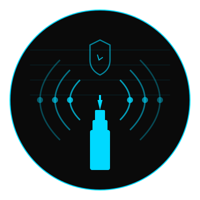

<p align="center">
  
</p>
<h2 align="center">Privacy-First OpenTelemetry SDK for Modern Applications</h2>

<p align="center">
  <strong>🎯 Zero-Dependency, Opt-In Telemetry with Production-Ready OTLP Protocol</strong><br>
  Built for developers who value privacy, performance, and observability.<br>
  100% test coverage. Python & TypeScript. Production-ready.
</p>

<p align="center">
  <a href="https://github.com/namastexlabs/automagik-telemetry/actions/workflows/python-ci.yml"></a>
  <a href="https://github.com/namastexlabs/automagik-telemetry/actions/workflows/typescript-ci.yml"></a>
  <a href="https://pypi.org/project/automagik-telemetry/"></a>
  <a href="https://www.npmjs.com/package/@automagik/telemetry"></a>
  <a href="https://github.com/namastexlabs/automagik-telemetry/blob/main/LICENSE"></a>
  <a href="https://discord.gg/xcW8c7fF3R"></a>
</p>

<p align="center">
  <a href="#-key-features">Features</a> •
  <a href="#-quick-start">Quick Start</a> •
  <a href="#-architecture">Architecture</a> •
  <a href="#-development">Development</a> •
  <a href="#-roadmap">Roadmap</a> •
  <a href="#-contributing">Contributing</a>
</p>

---

## 🚀 What is Automagik Telemetry?

**Automagik Telemetry** is a privacy-first, zero-dependency telemetry SDK built on OpenTelemetry Protocol (OTLP). It provides production-ready observability for Python and TypeScript applications without compromising user privacy or adding heavy dependencies.

### 🎭 Why We Built This

**The Problem with Traditional Telemetry:**
- Heavy dependencies that bloat your application
- Privacy-invasive defaults that collect everything
- Complex setup requiring infrastructure expertise
- Vendor lock-in with proprietary formats
- No easy way to disable in development

**The Automagik Solution:**
- **Zero dependencies** - Pure Python/TypeScript implementation
- **Opt-in by default** - Disabled in development, enabled in production
- **Privacy-first** - No PII, no tracking, just metrics
- **OTLP standard** - Works with any OpenTelemetry-compatible backend
- **100% test coverage** - Battle-tested and reliable

### ✅ What Makes This Different

**Other SDKs Force You to Choose:**
- ❌ Easy setup OR production features
- ❌ Privacy OR comprehensive telemetry
- ❌ Lightweight OR fully featured

**Automagik Telemetry Gives You Everything:**
- ✅ **Zero Dependencies** - No bloat, no conflicts
- ✅ **Privacy-First Design** - Opt-in, environment-aware, no PII
- ✅ **Standard Protocol** - OTLP over HTTP/JSON
- ✅ **Dual SDK Support** - Python & TypeScript with identical APIs
- ✅ **100% Test Coverage** - Every line tested, production-ready
- ✅ **Developer-Friendly** - Auto-disabled in dev, easy configuration

---

## 🌟 Key Features

### 📡 **Dual Backend Support**
**OTLP Backend (Default):** Industry-standard telemetry protocol over HTTP. Works with Prometheus, Grafana, Jaeger, and any OTLP-compatible backend.

**ClickHouse Backend (Self-Hosting):** Direct insertion to ClickHouse for self-hosted deployments. Bypasses middleware, simpler architecture, better performance for local development.

### 🔒 **Privacy-First by Design**
```python
# Automatically disabled in development
os.environ["ENVIRONMENT"] = "development"  # No telemetry sent

# Explicit opt-out anytime
os.environ["AUTOMAGIK_TELEMETRY_ENABLED"] = "false"

# No PII collected - only anonymous metrics
```

### ⚡ **Zero Dependencies**
Pure Python (3.12+) and TypeScript implementations with no external dependencies. Just standard library HTTP clients.

### 🎯 **Dual SDK Support**

**Python:**
```python
from automagik_telemetry import AutomagikTelemetry

client = AutomagikTelemetry(project_name="my-app", version="1.0.0")
client.track_event("api.request", {"endpoint": "/users", "status": 200})
```

**TypeScript:**
```typescript
import { AutomagikTelemetry } from '@automagik/telemetry';

const client = new AutomagikTelemetry({ projectName: 'my-app', version: '1.0.0' });
client.trackEvent('api.request', { endpoint: '/users', status: 200 });
```

### 🧪 **100% Test Coverage**
Every SDK maintains 100% code coverage with comprehensive unit, integration, and performance tests.

### 🌐 **Production-Ready**
Async by default, automatic batching, retry logic, timeout handling, and graceful degradation when telemetry is unavailable.

---

## 📊 Architecture

### How It Works

**Option 1: OTLP Backend (Default - Production)**
```
Your Application → AutomagikTelemetry SDK → OTLP/HTTP → OpenTelemetry Collector → Prometheus/Grafana
                         ↓
                  Privacy Checks
                  Environment Detection
                  Async Batching
```

**Option 2: ClickHouse Backend (Self-Hosting)**
```
Your Application → AutomagikTelemetry SDK → ClickHouse HTTP API → ClickHouse → Grafana
                         ↓
                  Privacy Checks
                  Environment Detection
                  Batch Processing
                  Compression
```

### Backend Comparison

| Feature | OTLP Backend | ClickHouse Backend |
|---------|--------------|-------------------|
| **Use Case** | Production SaaS | Self-hosted, Local dev |
| **Protocol** | OTLP over HTTP | ClickHouse HTTP API |
| **Components** | SDK → Collector → Storage | SDK → ClickHouse (direct) |
| **Dependencies** | OpenTelemetry Collector | ClickHouse only |
| **Performance** | Standard | Optimized (batching + compression) |
| **Setup Complexity** | Medium | Simple |
| **Data Control** | Collector-managed | Full control |

### Components

| Component | Purpose | Default Endpoint |
|-----------|---------|------------------|
| **SDK** | Client library for your application | N/A |
| **OTLP/HTTP** | Standard telemetry protocol | `https://telemetry.namastex.ai` |
| **ClickHouse HTTP** | Direct ClickHouse insertion | `http://localhost:8123` |
| **Collector** | Receives and processes OTLP telemetry | Configured endpoint |
| **ClickHouse** | High-performance OLAP database | Backend storage |
| **Prometheus** | Stores metrics (OTLP path) | Backend storage |
| **Grafana** | Visualizes metrics | Visualization layer |

### Privacy Controls

```python
# Environment-based auto-disable
ENVIRONMENT=development          # Telemetry disabled
ENVIRONMENT=production          # Telemetry enabled

# Explicit disable
AUTOMAGIK_TELEMETRY_ENABLED=false

# Custom endpoint
AUTOMAGIK_TELEMETRY_ENDPOINT=https://your-collector.com
```

---

## 📦 Quick Start

### Python SDK

**Prerequisites:**
- Python 3.12+

**Installation:**
```bash
pip install automagik-telemetry
```

**Basic Usage:**
```python
from automagik_telemetry import AutomagikTelemetry

# Initialize client
client = AutomagikTelemetry(
    project_name="my-app",
    version="1.0.0"
)

# Track events (traces)
client.track_event("user.login", {
    "user_id": "anonymous-123",
    "method": "oauth"
})

# Track metrics (counters, gauges, histograms)
from automagik_telemetry import MetricType

client.track_metric("api.requests", value=1, metric_type=MetricType.COUNTER, attributes={
    "endpoint": "/api/users",
    "status": 200
})

client.track_metric("system.memory_mb", value=512.5, metric_type=MetricType.GAUGE)

client.track_metric("api.response_time_ms", value=125.3, metric_type=MetricType.HISTOGRAM)
```

### TypeScript SDK

**Prerequisites:**
- Node.js 18+

**Installation:**
```bash
npm install @automagik/telemetry
# or
pnpm add @automagik/telemetry
```

**Basic Usage:**
```typescript
import { AutomagikTelemetry } from '@automagik/telemetry';

// Initialize client
const client = new AutomagikTelemetry({
    projectName: 'my-app',
    version: '1.0.0'
});

// Track events
client.trackEvent('user.login', {
    userId: 'anonymous-123',
    method: 'oauth'
});

// Track metrics
import { MetricType } from '@automagik/telemetry';

client.trackMetric('api.requests', 1, MetricType.COUNTER, {
    endpoint: '/api/users',
    status: 200
});

client.trackMetric('system.memory_mb', 512.5, MetricType.GAUGE);

client.trackMetric('api.response_time_ms', 125.3, MetricType.HISTOGRAM);
```

### Using ClickHouse Backend (Self-Hosting)

For self-hosted deployments, you can bypass the OTLP Collector and write directly to ClickHouse. This provides better performance and simpler architecture for local development.

**Why Use ClickHouse Backend?**
- Direct insertion to ClickHouse (no middleware)
- Faster for self-hosted setups
- Full control over your telemetry data
- Simpler architecture with fewer components
- Zero additional dependencies (uses stdlib only)

**Python with ClickHouse:**
```python
from automagik_telemetry import AutomagikTelemetry

# Direct ClickHouse backend
client = AutomagikTelemetry(
    project_name="my-app",
    version="1.0.0",
    backend="clickhouse",  # Use ClickHouse instead of OTLP
    clickhouse_endpoint="http://localhost:8123",
    clickhouse_database="telemetry",
    clickhouse_batch_size=100  # Optional: batch rows before insert
)

# Use normally - data goes directly to ClickHouse
client.track_event("user.login", {"user_id": "123"})
```

**TypeScript with ClickHouse:**
```typescript
import { AutomagikTelemetry } from '@automagik/telemetry';

// Direct ClickHouse backend
const client = new AutomagikTelemetry({
    projectName: 'my-app',
    version: '1.0.0',
    backend: 'clickhouse',  // Use ClickHouse instead of OTLP
    clickhouseEndpoint: 'http://localhost:8123',
    clickhouseDatabase: 'telemetry',
    clickhouseBatchSize: 100  // Optional: batch rows before insert
});

// Use normally - data goes directly to ClickHouse
client.trackEvent('user.login', { userId: '123' });
```

**When to Use Which Backend:**

| Use Case | Backend | Why |
|----------|---------|-----|
| Production SaaS | `otlp` (default) | Managed infrastructure, standard protocol |
| Self-hosted | `clickhouse` | Direct control, better performance |
| Local development | `clickhouse` | Simple setup, instant feedback |
| Multi-cloud | `otlp` | Flexibility to change backends |

### Configuration

**Batch Size Defaults**

The Python and TypeScript SDKs have different default batch sizes to match their typical usage patterns:

- **Python SDK:** `batch_size=1` (immediate send) - Optimized for low-latency and backward compatibility
- **TypeScript SDK:** `batchSize=100` (batched send) - Optimized for high-volume web applications

**Python - Enable batching for better performance:**
```python
client = AutomagikTelemetry(
    project_name="my-app",
    version="1.0.0",
    batch_size=100  # Send in batches instead of immediately
)
```

**TypeScript - Enable immediate send if needed:**
```typescript
const client = new AutomagikTelemetry({
    projectName: 'my-app',
    version: '1.0.0',
    batchSize: 1  // Send immediately instead of batching
});
```

**Environment Variables (OTLP Backend - Default):**
```bash
# Disable telemetry completely
export AUTOMAGIK_TELEMETRY_ENABLED=false

# Custom OTLP endpoint
export AUTOMAGIK_TELEMETRY_ENDPOINT=https://your-collector.com

# Auto-disable in development
export ENVIRONMENT=development
```

**Environment Variables (ClickHouse Backend):**
```bash
# Use ClickHouse backend
export AUTOMAGIK_TELEMETRY_BACKEND=clickhouse
export AUTOMAGIK_TELEMETRY_CLICKHOUSE_ENDPOINT=http://localhost:8123
export AUTOMAGIK_TELEMETRY_CLICKHOUSE_DATABASE=telemetry

# Optional ClickHouse authentication
export AUTOMAGIK_TELEMETRY_CLICKHOUSE_USERNAME=default
export AUTOMAGIK_TELEMETRY_CLICKHOUSE_PASSWORD=your-password

# Optional performance tuning
export AUTOMAGIK_TELEMETRY_CLICKHOUSE_BATCH_SIZE=100
```

**Code Configuration (OTLP):**
```python
# Python
client = AutomagikTelemetry(
    project_name="my-app",
    version="1.0.0",
    endpoint="https://custom-collector.com",  # Optional
    disabled=False  # Optional override
)
```

```typescript
// TypeScript
const client = new AutomagikTelemetry({
    projectName: 'my-app',
    version: '1.0.0',
    endpoint: 'https://custom-collector.com',  // Optional
    disabled: false  // Optional override
});
```

**Code Configuration (ClickHouse):**
```python
# Python
client = AutomagikTelemetry(
    project_name="my-app",
    version="1.0.0",
    backend="clickhouse",
    clickhouse_endpoint="http://localhost:8123",
    clickhouse_database="telemetry",
    clickhouse_username="default",  # Optional
    clickhouse_password="",  # Optional
    clickhouse_batch_size=100,  # Optional (default: 100)
    clickhouse_compression=True  # Optional (default: True)
)
```

```typescript
// TypeScript
const client = new AutomagikTelemetry({
    projectName: 'my-app',
    version: '1.0.0',
    backend: 'clickhouse',
    clickhouseEndpoint: 'http://localhost:8123',
    clickhouseDatabase: 'telemetry',
    clickhouseUsername: 'default',  // Optional
    clickhousePassword: '',  // Optional
    clickhouseBatchSize: 100,  // Optional (default: 100)
    clickhouseCompression: true  // Optional (default: true)
});
```

---

## 🔧 Advanced Usage

### Custom Attributes

Add context to every metric and event:

```python
# Python
client.track_event("payment.processed", {
    "amount": 99.99,
    "currency": "USD",
    "payment_method": "card",
    "success": True
})
```

```typescript
// TypeScript
client.trackEvent('payment.processed', {
    amount: 99.99,
    currency: 'USD',
    paymentMethod: 'card',
    success: true
});
```

### Error Tracking

Track errors without exposing sensitive data:

```python
# Python
try:
    risky_operation()
except Exception as e:
    client.track_event("error.occurred", {
        "error_type": type(e).__name__,
        "module": "payment_processor",
        "recoverable": False
    })
```

### Performance Monitoring

Track response times and resource usage:

```python
# Python
import time

start = time.time()
process_request()
duration_ms = (time.time() - start) * 1000

client.track_histogram("request.duration_ms", value=duration_ms, attributes={
    "endpoint": "/api/process",
    "method": "POST"
})
```

### Switching Between Backends

You can easily switch between OTLP and ClickHouse backends based on your environment:

```python
# Python - Environment-based backend selection
import os

backend = os.getenv("TELEMETRY_BACKEND", "otlp")

if backend == "clickhouse":
    client = AutomagikTelemetry(
        project_name="my-app",
        version="1.0.0",
        backend="clickhouse",
        clickhouse_endpoint=os.getenv("CLICKHOUSE_ENDPOINT", "http://localhost:8123")
    )
else:
    client = AutomagikTelemetry(
        project_name="my-app",
        version="1.0.0",
        endpoint=os.getenv("OTLP_ENDPOINT", "https://telemetry.namastex.ai")
    )

# Use the same API regardless of backend
client.track_event("app.started", {"version": "1.0.0"})
```

```typescript
// TypeScript - Environment-based backend selection
const backend = process.env.TELEMETRY_BACKEND || 'otlp';

const client = backend === 'clickhouse'
  ? new AutomagikTelemetry({
      projectName: 'my-app',
      version: '1.0.0',
      backend: 'clickhouse',
      clickhouseEndpoint: process.env.CLICKHOUSE_ENDPOINT || 'http://localhost:8123'
    })
  : new AutomagikTelemetry({
      projectName: 'my-app',
      version: '1.0.0',
      endpoint: process.env.OTLP_ENDPOINT || 'https://telemetry.namastex.ai'
    });

// Use the same API regardless of backend
client.trackEvent('app.started', { version: '1.0.0' });
```

---

## 🏗️ Self-Hosting & Local Development

Want to run your own telemetry infrastructure? We've got you covered!

```bash
cd infra
make start        # Start all services (ClickHouse + Collector + Grafana)
make test         # Send test data
make dashboard    # Open Grafana dashboard
```

**What you get:**
- 🗄️ **ClickHouse** - High-performance OLAP database for telemetry data
- 📡 **OTLP Collector** - Receives and processes OTLP telemetry
- 📊 **Grafana** - Pre-configured dashboards for visualization
- 🚀 **Production-ready** - Docker Compose setup with best practices

**Two Backend Options:**

1. **OTLP Collector Path** (Standard)
   - Use default SDK configuration
   - Data flows through OpenTelemetry Collector
   - Best for production-like environments

2. **Direct ClickHouse Path** (Recommended for Self-Hosting)
   - Use `backend="clickhouse"` in SDK configuration
   - Bypasses collector, writes directly to ClickHouse
   - Simpler, faster, fewer components
   - See [ClickHouse Backend Design](infra/CLICKHOUSE_BACKEND_DESIGN.md)

**Full documentation:** [infra/README.md](infra/README.md)

**Quick links:**
- [Architecture Overview](infra/README.md#-architecture)
- [Configuration Guide](infra/README.md#-configuration)
- [Production Deployment](infra/README.md#-production-deployment)
- [Scaling Guidelines](infra/README.md#-scaling)
- [Troubleshooting](infra/README.md#-troubleshooting)

---

## 📚 Documentation

- **[QUICK_REFERENCE.md](QUICK_REFERENCE.md)** - Command cheat sheet and common patterns
- **[TELEMETRY_DEVELOPMENT_GUIDE.md](TELEMETRY_DEVELOPMENT_GUIDE.md)** - Architecture deep dive and development guide
- **[QUICKSTART.md](QUICKSTART.md)** - Getting started tutorial
- **[INTEGRATION_TESTS.md](INTEGRATION_TESTS.md)** - Integration testing guide
- **[infra/README.md](infra/README.md)** - Self-hosting infrastructure guide
- **[infra/CLICKHOUSE_BACKEND_DESIGN.md](infra/CLICKHOUSE_BACKEND_DESIGN.md)** - ClickHouse backend architecture and design decisions

---

## 🛠️ Development

### Python Development

```bash
# Clone repository
git clone https://github.com/namastexlabs/automagik-telemetry.git
cd automagik-telemetry/python

# Install dependencies
pip install -e ".[dev]"

# Run tests
pytest

# Run tests with coverage
pytest --cov=automagik_telemetry --cov-report=html

# Type checking
mypy src/automagik_telemetry

# Linting
ruff check src tests
```

### TypeScript Development

```bash
# Navigate to TypeScript directory
cd typescript

# Install dependencies
pnpm install

# Build
pnpm build

# Run tests
pnpm test

# Run tests with coverage
pnpm test -- --coverage

# Linting
pnpm lint
```

### Running Integration Tests

```bash
# Python integration tests
cd python
pytest tests/integration/

# TypeScript integration tests
cd typescript
pnpm test -- --testPathPattern=integration
```

### Testing Against Local Collector

```bash
# Start local OpenTelemetry Collector
docker run -p 4318:4318 -p 4317:4317 \
  otel/opentelemetry-collector-contrib:0.128.0

# Test Python SDK
python3 test_telemetry_local.py http://localhost:4318

# Test TypeScript SDK
cd typescript && pnpm test
```

---

## 🗺️ Roadmap

### Completed ✅
- [x] Python SDK with 100% test coverage
- [x] TypeScript SDK with 100% test coverage
- [x] OTLP/HTTP protocol support
- [x] Privacy-first design with opt-in defaults
- [x] Zero-dependency implementation
- [x] Prometheus integration
- [x] Production OpenTelemetry Collector
- [x] Cloudflare tunnel for secure access
- [x] Comprehensive documentation

### Next Up 🚀
- [ ] **Metrics Visualization** - Pre-built Grafana dashboards
- [ ] **Trace Visualization** - Jaeger integration for distributed tracing
- [ ] **Sampling Configuration** - Configurable sampling rates for high-volume apps
- [ ] **Batch Configuration** - Customizable batch size and timeout
- [ ] **OpenTelemetry SDK Integration** - Full OTEL SDK compatibility mode
- [ ] **Custom Exporters** - Support for additional backends (DataDog, New Relic)

### Future Vision 🌟
- [ ] **Browser SDK** - JavaScript SDK for frontend telemetry
- [ ] **Mobile SDKs** - iOS and Android support
- [ ] **Real User Monitoring** - RUM metrics and session replay
- [ ] **APM Features** - Application Performance Monitoring
- [ ] **Distributed Tracing** - Cross-service trace correlation
- [ ] **Anomaly Detection** - ML-powered anomaly detection

---

## 🧪 Testing Philosophy

We maintain **100% test coverage** across both SDKs with:

- **Unit Tests** - Every function, every edge case
- **Integration Tests** - End-to-end OTLP communication
- **Performance Tests** - Overhead benchmarks < 1ms per operation
- **Privacy Tests** - Verify no PII leakage
- **Reliability Tests** - Graceful degradation when collector is down

**Coverage Reports:**
- Python: 100% (all modules)
- TypeScript: 100% (all modules)

**Test Commands:**
```bash
# Python - Generate coverage report
cd python && pytest --cov=automagik_telemetry --cov-report=html
# View at python/htmlcov/index.html

# TypeScript - Generate coverage report
cd typescript && pnpm test -- --coverage
# View at typescript/coverage/lcov-report/index.html
```

---

## 🤝 Contributing

We love contributions! However, to maintain project quality:

1. **Discuss First**: Open an issue before starting work
2. **Maintain 100% Coverage**: All new code must have tests
3. **Follow Standards**: Match existing code patterns
4. **Test Thoroughly**: Run full test suite before submitting
5. **Document Well**: Update docs with your changes
6. **Privacy First**: Never add features that compromise privacy

### Development Standards

**Python:**
- Type hints required (mypy strict mode)
- Ruff for linting and formatting
- pytest for testing
- 100% test coverage enforced

**TypeScript:**
- Strict TypeScript configuration
- ESLint + Prettier for code quality
- Jest for testing
- 100% test coverage enforced

See [CONTRIBUTING.md](CONTRIBUTING.md) for detailed guidelines.

---

## 🙏 Acknowledgments

Built with love by [Namastex Labs](https://namastex.ai) using:
- [OpenTelemetry](https://opentelemetry.io/) - The industry standard for observability
- [Prometheus](https://prometheus.io/) - Metrics storage and querying
- [Grafana](https://grafana.com/) - Metrics visualization
- [Python](https://python.org/) - Python 3.12+
- [TypeScript](https://www.typescriptlang.org/) - TypeScript 5.4+

Special thanks to the OpenTelemetry community for creating the standard protocol that makes this SDK possible.

---

## 📄 License

MIT License - see [LICENSE](LICENSE) file for details.

---

## 🔗 Links

- **GitHub**: [github.com/namastexlabs/automagik-telemetry](https://github.com/namastexlabs/automagik-telemetry)
- **PyPI**: [pypi.org/project/automagik-telemetry](https://pypi.org/project/automagik-telemetry)
- **npm**: [npmjs.com/package/@automagik/telemetry](https://www.npmjs.com/package/@automagik/telemetry)
- **Discord**: [discord.gg/xcW8c7fF3R](https://discord.gg/xcW8c7fF3R)
- **Twitter**: [@namastexlabs](https://twitter.com/namastexlabs)
- **DeepWiki Docs**: [deepwiki.com/namastexlabs/automagik-telemetry](https://deepwiki.com/namastexlabs/automagik-telemetry)

---

<p align="center">
  <strong>🚀 Privacy-first telemetry. Zero dependencies. 100% coverage. Production-ready.</strong><br>
  <strong>Built for developers who care about privacy and performance.</strong><br><br>
  <a href="https://github.com/namastexlabs/automagik-telemetry">Star us on GitHub</a> •
  <a href="https://discord.gg/xcW8c7fF3R">Join our Discord</a>
</p>

<p align="center">
  Made with ❤️ by <a href="https://namastex.ai">Namastex Labs</a><br>
  <em>AI that elevates human potential, not replaces it</em>
</p>
<a href="https://deepwiki.com/namastexlabs/automagik-telemetry"></a>
