# Architecture Deep Dive

<p align="center">
  <strong>🏗️ Complete architectural overview of Automagik Telemetry SDK</strong><br>
  System design, data flows, component interactions, and technical decisions
</p>

---

## Table of Contents

- [System Overview](#system-overview)
- [Architecture Patterns](#architecture-patterns)
- [Component Design](#component-design)
- [Data Flow](#data-flow)
- [Backend Architectures](#backend-architectures)
- [Deployment Models](#deployment-models)
- [Performance Characteristics](#performance-characteristics)
- [Security Architecture](#security-architecture)

---

## System Overview

### High-Level Architecture


### C4 Model: System Context


### C4 Model: Container Diagram


---

## Architecture Patterns

### Design Principles

| Principle | Implementation | Rationale |
|-----------|---------------|-----------|
| **Privacy-First** | Opt-in by default, environment detection, PII sanitization | User privacy is non-negotiable |
| **Zero Dependencies** | Pure stdlib implementation | No bloat, no version conflicts |
| **Fail-Safe** | Silent failures, graceful degradation | Telemetry never breaks the app |
| **Backend Agnostic** | Pluggable backend architecture | Flexibility for different deployment models |
| **Performance Optimized** | Async by default, batching, compression | Minimal application overhead |

### Architectural Patterns Used

#### 1. **Strategy Pattern** (Backend Selection)


#### 2. **Builder Pattern** (Configuration)

```python
# Fluent configuration API
client = AutomagikTelemetry(
    project_name="my-app",
    version="1.0.0",
    backend="clickhouse",
    clickhouse_endpoint="http://localhost:8123",
    batch_size=100
)
```

#### 3. **Observer Pattern** (Event Tracking)


#### 4. **Circuit Breaker Pattern** (Retry Logic)


---

## Component Design

### Core Components

#### 1. TelemetryClient

**Responsibilities:**
- Public API for tracking events, metrics, logs, errors
- Configuration management
- Privacy enforcement
- Backend coordination

**Class Diagram:**


#### 2. Backend System

**Component Hierarchy:**

```mermaid
graph TD
    subgraph "Backend Abstraction"
        BASE[Backend Base Class]
    end

    subgraph "OTLP Backend"
        OTLP[OTLPBackend]
        OTLP_BATCH[Batch Processor]
        OTLP_HTTP[HTTP Client]
        OTLP_RETRY[Retry Handler]
    end

    subgraph "ClickHouse Backend"
        CH[ClickHouseBackend]
        CH_TRANSFORM[OTLP → CH Transformer]
        CH_BATCH[Batch Processor]
        CH_COMPRESS[Compression]
        CH_HTTP[HTTP Client]
    end

    BASE --> OTLP
    BASE --> CH

    OTLP --> OTLP_BATCH
    OTLP_BATCH --> OTLP_HTTP
    OTLP_HTTP --> OTLP_RETRY

    CH --> CH_TRANSFORM
    CH_TRANSFORM --> CH_BATCH
    CH_BATCH --> CH_COMPRESS
    CH_COMPRESS --> CH_HTTP
```



#### 3. Privacy Engine

**Data Flow:**


**PII Detection Rules:**

| Data Type | Detection Pattern | Action |
|-----------|------------------|--------|
| Email | `.*@.*\..*` | Hash domain, remove local |
| Phone | `^\+?[\d\s\-\(\)]+$` | Hash or truncate to country code |
| API Key | `(api[_-]?key|token|secret)` in key name | Remove completely |
| IP Address | IPv4/IPv6 patterns | Hash with salt |
| User ID | Configurable patterns | Hash with SHA-256 |
| Message Content | Any `message` or `content` field | Remove if enabled |

---

## Data Flow

### Event Tracking Flow


### Metric Tracking Flow


---

## Backend Architectures

### OTLP Backend Architecture


**OTLP Backend Features:**

| Feature | Implementation | Benefit |
|---------|---------------|---------|
| **Standard Protocol** | OTLP/HTTP JSON | Industry standard, wide compatibility |
| **Batching** | Configurable batch size | Reduced network overhead |
| **Compression** | Gzip if payload > 1KB | 70-90% bandwidth reduction |
| **Retry Logic** | Exponential backoff (3 attempts) | Resilience to transient failures |
| **Timeout** | 5 seconds default | Prevents hanging requests |
| **Async Sending** | Non-blocking | Zero application latency impact |

### ClickHouse Backend Architecture


**ClickHouse Backend Features:**

| Feature | Implementation | Benefit |
|---------|---------------|---------|
| **Direct Insertion** | No middleware | Simpler architecture, faster |
| **Schema Control** | Custom table schema | Full control over data model |
| **Batching** | 100 rows default | Optimal ClickHouse performance |
| **Compression** | Gzip for large payloads | Reduced network usage |
| **Transformation** | OTLP → Flat rows | ClickHouse-optimized schema |
| **Zero Dependencies** | Pure stdlib | Lightweight, no external deps |

### Backend Comparison: Data Path


**When to Use Each:**

| Use Case | Recommended Backend | Reasoning |
|----------|-------------------|-----------|
| Production SaaS | OTLP | Managed infrastructure, standard protocol |
| Self-Hosted | ClickHouse | Direct control, better performance |
| Local Development | ClickHouse | Simple setup, instant feedback |
| Multi-Cloud | OTLP | Flexibility to change backends |
| High Volume (>10k events/sec) | ClickHouse | Optimized batching and compression |
| Complex Processing | OTLP | Collector can transform/filter data |

---

## Deployment Models

### Model 1: SaaS (OTLP Backend)


**Configuration:**
```python
client = AutomagikTelemetry(
    project_name="my-app",
    version="1.0.0"
    # Uses default: https://telemetry.namastex.ai
)
```

### Model 2: Self-Hosted (ClickHouse Backend)


**Configuration:**
```python
client = AutomagikTelemetry(
    project_name="my-app",
    version="1.0.0",
    backend="clickhouse",
    clickhouse_endpoint="http://localhost:8123"
)
```

### Model 3: Hybrid (Both Backends)


**Configuration (Environment-Based):**
```python
import os

backend = "clickhouse" if os.getenv("ENVIRONMENT") == "development" else "otlp"

client = AutomagikTelemetry(
    project_name="my-app",
    version="1.0.0",
    backend=backend,
    clickhouse_endpoint="http://localhost:8123" if backend == "clickhouse" else None
)
```

---

## Performance Characteristics

### Latency Analysis


**Performance Benchmarks:**

| Operation | Python SDK | TypeScript SDK | Target |
|-----------|-----------|----------------|--------|
| **Event Generation** | 10,000+ events/sec | 8,000+ events/sec | >5,000/sec |
| **track_event() Latency** | <1ms | <1ms | <5ms |
| **Batch Flush (100 events)** | <500ms | <500ms | <1s |
| **Memory Overhead** | <5MB (10k events) | <10MB (5k events) | <20MB |
| **CPU Overhead** | <1% (idle) | <1% (idle) | <5% |
| **Network Compression** | 70-90% reduction | 70-90% reduction | >50% |

### Throughput Analysis


**Recommended Configuration:**

| Throughput | batch_size | flush_interval | Compression | Backend |
|------------|-----------|---------------|------------|---------|
| Low (<100/s) | 1 | 5s | Optional | Either |
| Medium (100-1000/s) | 100 | 5s | Recommended | Either |
| High (1000-5000/s) | 500 | 2s | Required | ClickHouse |
| Very High (>5000/s) | 1000 | 1s | Required | ClickHouse |

---

## Security Architecture

### Data Protection Layers


### Privacy Guarantees

| Data Type | Collection | Processing | Storage | Retention |
|-----------|-----------|-----------|---------|-----------|
| **Events** | ✅ Allowed | Sanitized | Encrypted | 90 days |
| **Metrics** | ✅ Allowed | Sanitized | Encrypted | 90 days |
| **Logs** | ✅ Allowed (opt-in) | Sanitized | Encrypted | 30 days |
| **User IDs** | ✅ Hashed only | SHA-256 | Encrypted | 90 days |
| **IP Addresses** | ❌ Not collected | N/A | N/A | N/A |
| **Email** | ❌ Sanitized out | Removed | N/A | N/A |
| **Phone Numbers** | ❌ Sanitized out | Removed | N/A | N/A |
| **API Keys** | ❌ Never collected | Removed | N/A | N/A |
| **Message Content** | ❌ Never collected | Removed | N/A | N/A |

### Threat Model

```mermaid
graph TD
    subgraph "Threats"
        T1[PII Leakage]
        T2[Man-in-the-Middle]
        T3[Unauthorized Access]
        T4[Data Tampering]
        T5[DoS Attack]
    end

    subgraph "Mitigations"
        M1[Privacy Engine]
        M2[TLS Encryption]
        M3[Authentication]
        M4[Signature Validation]
        M5[Rate Limiting]
    end

    T1 -->|Prevented by| M1
    T2 -->|Prevented by| M2
    T3 -->|Prevented by| M3
    T4 -->|Prevented by| M4
    T5 -->|Prevented by| M5

    style M1 fill:#51CF66
    style M2 fill:#51CF66
    style M3 fill:#51CF66
    style M4 fill:#51CF66
    style M5 fill:#51CF66
```

---

## Related Documentation

- **[IMPLEMENTATION.md](IMPLEMENTATION.md)** - Implementation patterns and code examples
- **[TESTING.md](TESTING.md)** - Testing strategies and CI/CD integration
- **[SDK_DIFFERENCES.md](SDK_DIFFERENCES.md)** - Cross-SDK comparison and migration
- **[CONTRIBUTING.md](CONTRIBUTING.md)** - Development workflow and standards

---

<p align="center">
  <strong>Built with ❤️ by <a href="https://namastex.ai">Namastex Labs</a></strong><br>
  <em>Privacy-first architecture for modern observability</em>
</p>
