# Contributing Guide

<p align="center">
  <strong>🤝 Complete guide for contributing to Automagik Telemetry</strong><br>
  Development workflow, code standards, PR process, and review guidelines
</p>

---

## Table of Contents

- [Getting Started](#getting-started)
- [Development Workflow](#development-workflow)
- [Code Standards](#code-standards)
- [Testing Requirements](#testing-requirements)
- [Pull Request Process](#pull-request-process)
- [Code Review Guidelines](#code-review-guidelines)
- [Release Process](#release-process)

---

## Getting Started

### Prerequisites

**For Python development:**
- Python 3.12 or higher
- pip or uv package manager
- Git

**For TypeScript development:**
- Node.js 18 or higher
- pnpm package manager (recommended)
- Git

### Fork and Clone


**Steps:**

```bash
# 1. Fork the repository on GitHub
# Click "Fork" button at https://github.com/namastexlabs/automagik-telemetry

# 2. Clone your fork
git clone https://github.com/YOUR_USERNAME/automagik-telemetry.git
cd automagik-telemetry

# 3. Add upstream remote
git remote add upstream https://github.com/namastexlabs/automagik-telemetry.git

# 4. Verify remotes
git remote -v
# origin    https://github.com/YOUR_USERNAME/automagik-telemetry.git (fetch)
# origin    https://github.com/YOUR_USERNAME/automagik-telemetry.git (push)
# upstream  https://github.com/namastexlabs/automagik-telemetry.git (fetch)
# upstream  https://github.com/namastexlabs/automagik-telemetry.git (push)
```

### Setup Development Environment

#### Python Setup

```bash
cd python

# Install with development dependencies
pip install -e ".[dev,integration]"

# Verify installation
python -c "from automagik_telemetry import AutomagikTelemetry; print('✅ Python SDK installed')"

# Run tests to verify setup
pytest -v
```

#### TypeScript Setup

```bash
cd typescript

# Install dependencies
pnpm install

# Build
pnpm build

# Verify installation
pnpm test

# Run type checking
pnpm type-check
```

---

## Development Workflow

### Git Workflow Diagram


### Branching Strategy


### Branch Naming Convention

| Type | Pattern | Example |
|------|---------|---------|
| **Feature** | `feature/short-description` | `feature/add-clickhouse-backend` |
| **Bug Fix** | `bugfix/issue-number-description` | `bugfix/123-fix-memory-leak` |
| **Hotfix** | `hotfix/issue-number-description` | `hotfix/456-security-patch` |
| **Documentation** | `docs/description` | `docs/update-readme` |
| **Refactor** | `refactor/description` | `refactor/simplify-privacy-engine` |

### Creating a Feature Branch

```bash
# 1. Update main branch
git checkout main
git pull upstream main

# 2. Create feature branch
git checkout -b feature/add-amazing-feature

# 3. Make changes
# ... edit files ...

# 4. Commit changes
git add .
git commit -m "feat: add amazing feature"

# 5. Push to your fork
git push origin feature/add-amazing-feature

# 6. Create Pull Request on GitHub
```

### Commit Message Convention

We follow [Conventional Commits](https://www.conventionalcommits.org/):

```
<type>(<scope>): <subject>

<body>

<footer>
```

**Types:**

| Type | Description | Example |
|------|-------------|---------|
| `feat` | New feature | `feat: add ClickHouse backend support` |
| `fix` | Bug fix | `fix: resolve memory leak in batch processor` |
| `docs` | Documentation only | `docs: update API reference` |
| `style` | Code style (formatting, no logic change) | `style: format with black` |
| `refactor` | Code refactoring | `refactor: simplify privacy engine` |
| `test` | Adding or updating tests | `test: add integration tests for OTLP` |
| `chore` | Maintenance tasks | `chore: update dependencies` |
| `perf` | Performance improvement | `perf: optimize batch compression` |

**Examples:**

```bash
# Good commit messages
git commit -m "feat(python): add histogram metric support"
git commit -m "fix(typescript): resolve async handling bug"
git commit -m "docs: add migration guide for v2.0"
git commit -m "test(integration): add ClickHouse backend tests"

# Bad commit messages
git commit -m "Update code"
git commit -m "Fix bug"
git commit -m "WIP"
```

---

## Code Standards

### Python Code Standards

#### Style Guide

- **Formatter:** `ruff format`
- **Linter:** `ruff check`
- **Type Checker:** `mypy --strict`
- **Line Length:** 100 characters
- **Style:** PEP 8

#### Pre-commit Checklist

```bash
# 1. Format code
ruff format src tests

# 2. Lint code
ruff check src tests

# 3. Type check
mypy src

# 4. Run tests
pytest -v

# 5. Check coverage
pytest --cov=automagik_telemetry --cov-fail-under=100
```

#### Code Example (Python)

```python
"""
Module for privacy-related utilities.

This module provides functions to detect and sanitize PII from telemetry data.
"""
from typing import Any
import hashlib
import re


def sanitize_email(email: str) -> str:
    """
    Sanitize an email address for privacy.

    Args:
        email: Email address to sanitize

    Returns:
        Hashed version of the email

    Example:
        >>> sanitize_email("user@example.com")
        'a665a45920422f9d...'
    """
    return hashlib.sha256(email.encode()).hexdigest()[:16]


class PrivacyEngine:
    """Engine for detecting and removing PII from attributes."""

    EMAIL_PATTERN = re.compile(r"[a-zA-Z0-9._%+-]+@[a-zA-Z0-9.-]+\.[a-zA-Z]{2,}")

    def __init__(self) -> None:
        """Initialize privacy engine."""
        self.sanitized_count = 0

    def sanitize_attributes(self, attributes: dict[str, Any]) -> dict[str, Any]:
        """
        Sanitize attributes by removing PII.

        Args:
            attributes: Raw attributes

        Returns:
            Sanitized attributes with PII removed
        """
        clean_attrs = {}

        for key, value in attributes.items():
            if self._is_pii(key, value):
                self.sanitized_count += 1
                continue

            clean_attrs[key] = value

        return clean_attrs

    def _is_pii(self, key: str, value: Any) -> bool:
        """Check if a key-value pair contains PII."""
        if not isinstance(value, str):
            return False

        # Check for email
        if self.EMAIL_PATTERN.match(value):
            return True

        return False
```

### TypeScript Code Standards

#### Style Guide

- **Formatter:** `prettier`
- **Linter:** `eslint`
- **Type Checker:** `tsc --noEmit`
- **Line Length:** 100 characters (Prettier default)
- **Style:** Airbnb TypeScript

#### Pre-commit Checklist

```bash
# 1. Format code
pnpm format

# 2. Lint code
pnpm lint

# 3. Type check
pnpm type-check

# 4. Run tests
pnpm test

# 5. Check coverage
pnpm test -- --coverage
```

#### Code Example (TypeScript)

```typescript
/**
 * Module for privacy-related utilities.
 *
 * This module provides functions to detect and sanitize PII from telemetry data.
 */
import crypto from 'crypto';

/**
 * Sanitize an email address for privacy.
 *
 * @param email - Email address to sanitize
 * @returns Hashed version of the email
 *
 * @example
 * sanitizeEmail('user@example.com')
 * // Returns: 'a665a45920422f9d...'
 */
export function sanitizeEmail(email: string): string {
  return crypto.createHash('sha256').update(email).digest('hex').substring(0, 16);
}

/**
 * Engine for detecting and removing PII from attributes.
 */
export class PrivacyEngine {
  private static readonly EMAIL_PATTERN = /[a-zA-Z0-9._%+-]+@[a-zA-Z0-9.-]+\.[a-zA-Z]{2,}/;
  private sanitizedCount = 0;

  /**
   * Sanitize attributes by removing PII.
   *
   * @param attributes - Raw attributes
   * @returns Sanitized attributes with PII removed
   */
  sanitizeAttributes(attributes: Record<string, any>): Record<string, any> {
    const cleanAttrs: Record<string, any> = {};

    for (const [key, value] of Object.entries(attributes)) {
      if (this.isPII(key, value)) {
        this.sanitizedCount++;
        continue;
      }

      cleanAttrs[key] = value;
    }

    return cleanAttrs;
  }

  /**
   * Check if a key-value pair contains PII.
   */
  private isPII(key: string, value: any): boolean {
    if (typeof value !== 'string') {
      return false;
    }

    // Check for email
    if (PrivacyEngine.EMAIL_PATTERN.test(value)) {
      return true;
    }

    return false;
  }
}
```

### Documentation Standards

#### Code Documentation

✅ **DO:**
- Add docstrings/JSDoc to all public functions
- Include examples in documentation
- Document parameters and return values
- Explain complex logic with comments

❌ **DON'T:**
- Comment obvious code
- Leave outdated comments
- Use vague descriptions

#### File Headers

**Python:**
```python
"""
Module name.

Brief description of what this module does.

Example:
    >>> from automagik_telemetry import AutomagikTelemetry
    >>> client = AutomagikTelemetry(project_name="my-app", version="1.0.0")
"""
```

**TypeScript:**
```typescript
/**
 * Module name.
 *
 * Brief description of what this module does.
 *
 * @example
 * import { AutomagikTelemetry } from 'automagik-telemetry';
 * const client = new AutomagikTelemetry({ projectName: 'my-app', version: '1.0.0' });
 */
```

---

## Testing Requirements

### Test Coverage Requirements


**Requirements:**
- **Unit Tests:** 100% code coverage
- **Integration Tests:** All critical paths
- **Performance Tests:** Benchmark regressions

### Writing Tests

#### Test File Naming

**Python:**
- Unit tests: `tests/test_<module>.py`
- Integration tests: `tests/integration/test_<feature>.py`

**TypeScript:**
- Unit tests: `src/__tests__/<module>.test.ts`
- Integration tests: `tests/<feature>.integration.test.ts`

#### Test Structure

**Python:**
```python
"""
Test file: tests/test_privacy.py

Tests for privacy engine functionality.
"""
import pytest
from automagik_telemetry.privacy import PrivacyEngine


class TestPrivacyEngine:
    """Tests for PrivacyEngine class."""

    @pytest.fixture
    def engine(self):
        """Create a privacy engine instance."""
        return PrivacyEngine()

    def test_sanitize_email(self, engine):
        """Test email sanitization."""
        # Arrange
        attributes = {"email": "user@example.com", "name": "Test"}

        # Act
        clean = engine.sanitize_attributes(attributes)

        # Assert
        assert "email" not in clean
        assert "name" in clean

    def test_preserves_safe_fields(self, engine):
        """Test that safe fields are preserved."""
        # Arrange
        attributes = {"feature": "login", "count": 1}

        # Act
        clean = engine.sanitize_attributes(attributes)

        # Assert
        assert clean == attributes
```

**TypeScript:**
```typescript
/**
 * Test file: src/__tests__/privacy.test.ts
 *
 * Tests for privacy engine functionality.
 */
import { PrivacyEngine } from '../privacy';

describe('PrivacyEngine', () => {
  let engine: PrivacyEngine;

  beforeEach(() => {
    engine = new PrivacyEngine();
  });

  describe('sanitizeAttributes', () => {
    it('should remove email from attributes', () => {
      // Arrange
      const attributes = { email: 'user@example.com', name: 'Test' };

      // Act
      const clean = engine.sanitizeAttributes(attributes);

      // Assert
      expect(clean).not.toHaveProperty('email');
      expect(clean).toHaveProperty('name');
    });

    it('should preserve safe fields', () => {
      // Arrange
      const attributes = { feature: 'login', count: 1 };

      // Act
      const clean = engine.sanitizeAttributes(attributes);

      // Assert
      expect(clean).toEqual(attributes);
    });
  });
});
```

### Running Tests

**Python:**
```bash
# Run all tests
pytest -v

# Run specific test file
pytest tests/test_privacy.py -v

# Run with coverage
pytest --cov=automagik_telemetry --cov-report=html

# Run integration tests
pytest -m integration
```

**TypeScript:**
```bash
# Run all tests
pnpm test

# Run specific test file
pnpm test -- privacy.test.ts

# Run with coverage
pnpm test -- --coverage

# Run in watch mode
pnpm test -- --watch
```

---

## Pull Request Process

### PR Workflow


### PR Checklist

Before submitting a PR, ensure:

- [ ] **Code Quality**
  - [ ] Code follows style guide (ruff/prettier)
  - [ ] No linting errors
  - [ ] Type checking passes
  - [ ] Code is well-documented

- [ ] **Testing**
  - [ ] All tests pass
  - [ ] New code has tests
  - [ ] 100% code coverage maintained
  - [ ] Integration tests added if needed

- [ ] **Documentation**
  - [ ] README updated if needed
  - [ ] API docs updated
  - [ ] CHANGELOG.md updated
  - [ ] Code comments added for complex logic

- [ ] **Commit Quality**
  - [ ] Commits follow conventional commits
  - [ ] Commit messages are descriptive
  - [ ] No merge commits (rebase instead)

- [ ] **Privacy**
  - [ ] No PII in code or tests
  - [ ] Privacy tests added if handling user data
  - [ ] Sensitive data sanitized

### PR Template

```markdown
## Description

Brief description of what this PR does.

## Related Issue

Closes #123

## Type of Change

- [ ] Bug fix (non-breaking change which fixes an issue)
- [ ] New feature (non-breaking change which adds functionality)
- [ ] Breaking change (fix or feature that would cause existing functionality to not work as expected)
- [ ] Documentation update

## How Has This Been Tested?

- [ ] Unit tests
- [ ] Integration tests
- [ ] Manual testing

## Checklist

- [ ] Code follows style guide
- [ ] Self-review completed
- [ ] Code is commented where needed
- [ ] Documentation updated
- [ ] Tests added/updated
- [ ] All tests pass
- [ ] No breaking changes (or documented if necessary)

## Screenshots (if applicable)

Add screenshots here if UI changes.

## Additional Notes

Any additional context or notes for reviewers.
```

---

## Code Review Guidelines

### For Authors

#### Before Requesting Review

- [ ] Self-review your code
- [ ] Run all tests locally
- [ ] Ensure CI passes
- [ ] Write clear PR description
- [ ] Link related issues

#### Responding to Feedback


✅ **DO:**
- Respond to all comments
- Ask questions if unclear
- Implement suggested changes
- Mark conversations as resolved

❌ **DON'T:**
- Ignore feedback
- Get defensive
- Make changes without discussion
- Force-push after review

### For Reviewers

#### Review Checklist

- [ ] **Functionality**
  - [ ] Code does what it claims
  - [ ] No obvious bugs
  - [ ] Edge cases handled

- [ ] **Code Quality**
  - [ ] Follows style guide
  - [ ] Well-structured and readable
  - [ ] No code duplication
  - [ ] Appropriate abstractions

- [ ] **Testing**
  - [ ] Tests are comprehensive
  - [ ] Test cases make sense
  - [ ] Coverage is maintained

- [ ] **Documentation**
  - [ ] Code is documented
  - [ ] API changes documented
  - [ ] Examples provided

- [ ] **Privacy & Security**
  - [ ] No PII exposed
  - [ ] Input validation present
  - [ ] No security vulnerabilities

#### Review Comments

**Use GitHub's suggestion feature:**

```markdown
```suggestion
# Suggested change
def sanitize_email(email: str) -> str:
    """Sanitize email address."""
    return hashlib.sha256(email.encode()).hexdigest()[:16]
\```
```

**Be constructive:**

✅ **GOOD:**
```markdown
This function could be more efficient. Consider using a set instead of a list for O(1) lookups:

\```suggestion
if key in self.pii_fields:  # O(1) instead of O(n)
\```
```

❌ **BAD:**
```markdown
This is slow. Fix it.
```

### Review Approval

```mermaid
flowchart TD
    REVIEW[Review PR]
    QUALITY{Code<br/>Quality OK?}
    TESTS{Tests<br/>Pass?}
    DOCS{Docs<br/>Updated?}
    APPROVE[✅ Approve]
    REQUEST[🔄 Request Changes]
    COMMENT[💬 Comment]

    REVIEW --> QUALITY
    QUALITY -->|No| REQUEST
    QUALITY -->|Yes| TESTS
    TESTS -->|No| REQUEST
    TESTS -->|Yes| DOCS
    DOCS -->|No| COMMENT
    DOCS -->|Yes| APPROVE

    style APPROVE fill:#51CF66
    style REQUEST fill:#FF6B6B
    style COMMENT fill:#FFB84D
```



---

## Release Process

### Versioning

We follow [Semantic Versioning](https://semver.org/):

```
MAJOR.MINOR.PATCH

1.2.3
│ │ │
│ │ └─ Patch: Bug fixes
│ └─── Minor: New features (backward compatible)
└───── Major: Breaking changes
```

### Release Workflow


### Creating a Release

**For maintainers only:**

```bash
# 1. Update version
# Python: pyproject.toml
# TypeScript: package.json

# 2. Update CHANGELOG.md
# Add release notes under new version

# 3. Commit changes
git add .
git commit -m "chore: release v1.2.3"

# 4. Create tag
git tag -a v1.2.3 -m "Release v1.2.3"

# 5. Push to GitHub
git push origin main --tags

# 6. Create GitHub Release
# Go to GitHub and create release from tag

# 7. Publish packages (automated via CI)
```

---

## Related Documentation

- **[ARCHITECTURE.md](ARCHITECTURE.md)** - System architecture and design
- **[IMPLEMENTATION.md](IMPLEMENTATION.md)** - Implementation patterns
- **[TESTING.md](TESTING.md)** - Testing strategies
- **[SDK_DIFFERENCES.md](SDK_DIFFERENCES.md)** - Cross-SDK comparison

---

## Getting Help

### Resources

- **Documentation:** [GitHub Wiki](https://github.com/namastexlabs/automagik-telemetry/wiki)
- **Issues:** [GitHub Issues](https://github.com/namastexlabs/automagik-telemetry/issues)
- **Discussions:** [GitHub Discussions](https://github.com/namastexlabs/automagik-telemetry/discussions)
- **Discord:** [Join our Discord](https://discord.gg/xcW8c7fF3R)

### Contact

- **Email:** team@namastex.ai
- **Twitter:** [@namastexlabs](https://twitter.com/namastexlabs)

---

<p align="center">
  <strong>Thank you for contributing to Automagik Telemetry! 🎉</strong><br>
  <em>Built with ❤️ by <a href="https://namastex.ai">Namastex Labs</a> and contributors like you</em>
</p>
