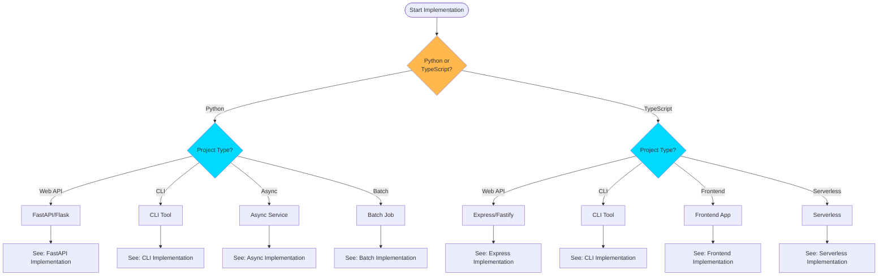
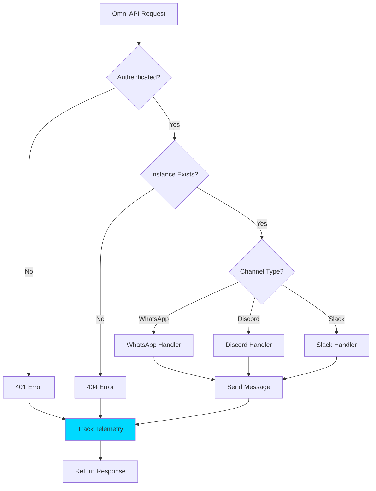
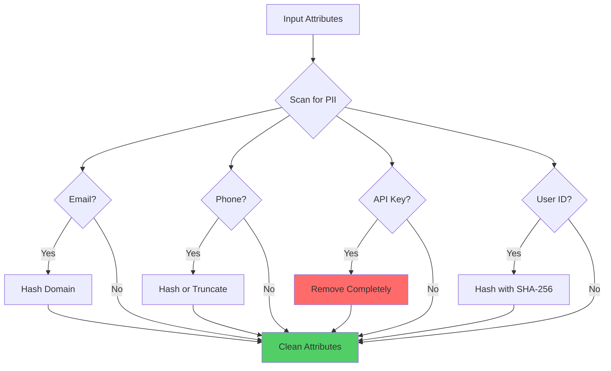
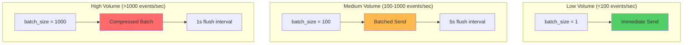

# Implementation Guide

<p align="center">
  <strong>🛠️ Complete implementation guide for Automagik Telemetry SDK</strong><br>
  Step-by-step patterns, code examples, and best practices for all project types
</p>

---

## Table of Contents

- [Quick Start by Project Type](#quick-start-by-project-type)
- [Installation](#installation)
- [Implementation Patterns](#implementation-patterns)
- [Project-Specific Integration](#project-specific-integration)
- [Privacy Implementation](#privacy-implementation)
- [Performance Optimization](#performance-optimization)
- [Troubleshooting](#troubleshooting)

---

## Quick Start by Project Type

### Decision Tree: Choose Your Implementation



---

## Installation

### Python Projects

#### Option 1: Using pip

```bash
pip install automagik-telemetry
```

#### Option 2: Using uv (Recommended for Automagik projects)

```bash
uv add automagik-telemetry
```

#### Option 3: Development Installation

```bash
# Clone repository
git clone https://github.com/namastexlabs/automagik-telemetry.git
cd automagik-telemetry/python

# Install in development mode
pip install -e ".[dev]"
```

### TypeScript Projects

#### Option 1: Using pnpm (Recommended)

```bash
pnpm add @automagik/telemetry
```

#### Option 2: Using npm

```bash
npm install @automagik/telemetry
```

#### Option 3: Using yarn

```bash
yarn add @automagik/telemetry
```

---

## Implementation Patterns

### Pattern 1: FastAPI Integration (Python)

<details>
<summary><strong>📱 Click to expand: Complete FastAPI implementation</strong></summary>

**File: `app/telemetry.py`**

```python
"""
Centralized telemetry configuration for FastAPI application.
"""
from automagik_telemetry import AutomagikTelemetry, MetricType
from functools import wraps
import time
from typing import Callable

# Initialize telemetry client (singleton pattern)
telemetry = AutomagikTelemetry(
    project_name="omni",
    version="1.0.0",
    batch_size=100,  # Batch for performance
    flush_interval=5.0
)

def track_endpoint(func: Callable) -> Callable:
    """Decorator to automatically track API endpoint calls."""
    @wraps(func)
    async def wrapper(*args, **kwargs):
        start_time = time.time()
        endpoint = func.__name__

        try:
            result = await func(*args, **kwargs)
            status = 200

            # Track successful request
            telemetry.track_event("api.request", {
                "endpoint": endpoint,
                "method": "POST",  # Extract from request
                "status": status
            })

            # Track latency
            duration_ms = (time.time() - start_time) * 1000
            telemetry.track_metric(
                "api.latency_ms",
                duration_ms,
                MetricType.HISTOGRAM,
                {"endpoint": endpoint}
            )

            return result

        except Exception as e:
            # Track error
            telemetry.track_error(e, {
                "endpoint": endpoint,
                "error_type": type(e).__name__
            })
            raise

    return wrapper
```

**File: `app/main.py`**

```python
"""
FastAPI application with telemetry integration.
"""
from fastapi import FastAPI, HTTPException
from app.telemetry import telemetry, track_endpoint

app = FastAPI()

@app.on_event("startup")
async def startup_event():
    """Track application startup."""
    telemetry.track_event("app.started", {
        "version": "1.0.0",
        "environment": "production"
    })

@app.on_event("shutdown")
async def shutdown_event():
    """Flush telemetry before shutdown."""
    telemetry.flush()
    telemetry.track_event("app.stopped", {})

@app.post("/api/v1/messages")
@track_endpoint
async def send_message(instance: str, recipient: str, message: str):
    """Send a message with automatic telemetry tracking."""

    # Your business logic here
    result = await send_whatsapp_message(instance, recipient, message)

    # Track business metric
    telemetry.track_metric(
        "messages.sent",
        1,
        MetricType.COUNTER,
        {
            "instance": instance,
            "channel": "whatsapp"
        }
    )

    return result

@app.get("/health")
async def health_check():
    """Health check endpoint (no telemetry tracking)."""
    return {"status": "healthy"}
```

**File: `.env`**

```bash
# Telemetry configuration
AUTOMAGIK_TELEMETRY_ENABLED=true
AUTOMAGIK_TELEMETRY_ENDPOINT=https://telemetry.namastex.ai

# Development override
# ENVIRONMENT=development  # Disables telemetry
```

</details>

### Pattern 2: Express Integration (TypeScript)

<details>
<summary><strong>📱 Click to expand: Complete Express implementation</strong></summary>

**File: `src/telemetry.ts`**

```typescript
/**
 * Centralized telemetry configuration for Express application.
 */
import { AutomagikTelemetry, MetricType } from '@automagik/telemetry';
import { Request, Response, NextFunction } from 'express';

// Initialize telemetry client (singleton pattern)
export const telemetry = new AutomagikTelemetry({
  projectName: 'forge',
  version: '1.0.0',
  batchSize: 100,  // Batch for performance
  flushInterval: 5000
});

/**
 * Express middleware for automatic endpoint tracking.
 */
export function telemetryMiddleware(req: Request, res: Response, next: NextFunction): void {
  const startTime = Date.now();

  // Track request
  res.on('finish', () => {
    const duration = Date.now() - startTime;

    // Track API request
    telemetry.trackEvent('api.request', {
      endpoint: req.path,
      method: req.method,
      status: res.statusCode
    });

    // Track latency
    telemetry.trackMetric(
      'api.latency_ms',
      duration,
      MetricType.HISTOGRAM,
      { endpoint: req.path }
    );
  });

  next();
}

/**
 * Error tracking middleware.
 */
export function errorTrackingMiddleware(err: Error, req: Request, res: Response, next: NextFunction): void {
  telemetry.trackError(err, {
    endpoint: req.path,
    method: req.method
  });

  next(err);
}
```

**File: `src/index.ts`**

```typescript
/**
 * Express application with telemetry integration.
 */
import express from 'express';
import { telemetry, telemetryMiddleware, errorTrackingMiddleware } from './telemetry';

const app = express();
const PORT = process.env.PORT || 3000;

// Apply telemetry middleware globally
app.use(telemetryMiddleware);

// Your routes
app.post('/api/v1/tasks', async (req, res) => {
  try {
    // Your business logic
    const task = await createTask(req.body);

    // Track business metric
    telemetry.trackMetric(
      'tasks.created',
      1,
      MetricType.COUNTER,
      { task_type: task.type }
    );

    res.json(task);
  } catch (error) {
    res.status(500).json({ error: 'Failed to create task' });
  }
});

// Health check (no tracking)
app.get('/health', (req, res) => {
  res.json({ status: 'healthy' });
});

// Error tracking middleware (must be last)
app.use(errorTrackingMiddleware);

// Startup
app.listen(PORT, () => {
  telemetry.trackEvent('app.started', {
    port: PORT,
    environment: process.env.NODE_ENV || 'development'
  });
});

// Graceful shutdown
process.on('SIGTERM', async () => {
  telemetry.flush();
  telemetry.trackEvent('app.stopped', {});
  process.exit(0);
});
```

**File: `.env`**

```bash
# Telemetry configuration
AUTOMAGIK_TELEMETRY_ENABLED=true
AUTOMAGIK_TELEMETRY_ENDPOINT=https://telemetry.namastex.ai

# Development override
# NODE_ENV=development  # Disables telemetry
```

</details>

### Pattern 3: CLI Tool (Python)

<details>
<summary><strong>🖥️ Click to expand: CLI implementation with Click</strong></summary>

**File: `cli/telemetry.py`**

```python
"""
Telemetry for CLI application.
"""
from automagik_telemetry import AutomagikTelemetry
import click
from functools import wraps

telemetry = AutomagikTelemetry(
    project_name="hive",
    version="1.0.0",
    batch_size=1  # Immediate send for CLI
)

def track_command(func):
    """Decorator to track CLI commands."""
    @wraps(func)
    def wrapper(*args, **kwargs):
        command_name = func.__name__

        telemetry.track_event("command.executed", {
            "command": command_name,
            "cli": "hive"
        })

        try:
            result = func(*args, **kwargs)

            telemetry.track_event("command.succeeded", {
                "command": command_name
            })

            return result

        except Exception as e:
            telemetry.track_error(e, {
                "command": command_name
            })
            raise
        finally:
            # Flush immediately for CLI (process may exit)
            telemetry.flush()

    return wrapper
```

**File: `cli/main.py`**

```python
"""
Main CLI application.
"""
import click
from cli.telemetry import telemetry, track_command

@click.group()
def cli():
    """Hive CLI - Multi-agent orchestration."""
    pass

@cli.command()
@click.option('--name', required=True, help='Agent name')
@click.option('--model', default='gpt-4', help='LLM model')
@track_command
def spawn(name: str, model: str):
    """Spawn a new agent."""
    click.echo(f"Spawning agent: {name} with model: {model}")

    # Your business logic
    agent = create_agent(name, model)

    # Track specific metric
    telemetry.track_event("agent.spawned", {
        "agent_name": name,
        "model": model
    })

    return agent

@cli.command()
@click.argument('agent_id')
@track_command
def terminate(agent_id: str):
    """Terminate an agent."""
    click.echo(f"Terminating agent: {agent_id}")

    # Your business logic
    terminate_agent(agent_id)

    telemetry.track_event("agent.terminated", {
        "agent_id": agent_id
    })

if __name__ == '__main__':
    cli()
```

</details>

### Pattern 4: Async Service (Python)

<details>
<summary><strong>⚡ Click to expand: Async service implementation</strong></summary>

```python
"""
Async service with telemetry tracking.
"""
import asyncio
from automagik_telemetry import AutomagikTelemetry, MetricType
from typing import List

class MessageProcessor:
    """Process messages asynchronously with telemetry."""

    def __init__(self):
        self.telemetry = AutomagikTelemetry(
            project_name="spark",
            version="1.0.0",
            batch_size=100
        )
        self.queue = asyncio.Queue()

    async def process_message(self, message: dict):
        """Process a single message."""
        start_time = asyncio.get_event_loop().time()

        try:
            # Your processing logic
            result = await self._handle_message(message)

            # Track success
            self.telemetry.track_event("message.processed", {
                "type": message.get("type"),
                "success": True
            })

            # Track latency
            duration = (asyncio.get_event_loop().time() - start_time) * 1000
            self.telemetry.track_metric(
                "message.processing_time_ms",
                duration,
                MetricType.HISTOGRAM
            )

            return result

        except Exception as e:
            self.telemetry.track_error(e, {
                "message_type": message.get("type")
            })
            raise

    async def worker(self):
        """Worker coroutine."""
        while True:
            message = await self.queue.get()

            try:
                await self.process_message(message)
            finally:
                self.queue.task_done()

    async def start(self, num_workers: int = 10):
        """Start processing with multiple workers."""
        self.telemetry.track_event("service.started", {
            "workers": num_workers
        })

        # Create worker tasks
        workers = [asyncio.create_task(self.worker()) for _ in range(num_workers)]

        # Track worker count
        self.telemetry.track_metric(
            "workers.active",
            num_workers,
            MetricType.GAUGE
        )

        # Wait for all tasks to complete
        await self.queue.join()

        # Cancel workers
        for worker in workers:
            worker.cancel()

        # Flush before shutdown
        self.telemetry.flush()

# Usage
async def main():
    processor = MessageProcessor()

    # Add messages to queue
    for i in range(1000):
        await processor.queue.put({"type": "email", "id": i})

    await processor.start(num_workers=10)

if __name__ == "__main__":
    asyncio.run(main())
```

</details>

### Pattern 5: Serverless Function (TypeScript)

<details>
<summary><strong>☁️ Click to expand: AWS Lambda implementation</strong></summary>

```typescript
/**
 * AWS Lambda handler with telemetry.
 */
import { Handler, APIGatewayProxyEvent, APIGatewayProxyResult } from 'aws-lambda';
import { AutomagikTelemetry, MetricType } from '@automagik/telemetry';

// Initialize outside handler for cold start optimization
const telemetry = new AutomagikTelemetry({
  projectName: 'genie-lambda',
  version: '1.0.0',
  batchSize: 1,  // Immediate send for serverless
  flushInterval: 1000  // Short interval
});

export const handler: Handler<APIGatewayProxyEvent, APIGatewayProxyResult> = async (event, context) => {
  const startTime = Date.now();
  const requestId = context.requestId;

  // Track function invocation
  telemetry.trackEvent('lambda.invoked', {
    function_name: context.functionName,
    request_id: requestId
  });

  try {
    // Your business logic
    const result = await processRequest(event);

    // Track success
    telemetry.trackEvent('lambda.succeeded', {
      request_id: requestId
    });

    // Track duration
    const duration = Date.now() - startTime;
    telemetry.trackMetric(
      'lambda.duration_ms',
      duration,
      MetricType.HISTOGRAM,
      { function_name: context.functionName }
    );

    // Flush before returning (important for serverless!)
    await telemetry.flush();

    return {
      statusCode: 200,
      body: JSON.stringify(result)
    };

  } catch (error) {
    // Track error
    telemetry.trackError(error as Error, {
      request_id: requestId
    });

    // Flush even on error
    await telemetry.flush();

    return {
      statusCode: 500,
      body: JSON.stringify({ error: 'Internal server error' })
    };
  }
};

async function processRequest(event: APIGatewayProxyEvent): Promise<any> {
  // Your implementation
  return { message: 'Processed successfully' };
}
```

</details>

---

## Project-Specific Integration

### Automagik Omni (Messaging Platform)



**Implementation Checklist:**

- [x] Track message sent/received per channel
- [x] Track instance creation/deletion
- [x] Track Evolution API errors
- [x] Track contact/chat operations
- [x] Sanitize phone numbers (hash)
- [x] Sanitize message content (remove)
- [x] Track API latency per endpoint

**Code Example:**

```python
# File: omni/routes/messages.py
from app.telemetry import telemetry
from automagik_telemetry import MetricType
import hashlib

@router.post("/api/v1/messages/send")
async def send_message(
    instance: str,
    recipient: str,
    message: str,
    channel: str = "whatsapp"
):
    start_time = time.time()

    # Sanitize phone number
    recipient_hash = hashlib.sha256(recipient.encode()).hexdigest()[:16]

    try:
        # Send via Evolution API
        result = await evolution_api.send_message(instance, recipient, message)

        # Track success
        telemetry.track_event("message.sent", {
            "instance": instance,
            "recipient_hash": recipient_hash,  # Privacy: hashed
            "channel": channel,
            "success": True
        })

        # Track latency
        duration_ms = (time.time() - start_time) * 1000
        telemetry.track_metric(
            "message.send_latency_ms",
            duration_ms,
            MetricType.HISTOGRAM,
            {"channel": channel}
        )

        # Track message count
        telemetry.track_metric(
            "messages.total",
            1,
            MetricType.COUNTER,
            {"channel": channel, "status": "sent"}
        )

        return result

    except EvolutionAPIError as e:
        telemetry.track_error(e, {
            "instance": instance,
            "channel": channel,
            "error_code": e.code
        })
        raise
```

### Automagik Hive (Multi-Agent System)

**Implementation Checklist:**

- [x] Track agent spawned/terminated
- [x] Track multi-agent workflow execution
- [x] Track knowledge base queries
- [x] Track tool usage per agent
- [x] Track agent decision points
- [x] Sanitize user queries (PII removal)

**Code Example:**

```python
# File: hive/orchestrator.py
from automagik_telemetry import AutomagikTelemetry, MetricType

telemetry = AutomagikTelemetry(project_name="hive", version="1.0.0")

class AgentOrchestrator:
    """Orchestrate multi-agent workflows with telemetry."""

    def spawn_agent(self, name: str, model: str, tools: list[str]):
        """Spawn a new agent."""
        telemetry.track_event("agent.spawned", {
            "agent_name": name,
            "model": model,
            "tools_count": len(tools)
        })

        # Track active agents
        telemetry.track_metric(
            "agents.active",
            self.get_active_agent_count(),
            MetricType.GAUGE
        )

        return Agent(name, model, tools)

    def execute_workflow(self, workflow_id: str, agents: list[Agent]):
        """Execute multi-agent workflow."""
        start_time = time.time()

        telemetry.track_event("workflow.started", {
            "workflow_id": workflow_id,
            "agents_count": len(agents)
        })

        try:
            result = self._run_workflow(workflow_id, agents)

            duration = time.time() - start_time
            telemetry.track_metric(
                "workflow.duration_seconds",
                duration,
                MetricType.HISTOGRAM,
                {"workflow_id": workflow_id}
            )

            telemetry.track_event("workflow.completed", {
                "workflow_id": workflow_id,
                "success": True
            })

            return result

        except Exception as e:
            telemetry.track_error(e, {
                "workflow_id": workflow_id
            })
            raise
```

### Automagik Forge (Task Orchestration)

**Implementation Checklist:**

- [x] Track task created/completed/failed
- [x] Track worker execution status
- [x] Track workflow execution time
- [x] Track resource utilization
- [x] Track queue depth

**Code Example:**

```typescript
// File: forge/task-manager.ts
import { AutomagikTelemetry, MetricType } from '@automagik/telemetry';

const telemetry = new AutomagikTelemetry({
  projectName: 'forge',
  version: '1.0.0'
});

class TaskManager {
  /**
   * Create and track a task.
   */
  async createTask(taskData: TaskInput): Promise<Task> {
    const task = await this.db.tasks.create(taskData);

    // Track task creation
    telemetry.trackEvent('task.created', {
      task_id: task.id,
      task_type: task.type,
      priority: task.priority
    });

    // Track queue depth
    const queueDepth = await this.getQueueDepth();
    telemetry.trackMetric(
      'queue.depth',
      queueDepth,
      MetricType.GAUGE,
      { queue: task.queue }
    );

    return task;
  }

  /**
   * Execute task with telemetry tracking.
   */
  async executeTask(taskId: string): Promise<void> {
    const startTime = Date.now();

    telemetry.trackEvent('task.started', { task_id: taskId });

    try {
      const result = await this.worker.execute(taskId);

      // Track completion
      const duration = Date.now() - startTime;
      telemetry.trackMetric(
        'task.duration_ms',
        duration,
        MetricType.HISTOGRAM,
        { task_type: result.type }
      );

      telemetry.trackEvent('task.completed', {
        task_id: taskId,
        success: true
      });

    } catch (error) {
      telemetry.trackError(error as Error, {
        task_id: taskId
      });
      throw;
    }
  }
}
```

---

## Privacy Implementation

### PII Detection & Sanitization



**Python Implementation:**

```python
from automagik_telemetry.privacy import sanitize_attributes
import hashlib
import re

def sanitize_user_data(attributes: dict) -> dict:
    """
    Sanitize user data before sending to telemetry.

    Removes:
    - Email addresses
    - Phone numbers
    - API keys
    - Message content

    Hashes:
    - User IDs
    - Session IDs
    """
    # Built-in sanitization
    clean_attrs = sanitize_attributes(attributes)

    # Additional custom sanitization
    if "phone" in clean_attrs:
        # Hash phone number
        clean_attrs["phone_hash"] = hashlib.sha256(
            clean_attrs["phone"].encode()
        ).hexdigest()[:16]
        del clean_attrs["phone"]

    if "message" in clean_attrs:
        # Remove message content
        del clean_attrs["message"]
        clean_attrs["has_message"] = True

    return clean_attrs

# Usage
telemetry.track_event("user.action", sanitize_user_data({
    "user_id": "12345",
    "phone": "+1234567890",
    "message": "Hello, world!",
    "action": "send_message"
}))
```

**TypeScript Implementation:**

```typescript
import { sanitizeAttributes } from '@automagik/telemetry';
import crypto from 'crypto';

function sanitizeUserData(attributes: Record<string, any>): Record<string, any> {
  /**
   * Sanitize user data before sending to telemetry.
   */
  // Built-in sanitization
  let clean = sanitizeAttributes(attributes);

  // Additional custom sanitization
  if (clean.phone) {
    // Hash phone number
    clean.phone_hash = crypto
      .createHash('sha256')
      .update(clean.phone)
      .digest('hex')
      .substring(0, 16);
    delete clean.phone;
  }

  if (clean.message) {
    // Remove message content
    delete clean.message;
    clean.has_message = true;
  }

  return clean;
}

// Usage
telemetry.trackEvent('user.action', sanitizeUserData({
  user_id: '12345',
  phone: '+1234567890',
  message: 'Hello, world!',
  action: 'send_message'
}));
```

---

## Performance Optimization

### Batching Strategy



**Configuration Examples:**

```python
# Python - High performance configuration
telemetry = AutomagikTelemetry(
    project_name="my-app",
    version="1.0.0",
    batch_size=500,  # Large batch
    flush_interval=2.0,  # Frequent flush
    compression_enabled=True,  # Compress large payloads
    max_retries=3  # Retry on failure
)
```

```typescript
// TypeScript - High performance configuration
const telemetry = new AutomagikTelemetry({
  projectName: 'my-app',
  version: '1.0.0',
  batchSize: 500,  // Large batch
  flushInterval: 2000,  // Frequent flush
  compressionEnabled: true,  // Compress large payloads
  maxRetries: 3  // Retry on failure
});
```

### Async vs Sync

> **💡 Best Practice:** Always use async methods in async contexts

```python
# ✅ GOOD: Async context with async method
async def handle_request():
    await telemetry.track_event_async("request.handled", {...})

# ✅ GOOD: Sync context with sync method
def handle_batch():
    telemetry.track_event("batch.processed", {...})

# ❌ BAD: Mixing sync/async incorrectly
async def wrong_approach():
    telemetry.track_event("event", {...})  # Blocks event loop!
```

---

## Troubleshooting

### Common Issues & Solutions

<details>
<summary><strong>🔧 Issue: Events not appearing in dashboard</strong></summary>

**Symptoms:**
- `track_event()` calls succeed
- No errors in logs
- Data not visible in Grafana

**Solutions:**

1. **Check if telemetry is enabled:**
   ```python
   print(telemetry.enabled)  # Should be True
   ```

2. **Check environment variables:**
   ```bash
   echo $AUTOMAGIK_TELEMETRY_ENABLED  # Should be empty or "true"
   echo $ENVIRONMENT  # Should NOT be "development"
   ```

3. **Manually flush:**
   ```python
   telemetry.flush()  # Force immediate send
   ```

4. **Enable verbose mode:**
   ```bash
   export AUTOMAGIK_TELEMETRY_VERBOSE=true
   python your_app.py
   ```

</details>

<details>
<summary><strong>🔧 Issue: High latency in application</strong></summary>

**Symptoms:**
- Application feels slow after adding telemetry
- Request latency increased

**Solutions:**

1. **Increase batch size:**
   ```python
   telemetry = AutomagikTelemetry(
       project_name="my-app",
       version="1.0.0",
       batch_size=100  # Reduce network calls
   )
   ```

2. **Check if using async properly:**
   ```python
   # ✅ GOOD
   await telemetry.track_event_async("event", {...})

   # ❌ BAD - blocks!
   telemetry.track_event("event", {...})  # in async function
   ```

3. **Reduce flush interval:**
   ```python
   flush_interval=10.0  # Flush less frequently
   ```

</details>

<details>
<summary><strong>🔧 Issue: PII appearing in telemetry data</strong></summary>

**Symptoms:**
- Sensitive data visible in dashboard
- Privacy compliance concerns

**Solutions:**

1. **Use sanitization functions:**
   ```python
   from automagik_telemetry.privacy import sanitize_attributes

   clean_attrs = sanitize_attributes(raw_attributes)
   telemetry.track_event("event", clean_attrs)
   ```

2. **Manually hash sensitive fields:**
   ```python
   import hashlib

   user_id_hash = hashlib.sha256(user_id.encode()).hexdigest()[:16]
   ```

3. **Remove content fields:**
   ```python
   # Don't send message content
   telemetry.track_event("message.sent", {
       "has_message": True,  # ✅ Just boolean
       # "message": "..."  # ❌ Never send content
   })
   ```

</details>

---

## Related Documentation

- **[ARCHITECTURE.md](ARCHITECTURE.md)** - System architecture and design patterns
- **[TESTING.md](TESTING.md)** - Testing strategies and CI/CD integration
- **[SDK_DIFFERENCES.md](SDK_DIFFERENCES.md)** - Cross-SDK comparison
- **[CONTRIBUTING.md](CONTRIBUTING.md)** - Development workflow

---

<p align="center">
  <strong>Built with ❤️ by <a href="https://namastex.ai">Namastex Labs</a></strong><br>
  <em>Implementation patterns for privacy-first telemetry</em>
</p>
