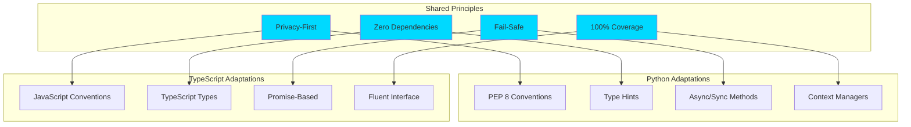
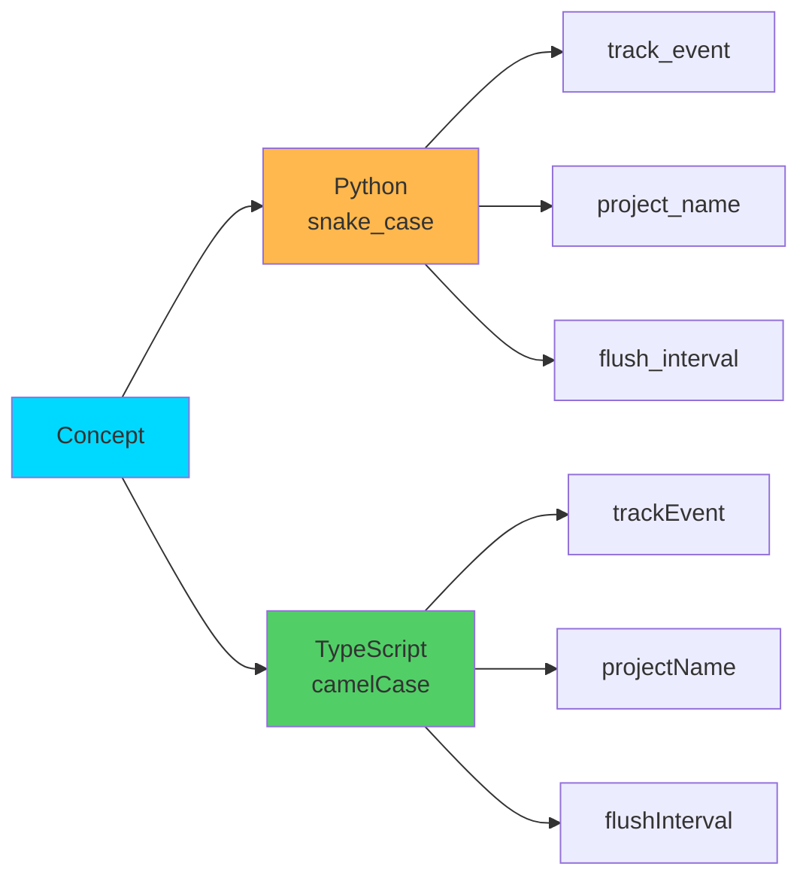
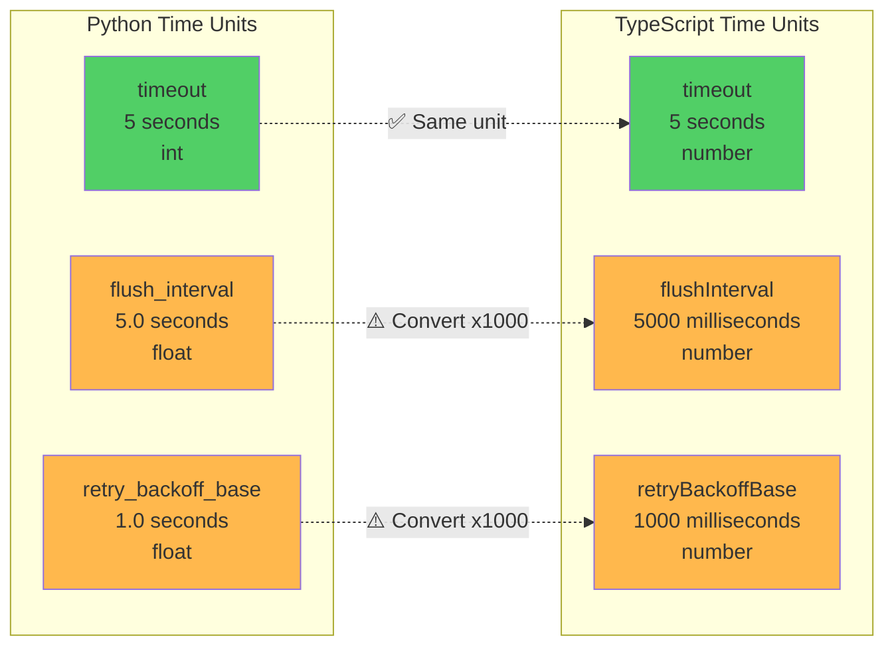
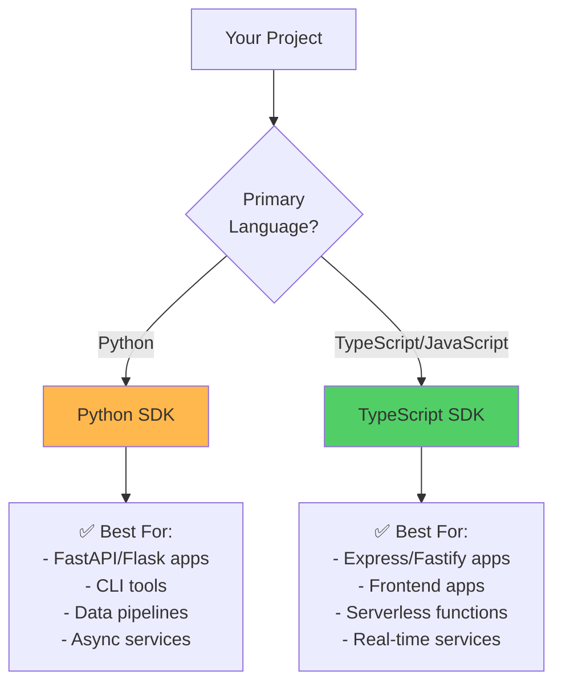
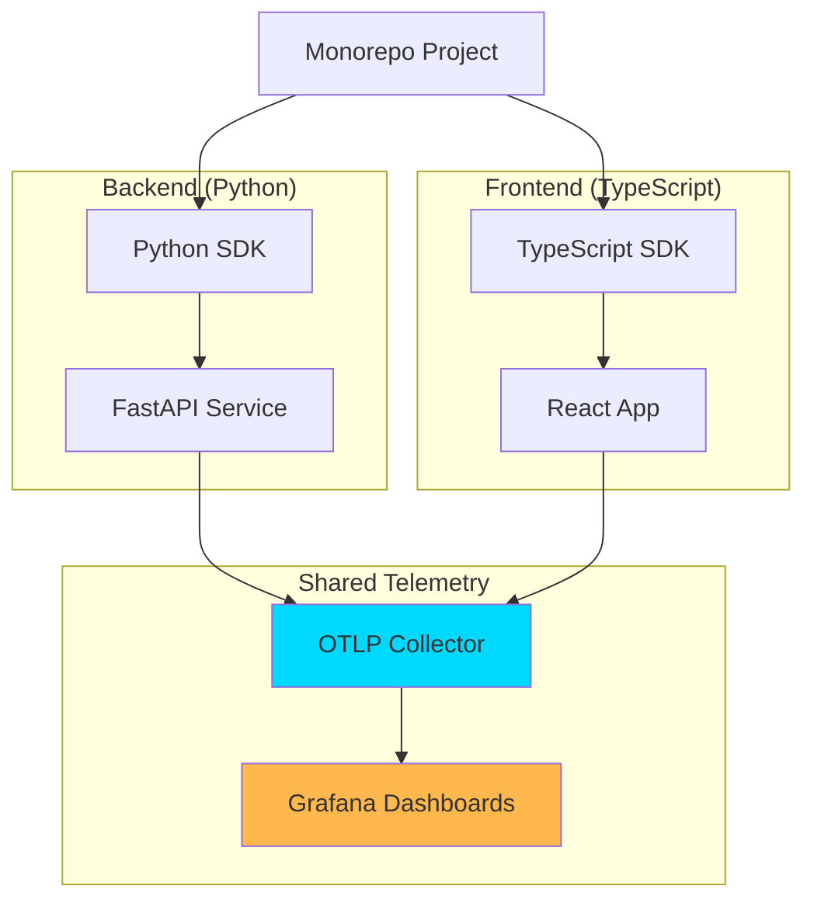

# SDK Differences & Migration Guide

<p align="center">
  <strong>🔄 Complete guide to Python vs TypeScript SDK differences</strong><br>
  Side-by-side comparisons, API mapping, and migration strategies
</p>

---

## Table of Contents

- [Philosophy](#philosophy)
- [Critical Behavioral Differences](#critical-behavioral-differences)
- [Quick Reference](#quick-reference)
- [Naming Conventions](#naming-conventions)
- [API Comparison](#api-comparison)
- [Control Methods Differences](#control-methods-differences)
- [Async/Await Patterns](#asyncawait-patterns)
- [Queue Architecture](#queue-architecture)
- [Configuration Differences](#configuration-differences)
- [Configuration Asymmetries](#configuration-asymmetries)
- [Migration Guides](#migration-guides)
- [Porting Code Between SDKs](#porting-code-between-sdks)
- [Best Practices](#best-practices)

---

## Philosophy

### Design Principles

Both SDKs follow the same core principles but adapt to language-specific idioms:



### Functional Equivalence

> **✅ Guarantee:** Both SDKs provide 100% functional equivalence. Any feature in Python is available in TypeScript and vice versa.

---

## Critical Behavioral Differences

> **⚠️ WARNING:** These differences can cause bugs when porting code between SDKs. Read carefully!

### Quick Comparison Table

| Feature | Python | TypeScript | Portable? | Impact |
|---------|--------|-----------|-----------|---------|
| **disable() flushes** | ✅ YES (v0.1.3+) | ✅ YES | ✅ Yes | **LOW** - Both flush now |
| **disable() signature** | `def disable() -> None` | `async disable() -> Promise<void>` | ❌ No | **CRITICAL** - Must await in TS |
| **flush() signature** | `def flush() -> None` | `async flush() -> Promise<void>` | ❌ No | **HIGH** - Must await in TS |
| **Async methods** | ✅ Explicit (`track_event_async`) | ❌ Internal only | ⚠️ Different | **HIGH** - API differs |
| **Queue architecture** | 3 separate queues | 1 unified queue | ❌ No | **HIGH** - Different semantics |
| **Initialization** | Requires `TelemetryConfig` object | Inline config object | ❌ No | **MEDIUM** - API differs |
| **clickhouse_table param** | ✅ Supported | ✅ Supported (v0.1.3+) | ✅ Yes | **LOW** - Feature parity achieved |
| **Batch size default** | `100` | `100` | ✅ Yes | **LOW** - Same |
| **Naming convention** | `snake_case` | `camelCase` | ❌ No | **LOW** - Expected |

### Impact Levels Explained

- **🔴 CRITICAL**: Can cause data loss, crashes, or silent failures
- **🟡 HIGH**: Significantly different behavior that affects functionality
- **🟢 MEDIUM**: Different APIs but predictable behavior
- **⚪ LOW**: Cosmetic differences with no functional impact

---

## Quick Reference

### Side-by-Side: Basic Usage

<table>
<tr>
<th>Python</th>
<th>TypeScript</th>
</tr>
<tr>
<td>

```python
from automagik_telemetry import (
    AutomagikTelemetry,
    MetricType
)

# Initialize
client = AutomagikTelemetry(
    project_name="my-app",
    version="1.0.0"
)

# Track event
client.track_event("user.login", {
    "method": "oauth"
})

# Track metric
client.track_metric(
    "api.requests",
    value=1,
    metric_type=MetricType.COUNTER
)

# Flush
client.flush()

# Shutdown
client.shutdown()
```

</td>
<td>

```typescript
import {
    AutomagikTelemetry,
    MetricType
} from '@automagik/telemetry';

// Initialize
const client = new AutomagikTelemetry({
    projectName: 'my-app',
    version: '1.0.0'
});

// Track event
client.trackEvent('user.login', {
    method: 'oauth'
});

// Track metric
client.trackMetric(
    'api.requests',
    1,
    MetricType.COUNTER
);

// Flush
client.flush();

// Shutdown
client.shutdown();
```

</td>
</tr>
</table>

---

## Naming Conventions

### Convention Mapping



### Complete Mapping Table

| Concept | Python | TypeScript |
|---------|--------|------------|
| **Class Name** | `AutomagikTelemetry` | `AutomagikTelemetry` |
| **Track Event** | `track_event()` | `trackEvent()` |
| **Track Metric** | `track_metric()` | `trackMetric()` |
| **Track Log** | `track_log()` | `trackLog()` |
| **Track Error** | `track_error()` | `trackError()` |
| **Flush** | `flush()` | `flush()` |
| **Shutdown** | `shutdown()` | `shutdown()` |
| **Project Name** | `project_name` | `projectName` |
| **Batch Size** | `batch_size` | `batchSize` |
| **Flush Interval** | `flush_interval` | `flushInterval` |
| **Compression Enabled** | `compression_enabled` | `compressionEnabled` |
| **Max Retries** | `max_retries` | `maxRetries` |
| **ClickHouse Endpoint** | `clickhouse_endpoint` | `clickhouseEndpoint` |
| **ClickHouse Database** | `clickhouse_database` | `clickhouseDatabase` |
| **ClickHouse Batch Size** | `clickhouse_batch_size` | `clickhouseBatchSize` |

### Consistent Names

These names are **identical** across both SDKs:

- `backend` (always lowercase)
- `version` (always lowercase)
- `endpoint` (always lowercase)
- `timeout` (always lowercase)
- `disabled` (always lowercase)

---

## API Comparison

### Initialization

<table>
<tr>
<th>Python</th>
<th>TypeScript</th>
</tr>
<tr>
<td>

```python
from automagik_telemetry import AutomagikTelemetry, TelemetryConfig

# Basic initialization - MUST use TelemetryConfig
config = TelemetryConfig(
    project_name="my-app",
    version="1.0.0"
)
client = AutomagikTelemetry(config=config)

# With all options using TelemetryConfig
config = TelemetryConfig(
    project_name="my-app",
    version="1.0.0",
    backend="otlp",
    endpoint="https://telemetry.example.com",
    batch_size=100,
    flush_interval=5.0,  # seconds
    compression_enabled=True,
    max_retries=3,
    timeout=5  # seconds
)
client = AutomagikTelemetry(config=config)

# ClickHouse backend with TelemetryConfig
config = TelemetryConfig(
    project_name="my-app",
    version="1.0.0",
    backend="clickhouse",
    clickhouse_endpoint="http://localhost:8123",
    clickhouse_database="telemetry",
    clickhouse_table="otel_traces",  # Python supports table customization
    batch_size=100
)
client = AutomagikTelemetry(config=config)
```

</td>
<td>

```typescript
// Basic initialization
const client = new AutomagikTelemetry({
    projectName: 'my-app',
    version: '1.0.0'
});

// With all options
const client = new AutomagikTelemetry({
    projectName: 'my-app',
    version: '1.0.0',
    backend: 'otlp',
    endpoint: 'https://telemetry.example.com',
    batchSize: 100,
    flushInterval: 5000,  // milliseconds
    compressionEnabled: true,
    maxRetries: 3,
    timeout: 5,  // seconds
    disabled: false
});

// ClickHouse backend
const client = new AutomagikTelemetry({
    projectName: 'my-app',
    version: '1.0.0',
    backend: 'clickhouse',
    clickhouseEndpoint: 'http://localhost:8123',
    clickhouseDatabase: 'telemetry',
    clickhouseBatchSize: 100
});
```

</td>
</tr>
</table>

### Event Tracking

<table>
<tr>
<th>Python</th>
<th>TypeScript</th>
</tr>
<tr>
<td>

```python
# Basic event
client.track_event("user.login")

# Event with attributes
client.track_event("user.login", {
    "method": "oauth",
    "provider": "google"
})

# Async version (Python only)
await client.track_event_async(
    "user.login",
    {"method": "oauth"}
)
```

</td>
<td>

```typescript
// Basic event
client.trackEvent('user.login');

// Event with attributes
client.trackEvent('user.login', {
    method: 'oauth',
    provider: 'google'
});

// All methods are internally async
// (fire-and-forget, no await needed)
client.trackEvent('user.login', {
    method: 'oauth'
});
```

</td>
</tr>
</table>

### Metric Tracking

<table>
<tr>
<th>Python</th>
<th>TypeScript</th>
</tr>
<tr>
<td>

```python
from automagik_telemetry import MetricType

# Counter
client.track_metric(
    "api.requests",
    value=1,
    metric_type=MetricType.COUNTER,
    attributes={"endpoint": "/users"}
)

# Gauge
client.track_metric(
    "memory.usage_mb",
    value=512.5,
    metric_type=MetricType.GAUGE
)

# Histogram
client.track_metric(
    "api.latency_ms",
    value=125.3,
    metric_type=MetricType.HISTOGRAM
)

# String-based metric type (also valid)
client.track_metric(
    "api.requests",
    value=1,
    metric_type="counter"
)
```

</td>
<td>

```typescript
import { MetricType } from '@automagik/telemetry';

// Counter
client.trackMetric(
    'api.requests',
    1,
    MetricType.COUNTER,
    { endpoint: '/users' }
);

// Gauge
client.trackMetric(
    'memory.usage_mb',
    512.5,
    MetricType.GAUGE
);

// Histogram
client.trackMetric(
    'api.latency_ms',
    125.3,
    MetricType.HISTOGRAM
);

// String-based metric type (also valid)
client.trackMetric(
    'api.requests',
    1,
    'counter'
);
```

</td>
</tr>
</table>

### Error Tracking

<table>
<tr>
<th>Python</th>
<th>TypeScript</th>
</tr>
<tr>
<td>

```python
try:
    risky_operation()
except Exception as e:
    client.track_error(e, {
        "operation": "risky_operation",
        "user_id": "12345"
    })
```

</td>
<td>

```typescript
try {
    riskyOperation();
} catch (error) {
    client.trackError(error as Error, {
        operation: 'riskyOperation',
        userId: '12345'
    });
}
```

</td>
</tr>
</table>

### Log Tracking

<table>
<tr>
<th>Python</th>
<th>TypeScript</th>
</tr>
<tr>
<td>

```python
from automagik_telemetry import LogLevel

client.track_log(
    "User logged in",
    level=LogLevel.INFO,
    attributes={"user_id": "12345"}
)

# Or with string level
client.track_log(
    "Error occurred",
    level="error",
    attributes={"error_code": "500"}
)
```

</td>
<td>

```typescript
import { LogLevel } from '@automagik/telemetry';

client.trackLog(
    'User logged in',
    LogLevel.INFO,
    { userId: '12345' }
);

// Or with string level
client.trackLog(
    'Error occurred',
    'error',
    { errorCode: '500' }
);
```

</td>
</tr>
</table>

---

## Control Methods Differences

> **📝 NOTE:** The `disable()` and `flush()` methods have some differences between SDKs.

### disable() Method

The `disable()` method has signature differences but **both SDKs now flush pending events**:

<table>
<tr>
<th>Aspect</th>
<th>Python</th>
<th>TypeScript</th>
</tr>
<tr>
<td><strong>Signature</strong></td>
<td><code>def disable(self) -> None</code></td>
<td><code>async disable(): Promise&lt;void&gt;</code></td>
</tr>
<tr>
<td><strong>Flushes pending events?</strong></td>
<td>✅ <strong>YES</strong> - Flushes before disabling (as of v0.1.3)</td>
<td>✅ <strong>YES</strong> - Flushes before disabling</td>
</tr>
<tr>
<td><strong>Stops flush timer?</strong></td>
<td>✅ YES</td>
<td>✅ YES</td>
</tr>
<tr>
<td><strong>Must be awaited?</strong></td>
<td>❌ No (sync)</td>
<td>✅ <strong>YES</strong> - Must await!</td>
</tr>
</table>

**Usage Examples:**

<table>
<tr>
<th>Python</th>
<th>TypeScript</th>
</tr>
<tr>
<td>

```python
# ✅ Both SDKs now flush automatically
client.track_event("app.shutdown", {
    "reason": "user_request"
})

# disable() flushes pending events automatically
client.disable()  # Synchronous, flushes before disabling
```

**Note:** As of v0.1.3, Python's `disable()` now flushes pending events before disabling, preventing data loss. No manual `flush()` call needed!

</td>
<td>

```typescript
// ✅ TypeScript flushes automatically
client.trackEvent('app.shutdown', {
    reason: 'user_request'
});

// Flushes events before disabling (must await)
await client.disable();  // Async, must be awaited
```

**Note:** TypeScript's `disable()` is async and must be awaited to ensure flush completes.

**⚠️ Must await or risk race condition:**
```typescript
// ❌ WRONG: Not awaiting
client.disable();  // Race condition!

// ✅ CORRECT: Always await
await client.disable();
```

</td>
</tr>
</table>

### flush() Method

The `flush()` method also has important differences:

<table>
<tr>
<th>Aspect</th>
<th>Python</th>
<th>TypeScript</th>
</tr>
<tr>
<td><strong>Signature</strong></td>
<td><code>def flush(self) -> None</code></td>
<td><code>async flush(): Promise&lt;void&gt;</code></td>
</tr>
<tr>
<td><strong>Return type</strong></td>
<td>Synchronous</td>
<td>Async - returns Promise</td>
</tr>
<tr>
<td><strong>Queues flushed</strong></td>
<td>3 separate (traces, metrics, logs)</td>
<td>1 unified queue</td>
</tr>
<tr>
<td><strong>Must be awaited?</strong></td>
<td>❌ No</td>
<td>✅ <strong>YES</strong></td>
</tr>
</table>

**Example:**

<table>
<tr>
<th>Python</th>
<th>TypeScript</th>
</tr>
<tr>
<td>

```python
# Synchronous flush
client.flush()

# Flushes all 3 queues:
# - trace_queue
# - metric_queue
# - log_queue
```

</td>
<td>

```typescript
// Asynchronous flush - must await
await client.flush();

// Flushes unified event queue
// containing all event types
```

</td>
</tr>
</table>

### shutdown() Method

The `shutdown()` method has consistent behavior:

<table>
<tr>
<th>Aspect</th>
<th>Python</th>
<th>TypeScript</th>
</tr>
<tr>
<td><strong>Flushes?</strong></td>
<td>✅ YES</td>
<td>✅ YES</td>
</tr>
<tr>
<td><strong>Stops timer?</strong></td>
<td>✅ YES</td>
<td>✅ YES</td>
</tr>
<tr>
<td><strong>Disables?</strong></td>
<td>✅ YES</td>
<td>✅ YES</td>
</tr>
</table>

> **✅ RECOMMENDED:** Use `shutdown()` instead of `disable()` to ensure safe cleanup in both SDKs.

---

## Async/Await Patterns

### Python: Explicit Async Methods

Python provides **explicit async variants** of all tracking methods:

```python
# Sync methods (default)
client.track_event("user.login", {...})
client.track_metric("api.requests", value=1, metric_type=MetricType.COUNTER)
client.track_error(error, {...})
client.track_log("message", level=LogLevel.INFO)
client.flush()

# Async methods (for async contexts)
await client.track_event_async("user.login", {...})
await client.track_metric_async("api.requests", value=1, metric_type=MetricType.COUNTER)
await client.track_error_async(error, {...})
await client.track_log_async("message", level=LogLevel.INFO)
await client.flush_async()
```

**When to use async methods in Python:**
- Inside `async def` functions
- When using asyncio event loops
- In async frameworks (FastAPI, aiohttp, etc.)

### TypeScript: Internal Async

TypeScript methods are **internally async but return void** (fire-and-forget):

```typescript
// All methods return void (except flush and disable)
client.trackEvent('user.login', {...});       // void, not Promise<void>
client.trackMetric('api.requests', 1, MetricType.COUNTER);  // void
client.trackError(error, {...});              // void
client.trackLog('message', LogLevel.INFO);    // void

// Only these return Promise<void>
await client.flush();    // Promise<void>
await client.disable();  // Promise<void>
```

**Important differences:**

<table>
<tr>
<th>Method</th>
<th>Python</th>
<th>TypeScript</th>
</tr>
<tr>
<td><code>track_event()</code></td>
<td>Sync - Returns None</td>
<td>Internally async - Returns void</td>
</tr>
<tr>
<td><code>track_event_async()</code></td>
<td>✅ Async - Returns awaitable</td>
<td>❌ Not available</td>
</tr>
<tr>
<td><code>flush()</code></td>
<td>Sync - Returns None</td>
<td>✅ Async - Returns Promise&lt;void&gt;</td>
</tr>
<tr>
<td><code>flush_async()</code></td>
<td>✅ Async - Returns awaitable</td>
<td>❌ Not available</td>
</tr>
<tr>
<td><code>disable()</code></td>
<td>Sync - Returns None</td>
<td>✅ Async - Returns Promise&lt;void&gt;</td>
</tr>
</table>

### Porting Async Code

**Python to TypeScript:**

```python
# Python async code
await client.track_event_async("test", {...})
await client.flush_async()
```

```typescript
// TypeScript equivalent
client.trackEvent('test', {...});  // No await! Fire-and-forget
await client.flush();               // Await flush
```

**TypeScript to Python:**

```typescript
// TypeScript code
client.trackEvent('test', {...});
await client.flush();
```

```python
# Python sync equivalent
client.track_event("test", {...})
client.flush()

# Or Python async equivalent
await client.track_event_async("test", {...})
await client.flush_async()
```

---

## Queue Architecture

### Critical Difference: 3 Queues vs 1 Queue

The SDKs use **fundamentally different queue architectures**:

<table>
<tr>
<th>Python</th>
<th>TypeScript</th>
</tr>
<tr>
<td>

**3 Separate Queues:**

```python
class AutomagikTelemetry:
    def __init__(self):
        self._trace_queue = deque()
        self._metric_queue = deque()
        self._log_queue = deque()
```

**Implications:**
- Events are queued by type
- Each queue flushes independently
- Batching is per event type
- Can flush traces without metrics

</td>
<td>

**1 Unified Queue:**

```typescript
class AutomagikTelemetry {
    private eventQueue: QueuedEvent[] = [];
}

type QueuedEvent = {
    type: 'trace' | 'metric' | 'log';
    data: any;
}
```

**Implications:**
- All events in single queue
- Flush processes all event types
- Batching across all events
- Cannot flush selectively

</td>
</tr>
</table>

### Flush Behavior Comparison

```mermaid
graph TD
    subgraph "Python - 3 Queues"
        PY_TRACES[Trace Queue<br/>100 events]
        PY_METRICS[Metric Queue<br/>50 events]
        PY_LOGS[Log Queue<br/>25 events]
        PY_FLUSH[flush()]
        PY_SEND1[Send Traces]
        PY_SEND2[Send Metrics]
        PY_SEND3[Send Logs]

        PY_FLUSH --> PY_TRACES --> PY_SEND1
        PY_FLUSH --> PY_METRICS --> PY_SEND2
        PY_FLUSH --> PY_LOGS --> PY_SEND3
    end

    subgraph "TypeScript - 1 Queue"
        TS_QUEUE[Unified Queue<br/>175 events mixed]
        TS_FLUSH[flush()]
        TS_SEND[Send All Events]

        TS_FLUSH --> TS_QUEUE --> TS_SEND
    end

    style PY_TRACES fill:#FFB84D
    style PY_METRICS fill:#FFB84D
    style PY_LOGS fill:#FFB84D
    style TS_QUEUE fill:#51CF66
```

### Batch Processing

**Python:** Each queue respects batch_size independently:

```python
config = TelemetryConfig(
    batch_size=100
)

# If you have:
# - 150 traces
# - 50 metrics
# - 25 logs

# Flush sends:
# - 2 batches of traces (100 + 50)
# - 1 batch of metrics (50)
# - 1 batch of logs (25)
```

**TypeScript:** Single queue respects batch_size collectively:

```typescript
const client = new AutomagikTelemetry({
    batchSize: 100
});

// If you have 225 mixed events:
// - 150 traces
// - 50 metrics
// - 25 logs

// Flush sends:
// - 3 batches of 100, 100, 25 mixed events
```

### Impact on Custom Backends

When implementing custom backends:

- **Python**: Implement separate handlers for each event type
- **TypeScript**: Implement single handler that processes mixed events

---

## Configuration Differences

### Default Values

| Setting | Python Default | TypeScript Default | Reason |
|---------|---------------|-------------------|---------|
| **batch_size / batchSize** | `100` | `100` | Both optimized for performance with batching |
| **flush_interval / flushInterval** | `5.0` (seconds) | `5000` (milliseconds) | Different time unit conventions |
| **Backend** | `"otlp"` | `"otlp"` | ✅ Same |
| **Endpoint** | `"https://telemetry.namastex.ai"` | `"https://telemetry.namastex.ai"` | ✅ Same |
| **Compression** | `True` | `true` | ✅ Same |
| **Max Retries** | `3` | `3` | ✅ Same |
| **Timeout** | `5` (seconds) | `5` (seconds) | ✅ Same |

### Time Units

> **⚠️ Critical:** Time units differ between SDKs - Pay careful attention to avoid configuration errors!

#### Complete Time Units Comparison

| Parameter | Python Unit | Python Type | TypeScript Unit | TypeScript Type | Notes |
|-----------|------------|-------------|-----------------|-----------------|-------|
| **`timeout`** | **seconds** | `int` | **seconds** | `number` | ✅ Same unit - HTTP request timeout |
| **`flush_interval`** | **seconds** | `float` | **milliseconds** | `number` | ⚠️ Different units! |
| **`retry_backoff_base`** | **seconds** | `float` | **milliseconds** | `number` | ⚠️ Different units! |

#### Detailed Explanation

**Timeout (Consistent Across SDKs):**

> **Design Note:** The `timeout` parameter uses **seconds** in both SDKs for API consistency, even though TypeScript conventionally uses milliseconds for time values. The TypeScript SDK automatically converts the seconds value to milliseconds internally when making HTTP requests. This design decision means users don't need to remember different units when switching between SDKs.

```python
# Python - timeout in SECONDS
timeout=5  # 5 seconds (int)
```

```typescript
// TypeScript - timeout in SECONDS (API accepts seconds for consistency)
timeout: 5  // 5 seconds (number)
           // Note: Internally converted to 5000ms for HTTP client
           // You don't need to do this conversion yourself!
```

**Why timeout isn't in the "different units" table:**
- The parameter ACCEPTS the same unit (seconds) in both SDKs
- The internal conversion to milliseconds in TypeScript is transparent to users
- From a user's perspective, both SDKs work identically with timeout values

**Flush Interval (Different Units!):**
```python
# Python - flush_interval in SECONDS
flush_interval=5.0  # 5 seconds (float)
```

```typescript
// TypeScript - flushInterval in MILLISECONDS
flushInterval: 5000  // 5000 milliseconds = 5 seconds
```

**Retry Backoff Base (Different Units!):**
```python
# Python - retry_backoff_base in SECONDS
retry_backoff_base=1.0  # 1 second (float)
```

```typescript
// TypeScript - retryBackoffBase in MILLISECONDS
retryBackoffBase: 1000  // 1000 milliseconds = 1 second
```

#### Visual Comparison



#### Conversion Guide

**From Python to TypeScript:**
- `timeout`: Keep the same value (both use seconds)
- `flush_interval`: Multiply by 1000 (seconds → milliseconds)
- `retry_backoff_base`: Multiply by 1000 (seconds → milliseconds)

**From TypeScript to Python:**
- `timeout`: Keep the same value (both use seconds)
- `flushInterval`: Divide by 1000 (milliseconds → seconds)
- `retryBackoffBase`: Divide by 1000 (milliseconds → seconds)

#### Common Examples

<table>
<tr>
<th>Configuration</th>
<th>Python</th>
<th>TypeScript</th>
</tr>
<tr>
<td><strong>5 second timeout</strong></td>
<td>

```python
timeout=5
```

</td>
<td>

```typescript
timeout: 5
```

</td>
</tr>
<tr>
<td><strong>5 second flush interval</strong></td>
<td>

```python
flush_interval=5.0
```

</td>
<td>

```typescript
flushInterval: 5000
```

</td>
</tr>
<tr>
<td><strong>1 second retry backoff</strong></td>
<td>

```python
retry_backoff_base=1.0
```

</td>
<td>

```typescript
retryBackoffBase: 1000
```

</td>
</tr>
<tr>
<td><strong>30 second flush interval</strong></td>
<td>

```python
flush_interval=30.0
```

</td>
<td>

```typescript
flushInterval: 30000
```

</td>
</tr>
<tr>
<td><strong>100ms flush interval</strong></td>
<td>

```python
flush_interval=0.1
```

</td>
<td>

```typescript
flushInterval: 100
```

</td>
</tr>
</table>

#### Why Different Units?

**Design Rationale:**
- **Python Convention**: Python's standard library typically uses seconds (e.g., `time.sleep()`, `socket.settimeout()`)
- **TypeScript Convention**: JavaScript/Node.js typically uses milliseconds (e.g., `setTimeout()`, `setInterval()`)

**Special Case - Timeout Parameter:**
The `timeout` parameter is intentionally **the same unit (seconds) in both SDKs** to provide a consistent API:
- **User-Facing API**: Both SDKs accept timeout in seconds
- **Internal Implementation**: TypeScript SDK converts timeout from seconds to milliseconds internally for HTTP client compatibility
- **Benefit**: Users don't need to remember different units when switching between SDKs
- **Contrast**: Other timing parameters (`flushInterval`, `retryBackoffBase`) follow their respective platform conventions for consistency with internal timers

**Best Practice:**
Always check parameter names and documentation when migrating between SDKs to avoid timing issues!

### Environment Variables

**✅ Identical across both SDKs:**

| Variable | Purpose | Values |
|----------|---------|--------|
| `AUTOMAGIK_TELEMETRY_ENABLED` | Enable/disable | `"true"` / `"false"` |
| `AUTOMAGIK_TELEMETRY_ENDPOINT` | Override endpoint | URL string |
| `AUTOMAGIK_TELEMETRY_BACKEND` | Backend selection | `"otlp"` / `"clickhouse"` |
| `ENVIRONMENT` | Auto-disable in dev | `"development"` disables |
| `AUTOMAGIK_TELEMETRY_VERBOSE` | Verbose logging | `"true"` / `"false"` |
| `AUTOMAGIK_TELEMETRY_CLICKHOUSE_ENDPOINT` | ClickHouse endpoint | URL string |
| `AUTOMAGIK_TELEMETRY_CLICKHOUSE_DATABASE` | ClickHouse database | Database name |

---

## Configuration Asymmetries

> **⚠️ NOTE:** Some configuration options are not available in both SDKs.

### Python-Only Configuration

#### clickhouse_table Parameter

**Python supports table name customization:**

```python
from automagik_telemetry import TelemetryConfig, AutomagikTelemetry

config = TelemetryConfig(
    project_name="my-app",
    version="1.0.0",
    backend="clickhouse",
    clickhouse_endpoint="http://localhost:8123",
    clickhouse_database="telemetry",
    clickhouse_table="custom_traces"  # ✅ Supported in Python
)
client = AutomagikTelemetry(config=config)
```

**Environment variable:**
```bash
export AUTOMAGIK_TELEMETRY_CLICKHOUSE_TABLE="custom_traces"
```

**TypeScript does NOT support this:**

```typescript
const client = new AutomagikTelemetry({
    projectName: 'my-app',
    version: '1.0.0',
    backend: 'clickhouse',
    clickhouseEndpoint: 'http://localhost:8123',
    clickhouseDatabase: 'telemetry',
    // ❌ clickhouseTable not available - table names are hardcoded
});
```

**Hardcoded table names in TypeScript:**
- Traces: `otel_traces`
- Metrics: `otel_metrics`
- Logs: `otel_logs`

#### retry_backoff_base Parameter

**Python exposes retry backoff customization:**

```python
config = TelemetryConfig(
    retry_backoff_base=2.0  # ✅ 2 seconds base (exponential backoff)
)
```

**TypeScript:** Hardcoded to 1000ms (1 second) - not configurable.

### TypeScript-Only Configuration

Currently, there are **no TypeScript-only configuration options**. All TypeScript options have Python equivalents.

### Feature Parity Roadmap

Planned improvements to achieve full feature parity:

- [ ] **TypeScript**: Add `clickhouseTable` configuration option
- [ ] **TypeScript**: Add `retryBackoffBase` configuration option
- [ ] **TypeScript**: Expose `compressionThreshold` configuration

### Workarounds

**If you need custom ClickHouse tables in TypeScript:**

1. Fork the TypeScript SDK and modify hardcoded table names
2. Use a view/alias in ClickHouse to map to your custom table names
3. Track feature request: https://github.com/namastexlabs/automagik-telemetry/issues

---

## Migration Guides

### Decision Tree: Which SDK to Use?


### Migrating from Python to TypeScript

<details>
<summary><strong>📘 Click to expand: Python → TypeScript migration guide</strong></summary>

#### Step 1: Install TypeScript SDK

```bash
# Remove Python SDK (if needed)
pip uninstall automagik-telemetry

# Install TypeScript SDK
pnpm add @automagik/telemetry
```

#### Step 2: Update Import Statements

```diff
- from automagik_telemetry import AutomagikTelemetry, MetricType
+ import { AutomagikTelemetry, MetricType } from '@automagik/telemetry';
```

#### Step 3: Update Initialization

```diff
- client = AutomagikTelemetry(
-     project_name="my-app",
-     version="1.0.0",
-     batch_size=100,
-     flush_interval=5.0  # seconds
- )
+ const client = new AutomagikTelemetry({
+     projectName: 'my-app',
+     version: '1.0.0',
+     batchSize: 100,
+     flushInterval: 5000  // milliseconds
+ });
```

#### Step 4: Update Method Calls

```diff
- client.track_event("user.login", {"method": "oauth"})
+ client.trackEvent('user.login', { method: 'oauth' });

- client.track_metric("api.requests", value=1, metric_type=MetricType.COUNTER)
+ client.trackMetric('api.requests', 1, MetricType.COUNTER);

- client.flush()
+ client.flush();
```

#### Step 5: Update Time Units

```diff
- flush_interval=5.0  # 5 seconds in Python
+ flushInterval: 5000  // 5 seconds in TypeScript (milliseconds)
```

#### Step 6: Update Error Handling

```diff
- try:
-     risky_operation()
- except Exception as e:
-     client.track_error(e, {"operation": "risky"})
+ try {
+     riskyOperation();
+ } catch (error) {
+     client.trackError(error as Error, { operation: 'risky' });
+ }
```

</details>

### Migrating from TypeScript to Python

<details>
<summary><strong>📗 Click to expand: TypeScript → Python migration guide</strong></summary>

#### Step 1: Install Python SDK

```bash
# Remove TypeScript SDK (if needed)
pnpm remove @automagik/telemetry

# Install Python SDK
pip install automagik-telemetry
```

#### Step 2: Update Import Statements

```diff
- import { AutomagikTelemetry, MetricType } from '@automagik/telemetry';
+ from automagik_telemetry import AutomagikTelemetry, MetricType
```

#### Step 3: Update Initialization

```diff
- const client = new AutomagikTelemetry({
-     projectName: 'my-app',
-     version: '1.0.0',
-     batchSize: 100,
-     flushInterval: 5000  // milliseconds
- });
+ client = AutomagikTelemetry(
+     project_name="my-app",
+     version="1.0.0",
+     batch_size=100,
+     flush_interval=5.0  # seconds
+ )
```

#### Step 4: Update Method Calls

```diff
- client.trackEvent('user.login', { method: 'oauth' });
+ client.track_event("user.login", {"method": "oauth"})

- client.trackMetric('api.requests', 1, MetricType.COUNTER);
+ client.track_metric("api.requests", value=1, metric_type=MetricType.COUNTER)

- client.flush();
+ client.flush()
```

#### Step 5: Update Time Units

```diff
- flushInterval: 5000  // 5 seconds in TypeScript (milliseconds)
+ flush_interval=5.0  # 5 seconds in Python
```

#### Step 6: Update Error Handling

```diff
- try {
-     riskyOperation();
- } catch (error) {
-     client.trackError(error as Error, { operation: 'risky' });
- }
+ try:
+     risky_operation()
+ except Exception as e:
+     client.track_error(e, {"operation": "risky"})
```

</details>

### Conversion Cheat Sheet

**Use this quick reference when converting code:**

| From Python | To TypeScript | Notes |
|------------|--------------|-------|
| `snake_case` | `camelCase` | Variables, methods, parameters |
| `class AutomagikTelemetry` | `class AutomagikTelemetry` | ✅ Same |
| `track_event()` | `trackEvent()` | Method name |
| `project_name=` | `projectName:` | Parameter name |
| `flush_interval=5.0` | `flushInterval: 5000` | Time unit conversion |
| `metric_type=MetricType.COUNTER` | `MetricType.COUNTER` | Enum usage |
| `{"key": "value"}` | `{ key: 'value' }` | Dictionary → Object |
| `None` | `null` or `undefined` | Null value |

---

## Porting Code Between SDKs

### Systematic Porting Guide

When porting code from one SDK to another, follow this checklist:

#### From Python to TypeScript

**Step-by-step conversion:**

1. **Update imports**
   ```diff
   - from automagik_telemetry import AutomagikTelemetry, TelemetryConfig, MetricType
   + import { AutomagikTelemetry, MetricType } from '@automagik/telemetry';
   ```

2. **Convert initialization pattern**
   ```diff
   - config = TelemetryConfig(project_name="my-app", version="1.0.0")
   - client = AutomagikTelemetry(config=config)
   + const client = new AutomagikTelemetry({
   +     projectName: 'my-app',
   +     version: '1.0.0'
   + });
   ```

3. **Convert naming convention (snake_case → camelCase)**
   ```diff
   - project_name → projectName
   - batch_size → batchSize
   - flush_interval → flushInterval
   - track_event → trackEvent
   - track_metric → trackMetric
   ```

4. **Convert time units**
   ```diff
   - flush_interval=5.0  # 5 seconds
   + flushInterval: 5000  // 5000 milliseconds

   - retry_backoff_base=1.0  # 1 second
   + // Not configurable in TypeScript (hardcoded to 1000ms)
   ```

5. **Replace async methods**
   ```diff
   - await client.track_event_async("test", {...})
   + client.trackEvent('test', {...})  // No await needed

   - await client.flush_async()
   + await client.flush()  // Must await
   ```

6. **Update disable() calls**
   ```diff
   - client.flush()  # Must flush manually in Python
   - client.disable()
   + await client.disable()  // Flushes automatically, must await
   ```

7. **Remove clickhouse_table (not supported)**
   ```diff
   - clickhouse_table="custom_traces"
   + // Not available - tables are hardcoded
   ```

8. **Convert dictionaries to objects**
   ```diff
   - {"key": "value", "count": 42}
   + { key: 'value', count: 42 }
   ```

**Complete Example:**

<table>
<tr>
<th>Python</th>
<th>TypeScript</th>
</tr>
<tr>
<td>

```python
from automagik_telemetry import (
    AutomagikTelemetry,
    TelemetryConfig,
    MetricType
)

config = TelemetryConfig(
    project_name="my-app",
    version="1.0.0",
    batch_size=100,
    flush_interval=5.0
)
client = AutomagikTelemetry(config=config)

await client.track_event_async(
    "user.login",
    {"method": "oauth"}
)

client.track_metric(
    "api.requests",
    value=1,
    metric_type=MetricType.COUNTER
)

client.flush()
client.disable()
```

</td>
<td>

```typescript
import {
    AutomagikTelemetry,
    MetricType
} from '@automagik/telemetry';

const client = new AutomagikTelemetry({
    projectName: 'my-app',
    version: '1.0.0',
    batchSize: 100,
    flushInterval: 5000
});

client.trackEvent(
    'user.login',
    { method: 'oauth' }
);

client.trackMetric(
    'api.requests',
    1,
    MetricType.COUNTER
);

await client.flush();
await client.disable();
```

</td>
</tr>
</table>

#### From TypeScript to Python

**Step-by-step conversion:**

1. **Update imports**
   ```diff
   - import { AutomagikTelemetry, MetricType } from '@automagik/telemetry';
   + from automagik_telemetry import AutomagikTelemetry, TelemetryConfig, MetricType
   ```

2. **Convert initialization pattern**
   ```diff
   - const client = new AutomagikTelemetry({
   -     projectName: 'my-app',
   -     version: '1.0.0'
   - });
   + config = TelemetryConfig(project_name="my-app", version="1.0.0")
   + client = AutomagikTelemetry(config=config)
   ```

3. **Convert naming convention (camelCase → snake_case)**
   ```diff
   - projectName → project_name
   - batchSize → batch_size
   - flushInterval → flush_interval
   - trackEvent → track_event
   - trackMetric → track_metric
   ```

4. **Convert time units**
   ```diff
   - flushInterval: 5000  // milliseconds
   + flush_interval=5.0  # seconds (divide by 1000)
   ```

5. **Replace tracking methods**
   ```diff
   - client.trackEvent('test', {...});
   + client.track_event("test", {...})
   + # Or for async context:
   + await client.track_event_async("test", {...})
   ```

6. **Update flush/disable calls**
   ```diff
   - await client.flush();
   + client.flush()  # Sync in Python
   + # Or for async context:
   + await client.flush_async()

   - await client.disable();
   + client.flush()  # IMPORTANT: Must flush manually!
   + client.disable()
   ```

7. **Add clickhouse_table if needed**
   ```diff
   + clickhouse_table="custom_traces"  # Now available in Python
   ```

8. **Convert objects to dictionaries**
   ```diff
   - { key: 'value', count: 42 }
   + {"key": "value", "count": 42}
   ```

**Complete Example:**

<table>
<tr>
<th>TypeScript</th>
<th>Python</th>
</tr>
<tr>
<td>

```typescript
import {
    AutomagikTelemetry,
    MetricType
} from '@automagik/telemetry';

const client = new AutomagikTelemetry({
    projectName: 'my-app',
    version: '1.0.0',
    batchSize: 100,
    flushInterval: 5000
});

client.trackEvent(
    'user.login',
    { method: 'oauth' }
);

client.trackMetric(
    'api.requests',
    1,
    MetricType.COUNTER
);

await client.flush();
await client.disable();
```

</td>
<td>

```python
from automagik_telemetry import (
    AutomagikTelemetry,
    TelemetryConfig,
    MetricType
)

config = TelemetryConfig(
    project_name="my-app",
    version="1.0.0",
    batch_size=100,
    flush_interval=5.0
)
client = AutomagikTelemetry(config=config)

client.track_event(
    "user.login",
    {"method": "oauth"}
)

client.track_metric(
    "api.requests",
    value=1,
    metric_type=MetricType.COUNTER
)

# disable() flushes automatically (v0.1.3+)
client.disable()
```

</td>
</tr>
</table>

### Common Pitfalls

#### ⚠️ Pitfall 1: Not awaiting disable() in TypeScript (CRITICAL)

**Note:** This pitfall was fixed in Python v0.1.3 - both SDKs now flush automatically!

```typescript
// ❌ WRONG - Race condition!
client.trackEvent('important', {...});
client.disable();  // Returns Promise, not awaited!

// ✅ CORRECT
client.trackEvent('important', {...});
await client.disable();  // Waits for flush to complete
```

#### ⚠️ Pitfall 2: Using wrong time units

```python
# ❌ WRONG
config = TelemetryConfig(
    flush_interval=5000  # This is 5000 SECONDS (83 minutes!)
)

# ✅ CORRECT
config = TelemetryConfig(
    flush_interval=5.0  # 5 seconds
)
```

```typescript
// ❌ WRONG
const client = new AutomagikTelemetry({
    flushInterval: 5  // This is 5 MILLISECONDS (too fast!)
});

// ✅ CORRECT
const client = new AutomagikTelemetry({
    flushInterval: 5000  // 5000 milliseconds = 5 seconds
});
```

#### ⚠️ Pitfall 4: Trying to customize ClickHouse tables in TypeScript

```typescript
// ❌ NOT SUPPORTED
const client = new AutomagikTelemetry({
    backend: 'clickhouse',
    clickhouseTable: 'custom_traces'  // This parameter doesn't exist!
});

// ✅ Use Python SDK if you need this feature
```

#### ⚠️ Pitfall 5: Mixing async/sync patterns incorrectly

```python
# ❌ WRONG - Using sync in async context
async def my_function():
    client.track_event("test", {...})  # Blocks async loop!

# ✅ CORRECT - Use async methods in async context
async def my_function():
    await client.track_event_async("test", {...})
```

```typescript
// ❌ WRONG - Awaiting fire-and-forget methods
await client.trackEvent('test', {...});  // trackEvent doesn't return Promise!

// ✅ CORRECT - Only await flush/disable
client.trackEvent('test', {...});  // Fire-and-forget
await client.flush();  // Await flush
```

### Testing After Porting

After porting code, verify these behaviors:

1. **✅ Events are sent successfully**
   - Check logs for successful HTTP requests
   - Verify events appear in backend (OTLP collector or ClickHouse)

2. **✅ Flush behavior is correct**
   - Python: Test that disable() flushes automatically (v0.1.3+)
   - TypeScript: Test that disable() awaits properly

3. **✅ Time intervals are correct**
   - Python: Verify flush_interval is in seconds
   - TypeScript: Verify flushInterval is in milliseconds

4. **✅ Async patterns work correctly**
   - Python: Test both sync and async methods
   - TypeScript: Test await on flush/disable only

5. **✅ Error handling works**
   - Test network failures
   - Test retry logic

---

## Best Practices

### When to Choose Which SDK



### Consistent Patterns Across SDKs

#### ✅ DO: Use identical event names

```python
# Python
client.track_event("user.login", {"method": "oauth"})
```

```typescript
// TypeScript
client.trackEvent('user.login', { method: 'oauth' });
```

#### ✅ DO: Use same metric names

```python
# Python
client.track_metric("api.requests", value=1, metric_type=MetricType.COUNTER)
```

```typescript
// TypeScript
client.trackMetric('api.requests', 1, MetricType.COUNTER);
```

#### ❌ DON'T: Mix naming conventions

```python
# ❌ BAD - TypeScript-style naming in Python
client.trackEvent("user.login", {"method": "oauth"})  # Wrong!
```

```typescript
// ❌ BAD - Python-style naming in TypeScript
client.track_event('user.login', { method: 'oauth' });  // Wrong!
```

### Multi-Language Projects

If you have both Python and TypeScript in the same project:



**Configuration:**

```yaml
# .env.shared
AUTOMAGIK_TELEMETRY_ENABLED=true
AUTOMAGIK_TELEMETRY_ENDPOINT=https://telemetry.example.com
AUTOMAGIK_TELEMETRY_BACKEND=otlp
```

**Python Backend:**
```python
# backend/telemetry.py
telemetry = AutomagikTelemetry(
    project_name="my-monorepo-backend",
    version="1.0.0"
)
```

**TypeScript Frontend:**
```typescript
// frontend/telemetry.ts
const telemetry = new AutomagikTelemetry({
    projectName: 'my-monorepo-frontend',
    version: '1.0.0'
});
```

---

## Related Documentation

- **[ARCHITECTURE.md](ARCHITECTURE.md)** - System architecture and design
- **[IMPLEMENTATION.md](IMPLEMENTATION.md)** - Implementation patterns
- **[TESTING.md](TESTING.md)** - Testing strategies
- **[CONTRIBUTING.md](CONTRIBUTING.md)** - Development workflow

---

<p align="center">
  <strong>Built with ❤️ by <a href="https://namastex.ai">Namastex Labs</a></strong><br>
  <em>Consistent APIs across Python and TypeScript</em>
</p>
