# SDK Differences & Migration Guide

<p align="center">
  <strong>🔄 Complete guide to Python vs TypeScript SDK differences</strong><br>
  Side-by-side comparisons, API mapping, and migration strategies
</p>

---

## Table of Contents

- [Philosophy](#philosophy)
- [Quick Reference](#quick-reference)
- [Naming Conventions](#naming-conventions)
- [API Comparison](#api-comparison)
- [Configuration Differences](#configuration-differences)
- [Migration Guides](#migration-guides)
- [Best Practices](#best-practices)

---

## Philosophy

### Design Principles

Both SDKs follow the same core principles but adapt to language-specific idioms:


### Functional Equivalence

> **✅ Guarantee:** Both SDKs provide 100% functional equivalence. Any feature in Python is available in TypeScript and vice versa.

---

## Quick Reference

### Side-by-Side: Basic Usage

<table>
<tr>
<th>Python</th>
<th>TypeScript</th>
</tr>
<tr>
<td>

```python
from automagik_telemetry import (
    AutomagikTelemetry,
    MetricType
)

# Initialize
client = AutomagikTelemetry(
    project_name="my-app",
    version="1.0.0"
)

# Track event
client.track_event("user.login", {
    "method": "oauth"
})

# Track metric
client.track_metric(
    "api.requests",
    value=1,
    metric_type=MetricType.COUNTER
)

# Flush
client.flush()

# Shutdown
client.shutdown()
```

</td>
<td>

```typescript
import {
    AutomagikTelemetry,
    MetricType
} from '@automagik/telemetry';

// Initialize
const client = new AutomagikTelemetry({
    projectName: 'my-app',
    version: '1.0.0'
});

// Track event
client.trackEvent('user.login', {
    method: 'oauth'
});

// Track metric
client.trackMetric(
    'api.requests',
    1,
    MetricType.COUNTER
);

// Flush
client.flush();

// Shutdown
client.shutdown();
```

</td>
</tr>
</table>

---

## Naming Conventions

### Convention Mapping


### Complete Mapping Table

| Concept | Python | TypeScript |
|---------|--------|------------|
| **Class Name** | `AutomagikTelemetry` | `AutomagikTelemetry` |
| **Track Event** | `track_event()` | `trackEvent()` |
| **Track Metric** | `track_metric()` | `trackMetric()` |
| **Track Log** | `track_log()` | `trackLog()` |
| **Track Error** | `track_error()` | `trackError()` |
| **Flush** | `flush()` | `flush()` |
| **Shutdown** | `shutdown()` | `shutdown()` |
| **Project Name** | `project_name` | `projectName` |
| **Batch Size** | `batch_size` | `batchSize` |
| **Flush Interval** | `flush_interval` | `flushInterval` |
| **Compression Enabled** | `compression_enabled` | `compressionEnabled` |
| **Max Retries** | `max_retries` | `maxRetries` |
| **ClickHouse Endpoint** | `clickhouse_endpoint` | `clickhouseEndpoint` |
| **ClickHouse Database** | `clickhouse_database` | `clickhouseDatabase` |
| **ClickHouse Batch Size** | `clickhouse_batch_size` | `clickhouseBatchSize` |

### Consistent Names

These names are **identical** across both SDKs:

- `backend` (always lowercase)
- `version` (always lowercase)
- `endpoint` (always lowercase)
- `timeout` (always lowercase)
- `disabled` (always lowercase)

---

## API Comparison

### Initialization

<table>
<tr>
<th>Python</th>
<th>TypeScript</th>
</tr>
<tr>
<td>

```python
# Basic initialization
client = AutomagikTelemetry(
    project_name="my-app",
    version="1.0.0"
)

# With all options using TelemetryConfig
config = TelemetryConfig(
    project_name="my-app",
    version="1.0.0",
    backend="otlp",
    endpoint="https://telemetry.example.com",
    batch_size=100,
    flush_interval=5.0,  # seconds
    compression_enabled=True,
    max_retries=3,
    timeout=5  # seconds
)
client = AutomagikTelemetry(config=config)

# ClickHouse backend with TelemetryConfig
config = TelemetryConfig(
    project_name="my-app",
    version="1.0.0",
    backend="clickhouse",
    clickhouse_endpoint="http://localhost:8123",
    clickhouse_database="telemetry",
    batch_size=100
)
client = AutomagikTelemetry(config=config)
```

</td>
<td>

```typescript
// Basic initialization
const client = new AutomagikTelemetry({
    projectName: 'my-app',
    version: '1.0.0'
});

// With all options
const client = new AutomagikTelemetry({
    projectName: 'my-app',
    version: '1.0.0',
    backend: 'otlp',
    endpoint: 'https://telemetry.example.com',
    batchSize: 100,
    flushInterval: 5000,  // milliseconds
    compressionEnabled: true,
    maxRetries: 3,
    timeout: 5,  // seconds
    disabled: false
});

// ClickHouse backend
const client = new AutomagikTelemetry({
    projectName: 'my-app',
    version: '1.0.0',
    backend: 'clickhouse',
    clickhouseEndpoint: 'http://localhost:8123',
    clickhouseDatabase: 'telemetry',
    clickhouseBatchSize: 100
});
```

</td>
</tr>
</table>

### Event Tracking

<table>
<tr>
<th>Python</th>
<th>TypeScript</th>
</tr>
<tr>
<td>

```python
# Basic event
client.track_event("user.login")

# Event with attributes
client.track_event("user.login", {
    "method": "oauth",
    "provider": "google"
})

# Async version (Python only)
await client.track_event_async(
    "user.login",
    {"method": "oauth"}
)
```

</td>
<td>

```typescript
// Basic event
client.trackEvent('user.login');

// Event with attributes
client.trackEvent('user.login', {
    method: 'oauth',
    provider: 'google'
});

// All methods are internally async
// (fire-and-forget, no await needed)
client.trackEvent('user.login', {
    method: 'oauth'
});
```

</td>
</tr>
</table>

### Metric Tracking

<table>
<tr>
<th>Python</th>
<th>TypeScript</th>
</tr>
<tr>
<td>

```python
from automagik_telemetry import MetricType

# Counter
client.track_metric(
    "api.requests",
    value=1,
    metric_type=MetricType.COUNTER,
    attributes={"endpoint": "/users"}
)

# Gauge
client.track_metric(
    "memory.usage_mb",
    value=512.5,
    metric_type=MetricType.GAUGE
)

# Histogram
client.track_metric(
    "api.latency_ms",
    value=125.3,
    metric_type=MetricType.HISTOGRAM
)

# String-based metric type (also valid)
client.track_metric(
    "api.requests",
    value=1,
    metric_type="counter"
)
```

</td>
<td>

```typescript
import { MetricType } from '@automagik/telemetry';

// Counter
client.trackMetric(
    'api.requests',
    1,
    MetricType.COUNTER,
    { endpoint: '/users' }
);

// Gauge
client.trackMetric(
    'memory.usage_mb',
    512.5,
    MetricType.GAUGE
);

// Histogram
client.trackMetric(
    'api.latency_ms',
    125.3,
    MetricType.HISTOGRAM
);

// String-based metric type (also valid)
client.trackMetric(
    'api.requests',
    1,
    'counter'
);
```

</td>
</tr>
</table>

### Error Tracking

<table>
<tr>
<th>Python</th>
<th>TypeScript</th>
</tr>
<tr>
<td>

```python
try:
    risky_operation()
except Exception as e:
    client.track_error(e, {
        "operation": "risky_operation",
        "user_id": "12345"
    })
```

</td>
<td>

```typescript
try {
    riskyOperation();
} catch (error) {
    client.trackError(error as Error, {
        operation: 'riskyOperation',
        userId: '12345'
    });
}
```

</td>
</tr>
</table>

### Log Tracking

<table>
<tr>
<th>Python</th>
<th>TypeScript</th>
</tr>
<tr>
<td>

```python
from automagik_telemetry import LogLevel

client.track_log(
    "User logged in",
    level=LogLevel.INFO,
    attributes={"user_id": "12345"}
)

# Or with string level
client.track_log(
    "Error occurred",
    level="error",
    attributes={"error_code": "500"}
)
```

</td>
<td>

```typescript
import { LogLevel } from '@automagik/telemetry';

client.trackLog(
    'User logged in',
    LogLevel.INFO,
    { userId: '12345' }
);

// Or with string level
client.trackLog(
    'Error occurred',
    'error',
    { errorCode: '500' }
);
```

</td>
</tr>
</table>

---

## Configuration Differences

### Default Values

| Setting | Python Default | TypeScript Default | Reason |
|---------|---------------|-------------------|---------|
| **batch_size / batchSize** | `100` | `100` | Both optimized for performance with batching |
| **flush_interval / flushInterval** | `5.0` (seconds) | `5000` (milliseconds) | Different time unit conventions |
| **Backend** | `"otlp"` | `"otlp"` | ✅ Same |
| **Endpoint** | `"https://telemetry.namastex.ai"` | `"https://telemetry.namastex.ai"` | ✅ Same |
| **Compression** | `True` | `true` | ✅ Same |
| **Max Retries** | `3` | `3` | ✅ Same |
| **Timeout** | `5` (seconds) | `5` (seconds) | ✅ Same |

### Time Units

> **⚠️ Critical:** Time units differ between SDKs - Pay careful attention to avoid configuration errors!

#### Complete Time Units Comparison

| Parameter | Python Unit | Python Type | TypeScript Unit | TypeScript Type | Notes |
|-----------|------------|-------------|-----------------|-----------------|-------|
| **`timeout`** | **seconds** | `int` | **seconds** | `number` | ✅ Same unit - HTTP request timeout |
| **`flush_interval`** | **seconds** | `float` | **milliseconds** | `number` | ⚠️ Different units! |
| **`retry_backoff_base`** | **seconds** | `float` | **milliseconds** | `number` | ⚠️ Different units! |

#### Detailed Explanation

**Timeout (Consistent Across SDKs):**

> **Design Note:** The `timeout` parameter uses **seconds** in both SDKs for API consistency, even though TypeScript conventionally uses milliseconds for time values. The TypeScript SDK automatically converts the seconds value to milliseconds internally when making HTTP requests. This design decision means users don't need to remember different units when switching between SDKs.

```python
# Python - timeout in SECONDS
timeout=5  # 5 seconds (int)
```

```typescript
// TypeScript - timeout in SECONDS (API accepts seconds for consistency)
timeout: 5  // 5 seconds (number)
           // Note: Internally converted to 5000ms for HTTP client
           // You don't need to do this conversion yourself!
```

**Why timeout isn't in the "different units" table:**
- The parameter ACCEPTS the same unit (seconds) in both SDKs
- The internal conversion to milliseconds in TypeScript is transparent to users
- From a user's perspective, both SDKs work identically with timeout values

**Flush Interval (Different Units!):**
```python
# Python - flush_interval in SECONDS
flush_interval=5.0  # 5 seconds (float)
```

```typescript
// TypeScript - flushInterval in MILLISECONDS
flushInterval: 5000  // 5000 milliseconds = 5 seconds
```

**Retry Backoff Base (Different Units!):**
```python
# Python - retry_backoff_base in SECONDS
retry_backoff_base=1.0  # 1 second (float)
```

```typescript
// TypeScript - retryBackoffBase in MILLISECONDS
retryBackoffBase: 1000  // 1000 milliseconds = 1 second
```

#### Visual Comparison

```mermaid
graph LR
    subgraph "Python Time Units"
        PY_TIMEOUT[timeout<br/>5 seconds<br/>int]
        PY_FLUSH[flush_interval<br/>5.0 seconds<br/>float]
        PY_RETRY[retry_backoff_base<br/>1.0 seconds<br/>float]
    end

    subgraph "TypeScript Time Units"
        TS_TIMEOUT[timeout<br/>5 seconds<br/>number]
        TS_FLUSH[flushInterval<br/>5000 milliseconds<br/>number]
        TS_RETRY[retryBackoffBase<br/>1000 milliseconds<br/>number]
    end

    PY_TIMEOUT -.->|"✅ Same unit"| TS_TIMEOUT
    PY_FLUSH -.->|"⚠️ Convert x1000"| TS_FLUSH
    PY_RETRY -.->|"⚠️ Convert x1000"| TS_RETRY

    style PY_TIMEOUT fill:#51CF66
    style TS_TIMEOUT fill:#51CF66
    style PY_FLUSH fill:#FFB84D
    style TS_FLUSH fill:#FFB84D
    style PY_RETRY fill:#FFB84D
    style TS_RETRY fill:#FFB84D
```



#### Conversion Guide

**From Python to TypeScript:**
- `timeout`: Keep the same value (both use seconds)
- `flush_interval`: Multiply by 1000 (seconds → milliseconds)
- `retry_backoff_base`: Multiply by 1000 (seconds → milliseconds)

**From TypeScript to Python:**
- `timeout`: Keep the same value (both use seconds)
- `flushInterval`: Divide by 1000 (milliseconds → seconds)
- `retryBackoffBase`: Divide by 1000 (milliseconds → seconds)

#### Common Examples

<table>
<tr>
<th>Configuration</th>
<th>Python</th>
<th>TypeScript</th>
</tr>
<tr>
<td><strong>5 second timeout</strong></td>
<td>

```python
timeout=5
```

</td>
<td>

```typescript
timeout: 5
```

</td>
</tr>
<tr>
<td><strong>5 second flush interval</strong></td>
<td>

```python
flush_interval=5.0
```

</td>
<td>

```typescript
flushInterval: 5000
```

</td>
</tr>
<tr>
<td><strong>1 second retry backoff</strong></td>
<td>

```python
retry_backoff_base=1.0
```

</td>
<td>

```typescript
retryBackoffBase: 1000
```

</td>
</tr>
<tr>
<td><strong>30 second flush interval</strong></td>
<td>

```python
flush_interval=30.0
```

</td>
<td>

```typescript
flushInterval: 30000
```

</td>
</tr>
<tr>
<td><strong>100ms flush interval</strong></td>
<td>

```python
flush_interval=0.1
```

</td>
<td>

```typescript
flushInterval: 100
```

</td>
</tr>
</table>

#### Why Different Units?

**Design Rationale:**
- **Python Convention**: Python's standard library typically uses seconds (e.g., `time.sleep()`, `socket.settimeout()`)
- **TypeScript Convention**: JavaScript/Node.js typically uses milliseconds (e.g., `setTimeout()`, `setInterval()`)

**Special Case - Timeout Parameter:**
The `timeout` parameter is intentionally **the same unit (seconds) in both SDKs** to provide a consistent API:
- **User-Facing API**: Both SDKs accept timeout in seconds
- **Internal Implementation**: TypeScript SDK converts timeout from seconds to milliseconds internally for HTTP client compatibility
- **Benefit**: Users don't need to remember different units when switching between SDKs
- **Contrast**: Other timing parameters (`flushInterval`, `retryBackoffBase`) follow their respective platform conventions for consistency with internal timers

**Best Practice:**
Always check parameter names and documentation when migrating between SDKs to avoid timing issues!

### Environment Variables

**✅ Identical across both SDKs:**

| Variable | Purpose | Values |
|----------|---------|--------|
| `AUTOMAGIK_TELEMETRY_ENABLED` | Enable/disable | `"true"` / `"false"` |
| `AUTOMAGIK_TELEMETRY_ENDPOINT` | Override endpoint | URL string |
| `AUTOMAGIK_TELEMETRY_BACKEND` | Backend selection | `"otlp"` / `"clickhouse"` |
| `ENVIRONMENT` | Auto-disable in dev | `"development"` disables |
| `AUTOMAGIK_TELEMETRY_VERBOSE` | Verbose logging | `"true"` / `"false"` |
| `AUTOMAGIK_TELEMETRY_CLICKHOUSE_ENDPOINT` | ClickHouse endpoint | URL string |
| `AUTOMAGIK_TELEMETRY_CLICKHOUSE_DATABASE` | ClickHouse database | Database name |

---

## Migration Guides

### Decision Tree: Which SDK to Use?

```mermaid
flowchart TD
    START([New Project])
    BACKEND{Backend<br/>Language?}

    PYTHON_Q{Python<br/>Version?}
    PYTHON_OLD[Python < 3.12<br/>⚠️ Not Supported]
    PYTHON_NEW[✅ Use Python SDK]

    NODE_Q{Node.js<br/>Version?}
    NODE_OLD[Node.js < 18<br/>⚠️ Not Supported]
    NODE_NEW[✅ Use TypeScript SDK]

    START --> BACKEND

    BACKEND -->|Python| PYTHON_Q
    BACKEND -->|Node.js/TypeScript| NODE_Q

    PYTHON_Q -->|< 3.12| PYTHON_OLD
    PYTHON_Q -->|>= 3.12| PYTHON_NEW

    NODE_Q -->|< 18| NODE_OLD
    NODE_Q -->|>= 18| NODE_NEW

    style PYTHON_NEW fill:#51CF66
    style NODE_NEW fill:#51CF66
    style PYTHON_OLD fill:#FF6B6B
    style NODE_OLD fill:#FF6B6B
```



### Migrating from Python to TypeScript

<details>
<summary><strong>📘 Click to expand: Python → TypeScript migration guide</strong></summary>

#### Step 1: Install TypeScript SDK

```bash
# Remove Python SDK (if needed)
pip uninstall automagik-telemetry

# Install TypeScript SDK
pnpm add @automagik/telemetry
```

#### Step 2: Update Import Statements

```diff
- from automagik_telemetry import AutomagikTelemetry, MetricType
+ import { AutomagikTelemetry, MetricType } from '@automagik/telemetry';
```

#### Step 3: Update Initialization

```diff
- client = AutomagikTelemetry(
-     project_name="my-app",
-     version="1.0.0",
-     batch_size=100,
-     flush_interval=5.0  # seconds
- )
+ const client = new AutomagikTelemetry({
+     projectName: 'my-app',
+     version: '1.0.0',
+     batchSize: 100,
+     flushInterval: 5000  // milliseconds
+ });
```

#### Step 4: Update Method Calls

```diff
- client.track_event("user.login", {"method": "oauth"})
+ client.trackEvent('user.login', { method: 'oauth' });

- client.track_metric("api.requests", value=1, metric_type=MetricType.COUNTER)
+ client.trackMetric('api.requests', 1, MetricType.COUNTER);

- client.flush()
+ client.flush();
```

#### Step 5: Update Time Units

```diff
- flush_interval=5.0  # 5 seconds in Python
+ flushInterval: 5000  // 5 seconds in TypeScript (milliseconds)
```

#### Step 6: Update Error Handling

```diff
- try:
-     risky_operation()
- except Exception as e:
-     client.track_error(e, {"operation": "risky"})
+ try {
+     riskyOperation();
+ } catch (error) {
+     client.trackError(error as Error, { operation: 'risky' });
+ }
```

</details>

### Migrating from TypeScript to Python

<details>
<summary><strong>📗 Click to expand: TypeScript → Python migration guide</strong></summary>

#### Step 1: Install Python SDK

```bash
# Remove TypeScript SDK (if needed)
pnpm remove @automagik/telemetry

# Install Python SDK
pip install automagik-telemetry
```

#### Step 2: Update Import Statements

```diff
- import { AutomagikTelemetry, MetricType } from '@automagik/telemetry';
+ from automagik_telemetry import AutomagikTelemetry, MetricType
```

#### Step 3: Update Initialization

```diff
- const client = new AutomagikTelemetry({
-     projectName: 'my-app',
-     version: '1.0.0',
-     batchSize: 100,
-     flushInterval: 5000  // milliseconds
- });
+ client = AutomagikTelemetry(
+     project_name="my-app",
+     version="1.0.0",
+     batch_size=100,
+     flush_interval=5.0  # seconds
+ )
```

#### Step 4: Update Method Calls

```diff
- client.trackEvent('user.login', { method: 'oauth' });
+ client.track_event("user.login", {"method": "oauth"})

- client.trackMetric('api.requests', 1, MetricType.COUNTER);
+ client.track_metric("api.requests", value=1, metric_type=MetricType.COUNTER)

- client.flush();
+ client.flush()
```

#### Step 5: Update Time Units

```diff
- flushInterval: 5000  // 5 seconds in TypeScript (milliseconds)
+ flush_interval=5.0  # 5 seconds in Python
```

#### Step 6: Update Error Handling

```diff
- try {
-     riskyOperation();
- } catch (error) {
-     client.trackError(error as Error, { operation: 'risky' });
- }
+ try:
+     risky_operation()
+ except Exception as e:
+     client.track_error(e, {"operation": "risky"})
```

</details>

### Conversion Cheat Sheet

**Use this quick reference when converting code:**

| From Python | To TypeScript | Notes |
|------------|--------------|-------|
| `snake_case` | `camelCase` | Variables, methods, parameters |
| `class AutomagikTelemetry` | `class AutomagikTelemetry` | ✅ Same |
| `track_event()` | `trackEvent()` | Method name |
| `project_name=` | `projectName:` | Parameter name |
| `flush_interval=5.0` | `flushInterval: 5000` | Time unit conversion |
| `metric_type=MetricType.COUNTER` | `MetricType.COUNTER` | Enum usage |
| `{"key": "value"}` | `{ key: 'value' }` | Dictionary → Object |
| `None` | `null` or `undefined` | Null value |

---

## Best Practices

### When to Choose Which SDK

```mermaid
flowchart TD
    PROJECT[Your Project]

    LANG{Primary<br/>Language?}

    PYTHON[Python SDK]
    TYPESCRIPT[TypeScript SDK]

    PY_BEST[✅ Best For:<br/>- FastAPI/Flask apps<br/>- CLI tools<br/>- Data pipelines<br/>- Async services]

    TS_BEST[✅ Best For:<br/>- Express/Fastify apps<br/>- Frontend apps<br/>- Serverless functions<br/>- Real-time services]

    PROJECT --> LANG

    LANG -->|Python| PYTHON
    LANG -->|TypeScript/JavaScript| TYPESCRIPT

    PYTHON --> PY_BEST
    TYPESCRIPT --> TS_BEST

    style PYTHON fill:#FFB84D
    style TYPESCRIPT fill:#51CF66
```



### Consistent Patterns Across SDKs

#### ✅ DO: Use identical event names

```python
# Python
client.track_event("user.login", {"method": "oauth"})
```

```typescript
// TypeScript
client.trackEvent('user.login', { method: 'oauth' });
```

#### ✅ DO: Use same metric names

```python
# Python
client.track_metric("api.requests", value=1, metric_type=MetricType.COUNTER)
```

```typescript
// TypeScript
client.trackMetric('api.requests', 1, MetricType.COUNTER);
```

#### ❌ DON'T: Mix naming conventions

```python
# ❌ BAD - TypeScript-style naming in Python
client.trackEvent("user.login", {"method": "oauth"})  # Wrong!
```

```typescript
// ❌ BAD - Python-style naming in TypeScript
client.track_event('user.login', { method: 'oauth' });  // Wrong!
```

### Multi-Language Projects

If you have both Python and TypeScript in the same project:


**Configuration:**

```yaml
# .env.shared
AUTOMAGIK_TELEMETRY_ENABLED=true
AUTOMAGIK_TELEMETRY_ENDPOINT=https://telemetry.example.com
AUTOMAGIK_TELEMETRY_BACKEND=otlp
```

**Python Backend:**
```python
# backend/telemetry.py
telemetry = AutomagikTelemetry(
    project_name="my-monorepo-backend",
    version="1.0.0"
)
```

**TypeScript Frontend:**
```typescript
// frontend/telemetry.ts
const telemetry = new AutomagikTelemetry({
    projectName: 'my-monorepo-frontend',
    version: '1.0.0'
});
```

---

## Related Documentation

- **[ARCHITECTURE.md](ARCHITECTURE.md)** - System architecture and design
- **[IMPLEMENTATION.md](IMPLEMENTATION.md)** - Implementation patterns
- **[TESTING.md](TESTING.md)** - Testing strategies
- **[CONTRIBUTING.md](CONTRIBUTING.md)** - Development workflow

---

<p align="center">
  <strong>Built with ❤️ by <a href="https://namastex.ai">Namastex Labs</a></strong><br>
  <em>Consistent APIs across Python and TypeScript</em>
</p>
