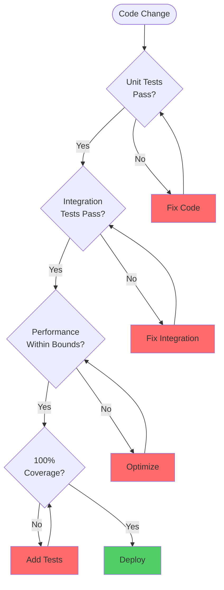
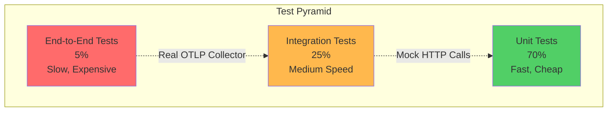
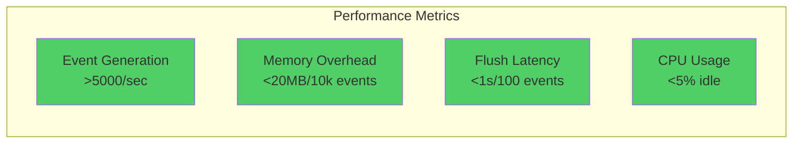
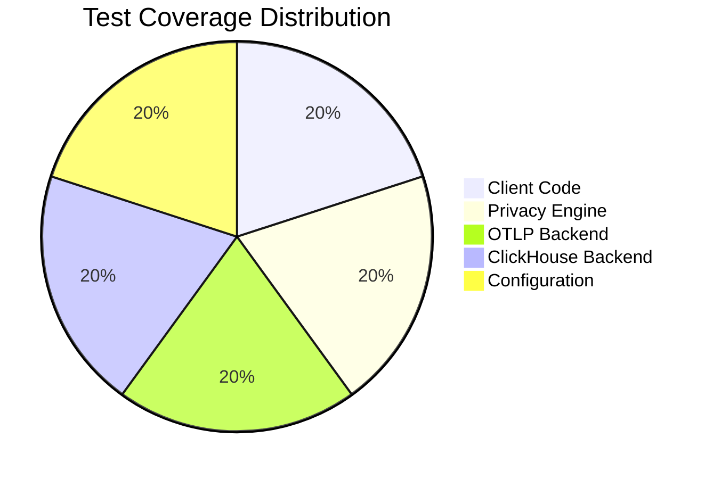

# Testing Guide

<p align="center">
  <strong>🧪 Complete testing guide for Automagik Telemetry SDK</strong><br>
  Unit tests, integration tests, performance benchmarks, and CI/CD integration
</p>

---

## Table of Contents

- [Testing Philosophy](#testing-philosophy)
- [Test Pyramid](#test-pyramid)
- [Unit Testing](#unit-testing)
- [Integration Testing](#integration-testing)
- [Performance Testing](#performance-testing)
- [CI/CD Integration](#cicd-integration)
- [Coverage Requirements](#coverage-requirements)

---

## Testing Philosophy

### Core Principles

| Principle | Implementation | Why |
|-----------|---------------|-----|
| **100% Coverage** | Every line tested | Catch regressions early |
| **Test Isolation** | No shared state | Reliable, reproducible tests |
| **Fast Feedback** | Unit tests < 1s | Developer productivity |
| **Real Scenarios** | Integration tests | Validate real-world usage |
| **Performance Validated** | Benchmark tests | Prevent performance regressions |
| **Privacy Tested** | PII detection tests | Ensure compliance |

### Testing Strategy



---

## Test Pyramid

### Overview



### Test Distribution

| Test Type | Count | Speed | Purpose | Example |
|-----------|-------|-------|---------|---------|
| **Unit Tests** | ~150 | <1s total | Test individual functions | `test_sanitize_email()` |
| **Integration Tests** | ~40 | 30-60s | Test component interactions | `test_fastapi_integration()` |
| **E2E Tests** | ~10 | 2-5min | Test full system | `test_real_otlp_collector()` |

---

## Unit Testing

### Python Unit Tests

#### Setup

```bash
cd python

# Install test dependencies
pip install -e ".[dev]"

# Run all unit tests
pytest -v

# Run with coverage
pytest --cov=automagik_telemetry --cov-report=html

# Run specific test file
pytest tests/test_client.py -v

# Run specific test
pytest tests/test_client.py::test_track_event -v
```

#### Test Structure

```python
"""
Test file: tests/test_client.py

Structure:
- Setup/teardown fixtures
- Test classes organized by functionality
- Descriptive test names
- Docstrings explaining what is tested
"""
import pytest
from automagik_telemetry import AutomagikTelemetry, MetricType

@pytest.fixture
def client():
    """Create a test client with disabled backend."""
    return AutomagikTelemetry(
        project_name="test-app",
        version="1.0.0",
        disabled=True  # Don't send during tests
    )

class TestEventTracking:
    """Tests for event tracking functionality."""

    def test_track_event_basic(self, client):
        """Test tracking a basic event."""
        # Act
        client.track_event("test.event", {"key": "value"})

        # Assert
        assert client._event_count > 0  # Internal tracking

    def test_track_event_with_none_attributes(self, client):
        """Test event tracking with None attributes."""
        # Should not raise
        client.track_event("test.event", None)

    def test_track_event_sanitizes_pii(self, client):
        """Test that PII is sanitized from event attributes."""
        # Arrange
        attributes = {
            "email": "user@example.com",
            "safe_field": "safe_value"
        }

        # Act
        client.track_event("test.event", attributes)

        # Assert
        # Email should be sanitized
        assert "email" not in client._last_event_attributes
        assert "safe_field" in client._last_event_attributes

class TestMetricTracking:
    """Tests for metric tracking functionality."""

    def test_track_counter(self, client):
        """Test counter metric tracking."""
        client.track_metric(
            "test.counter",
            value=1,
            metric_type=MetricType.COUNTER
        )

        assert client._last_metric_type == "counter"

    def test_track_gauge(self, client):
        """Test gauge metric tracking."""
        client.track_metric(
            "test.gauge",
            value=42.5,
            metric_type=MetricType.GAUGE
        )

        assert client._last_metric_value == 42.5

    def test_track_histogram(self, client):
        """Test histogram metric tracking."""
        client.track_metric(
            "test.histogram",
            value=125.3,
            metric_type=MetricType.HISTOGRAM
        )

        assert client._last_metric_type == "histogram"
```

#### Privacy Tests

```python
"""
Test file: tests/test_privacy.py

Critical tests for PII detection and sanitization.
"""
import pytest
from automagik_telemetry.privacy import (
    sanitize_attributes,
    detect_email,
    detect_phone,
    hash_sensitive
)

class TestPIIDetection:
    """Tests for PII detection."""

    @pytest.mark.parametrize("email", [
        "user@example.com",
        "test.user@subdomain.example.com",
        "user+tag@example.co.uk"
    ])
    def test_detect_email(self, email):
        """Test email detection with various formats."""
        assert detect_email(email) is True

    @pytest.mark.parametrize("phone", [
        "+1234567890",
        "123-456-7890",
        "(123) 456-7890",
        "+44 20 7123 4567"
    ])
    def test_detect_phone(self, phone):
        """Test phone number detection."""
        assert detect_phone(phone) is True

    def test_sanitize_removes_email(self):
        """Test that email is removed from attributes."""
        attrs = {"email": "user@example.com", "name": "Test"}

        clean = sanitize_attributes(attrs)

        assert "email" not in clean
        assert "name" in clean

    def test_sanitize_hashes_user_id(self):
        """Test that user IDs are hashed."""
        attrs = {"user_id": "12345"}

        clean = sanitize_attributes(attrs)

        assert "user_id_hash" in clean
        assert clean["user_id_hash"] != "12345"
        assert len(clean["user_id_hash"]) == 16  # SHA-256 truncated

    def test_sanitize_removes_api_keys(self):
        """Test that API keys are completely removed."""
        attrs = {
            "api_key": "sk-1234567890",
            "token": "ghp_abcdefg",
            "safe_key": "safe_value"
        }

        clean = sanitize_attributes(attrs)

        assert "api_key" not in clean
        assert "token" not in clean
        assert "safe_key" in clean
```

### TypeScript Unit Tests

#### Setup

```bash
cd typescript

# Install dependencies
pnpm install

# Run all tests
pnpm test

# Run with coverage
pnpm test -- --coverage

# Run specific test file
pnpm test -- client.test.ts

# Run in watch mode
pnpm test -- --watch
```

#### Test Structure

```typescript
/**
 * Test file: src/__tests__/client.test.ts
 */
import { AutomagikTelemetry, MetricType } from '../client';

describe('AutomagikTelemetry', () => {
  let client: AutomagikTelemetry;

  beforeEach(() => {
    // Create fresh client for each test
    client = new AutomagikTelemetry({
      projectName: 'test-app',
      version: '1.0.0',
      disabled: true  // Don't send during tests
    });
  });

  afterEach(() => {
    // Cleanup
    client.shutdown();
  });

  describe('Event Tracking', () => {
    it('should track basic event', () => {
      // Act
      client.trackEvent('test.event', { key: 'value' });

      // Assert
      expect(client['_eventCount']).toBeGreaterThan(0);
    });

    it('should handle null attributes', () => {
      // Should not throw
      expect(() => {
        client.trackEvent('test.event', null);
      }).not.toThrow();
    });

    it('should sanitize PII from attributes', () => {
      // Arrange
      const attributes = {
        email: 'user@example.com',
        safeField: 'safe_value'
      };

      // Act
      client.trackEvent('test.event', attributes);

      // Assert
      const lastEvent = client['_lastEventAttributes'];
      expect(lastEvent).not.toHaveProperty('email');
      expect(lastEvent).toHaveProperty('safeField');
    });
  });

  describe('Metric Tracking', () => {
    it('should track counter metric', () => {
      client.trackMetric('test.counter', 1, MetricType.COUNTER);

      expect(client['_lastMetricType']).toBe('counter');
    });

    it('should track gauge metric', () => {
      client.trackMetric('test.gauge', 42.5, MetricType.GAUGE);

      expect(client['_lastMetricValue']).toBe(42.5);
    });

    it('should track histogram metric', () => {
      client.trackMetric('test.histogram', 125.3, MetricType.HISTOGRAM);

      expect(client['_lastMetricType']).toBe('histogram');
    });
  });
});
```

#### Privacy Tests

```typescript
/**
 * Test file: src/__tests__/privacy.test.ts
 */
import {
  sanitizeAttributes,
  detectEmail,
  detectPhone,
  hashSensitive
} from '../privacy';

describe('PII Detection', () => {
  describe('Email Detection', () => {
    it.each([
      'user@example.com',
      'test.user@subdomain.example.com',
      'user+tag@example.co.uk'
    ])('should detect email: %s', (email) => {
      expect(detectEmail(email)).toBe(true);
    });
  });

  describe('Phone Detection', () => {
    it.each([
      '+1234567890',
      '123-456-7890',
      '(123) 456-7890',
      '+44 20 7123 4567'
    ])('should detect phone: %s', (phone) => {
      expect(detectPhone(phone)).toBe(true);
    });
  });

  describe('Sanitization', () => {
    it('should remove email from attributes', () => {
      const attrs = { email: 'user@example.com', name: 'Test' };

      const clean = sanitizeAttributes(attrs);

      expect(clean).not.toHaveProperty('email');
      expect(clean).toHaveProperty('name');
    });

    it('should hash user IDs', () => {
      const attrs = { user_id: '12345' };

      const clean = sanitizeAttributes(attrs);

      expect(clean).toHaveProperty('user_id_hash');
      expect(clean.user_id_hash).not.toBe('12345');
      expect(clean.user_id_hash).toHaveLength(16);
    });

    it('should remove API keys completely', () => {
      const attrs = {
        api_key: 'sk-1234567890',
        token: 'ghp_abcdefg',
        safe_key: 'safe_value'
      };

      const clean = sanitizeAttributes(attrs);

      expect(clean).not.toHaveProperty('api_key');
      expect(clean).not.toHaveProperty('token');
      expect(clean).toHaveProperty('safe_key');
    });
  });
});
```

---

## Integration Testing

### Overview

Integration tests validate end-to-end functionality with real backends and services. We have two main categories:
1. **OTLP Backend Integration** - Tests against OTLP collectors
2. **ClickHouse Backend Integration** - Tests against ClickHouse database

Both SDKs support both backends with comprehensive test coverage.

### Python Integration Tests

#### Quick Start

```bash
# Install dependencies
pip install -e ".[dev,integration]"

# Run all integration tests
pytest -v -m integration

# Run specific test file
pytest -v tests/test_integration_fastapi.py

# Skip integration tests (unit tests only)
pytest -v -m "not integration"

# Run with output visible
pytest -v -s -m integration
```

#### Environment Variables

- `AUTOMAGIK_TELEMETRY_ENABLED=true` - Enable telemetry (required for tests)
- `AUTOMAGIK_TELEMETRY_ENDPOINT` - Override collector endpoint
- `AUTOMAGIK_TELEMETRY_VERBOSE=true` - Enable verbose output
- `AUTOMAGIK_TELEMETRY_BACKEND` - Backend type (`clickhouse` or `otlp`)
- `AUTOMAGIK_TELEMETRY_CLICKHOUSE_ENDPOINT` - ClickHouse HTTP endpoint (default: `http://localhost:8123`)
- `AUTOMAGIK_TELEMETRY_CLICKHOUSE_DATABASE` - Database name (default: `telemetry`)
- `AUTOMAGIK_TELEMETRY_CLICKHOUSE_TABLE` - Table name (default: `traces`)

#### Test Organization

```
python/tests/
├── test_integration_fastapi.py     # FastAPI integration
├── test_integration_throughput.py  # High-volume tests
├── test_integration_otlp.py        # Real OTLP collector tests
├── test_integration_memory.py      # Memory leak detection
└── integration/
    ├── __init__.py
    ├── test_clickhouse_integration.py  # ClickHouse backend tests
    └── README.md                       # ClickHouse integration docs
```

#### Test Files Overview

| File | Description | Requirements |
|------|-------------|--------------|
| `test_integration_fastapi.py` | FastAPI integration with HTTP servers | fastapi, httpx |
| `test_integration_throughput.py` | High-throughput and sustained load | psutil (optional) |
| `test_integration_otlp.py` | Real OTLP collector communication | Network access |
| `test_integration_memory.py` | Memory leak detection | psutil |
| `integration/test_clickhouse_integration.py` | ClickHouse backend tests | ClickHouse running |

#### FastAPI Integration Test

```python
"""
Test file: tests/integration/test_fastapi_integration.py

Tests telemetry integration with FastAPI.
"""
import pytest
from fastapi import FastAPI
from fastapi.testclient import TestClient
from automagik_telemetry import AutomagikTelemetry, MetricType
import time

@pytest.fixture
def app():
    """Create FastAPI app with telemetry."""
    app = FastAPI()
    telemetry = AutomagikTelemetry(
        project_name="test-api",
        version="1.0.0",
        batch_size=1
    )

    @app.get("/health")
    def health():
        return {"status": "healthy"}

    @app.post("/api/v1/items")
    async def create_item(name: str):
        start = time.time()

        # Simulate work
        await asyncio.sleep(0.1)

        # Track event
        telemetry.track_event("item.created", {"name": name})

        # Track latency
        duration_ms = (time.time() - start) * 1000
        telemetry.track_metric(
            "api.latency_ms",
            duration_ms,
            MetricType.HISTOGRAM
        )

        return {"id": 1, "name": name}

    return app, telemetry

@pytest.mark.integration
def test_fastapi_basic_request(app):
    """Test basic FastAPI request with telemetry."""
    app, telemetry = app
    client = TestClient(app)

    # Act
    response = client.post("/api/v1/items?name=test")

    # Assert
    assert response.status_code == 200
    assert telemetry._event_count > 0

@pytest.mark.integration
@pytest.mark.asyncio
async def test_fastapi_concurrent_requests(app):
    """Test concurrent requests."""
    app, telemetry = app
    client = TestClient(app)

    # Act - Send 100 concurrent requests
    tasks = [
        client.post(f"/api/v1/items?name=item_{i}")
        for i in range(100)
    ]

    # Wait for all
    responses = await asyncio.gather(*tasks)

    # Assert
    assert all(r.status_code == 200 for r in responses)
    assert telemetry._event_count >= 100
```

#### High-Throughput Test

```python
"""
Test file: tests/integration/test_throughput.py

Tests SDK performance under high load.
"""
import pytest
from automagik_telemetry import AutomagikTelemetry, MetricType
import time
import threading

@pytest.mark.integration
@pytest.mark.performance
def test_high_throughput_burst():
    """Test burst of 1000 events."""
    client = AutomagikTelemetry(
        project_name="perf-test",
        version="1.0.0",
        batch_size=100
    )

    start = time.time()

    # Send 1000 events
    for i in range(1000):
        client.track_event(f"event.{i}", {"index": i})

    # Flush
    client.flush()

    duration = time.time() - start

    # Assert
    assert duration < 2.0  # Should complete in < 2s
    print(f"✅ Sent 1000 events in {duration:.2f}s ({1000/duration:.0f} events/sec)")

@pytest.mark.integration
@pytest.mark.performance
def test_sustained_throughput():
    """Test sustained throughput (1000 events/sec for 10s)."""
    client = AutomagikTelemetry(
        project_name="perf-test",
        version="1.0.0",
        batch_size=500
    )

    total_events = 0
    start_time = time.time()
    duration = 10  # Run for 10 seconds

    while time.time() - start_time < duration:
        # Send events in batches
        for i in range(100):
            client.track_event("sustained.event", {"index": total_events + i})

        total_events += 100
        time.sleep(0.1)  # 100ms between batches = 1000 events/sec

    client.flush()
    elapsed = time.time() - start_time

    # Assert
    throughput = total_events / elapsed
    assert throughput >= 900  # At least 900 events/sec
    print(f"✅ Sustained {throughput:.0f} events/sec for {elapsed:.1f}s")

@pytest.mark.integration
@pytest.mark.performance
def test_concurrent_producers():
    """Test multiple threads sending events concurrently."""
    client = AutomagikTelemetry(
        project_name="perf-test",
        version="1.0.0",
        batch_size=100
    )

    def producer(thread_id: int, count: int):
        """Producer thread."""
        for i in range(count):
            client.track_event(f"thread.{thread_id}.event", {"index": i})

    # Create 10 threads, each sending 100 events
    threads = [
        threading.Thread(target=producer, args=(i, 100))
        for i in range(10)
    ]

    start = time.time()

    # Start all threads
    for thread in threads:
        thread.start()

    # Wait for completion
    for thread in threads:
        thread.join()

    client.flush()
    duration = time.time() - start

    # Assert
    assert duration < 5.0  # Should complete in < 5s
    print(f"✅ 10 threads sent 1000 total events in {duration:.2f}s")
```

#### Real Collector Test

```python
"""
Test file: tests/integration/test_otlp_collector.py

Tests against real OTLP collector.
Requires: Network access to https://telemetry.namastex.ai
"""
import pytest
from automagik_telemetry import AutomagikTelemetry, MetricType
import os

@pytest.fixture
def real_client():
    """Client configured for real collector."""
    return AutomagikTelemetry(
        project_name="integration-test",
        version="1.0.0",
        endpoint=os.getenv(
            "AUTOMAGIK_TELEMETRY_ENDPOINT",
            "https://telemetry.namastex.ai"
        ),
        disabled=False  # Actually send!
    )

@pytest.mark.integration
@pytest.mark.network
def test_send_trace_to_collector(real_client):
    """Test sending a trace to real collector."""
    # Act
    real_client.track_event("integration_test.trace", {
        "test_id": "trace_001",
        "timestamp": time.time()
    })

    # Flush immediately
    real_client.flush()

    # Assert - No exceptions means success
    # Verify in Grafana manually

@pytest.mark.integration
@pytest.mark.network
def test_send_all_metric_types(real_client):
    """Test sending all metric types."""
    # Counter
    real_client.track_metric(
        "integration_test.counter",
        1,
        MetricType.COUNTER
    )

    # Gauge
    real_client.track_metric(
        "integration_test.gauge",
        42.5,
        MetricType.GAUGE
    )

    # Histogram
    real_client.track_metric(
        "integration_test.histogram",
        125.3,
        MetricType.HISTOGRAM
    )

    real_client.flush()

@pytest.mark.integration
@pytest.mark.network
def test_large_payload_with_compression(real_client):
    """Test large payload is compressed."""
    # Create large payload
    large_attrs = {f"key_{i}": f"value_{i}" for i in range(1000)}

    # Send event
    real_client.track_event("integration_test.large", large_attrs)

    real_client.flush()
```

### TypeScript Integration Tests

#### Quick Start

```bash
# Install dependencies
pnpm install

# Run all tests
pnpm test

# Run only integration tests
pnpm test -- integration.test.ts

# Run ClickHouse integration tests
pnpm test:integration:clickhouse

# Run with verbose output
pnpm test -- --verbose integration.test.ts

# Enable integration tests in CI
RUN_INTEGRATION_TESTS=true pnpm test
```

#### Environment Variables

- `AUTOMAGIK_TELEMETRY_ENABLED=true` - Enable telemetry (required for tests)
- `AUTOMAGIK_TELEMETRY_ENDPOINT` - Override collector endpoint
- `AUTOMAGIK_TELEMETRY_VERBOSE=true` - Enable verbose output
- `RUN_INTEGRATION_TESTS=true` - Run integration tests in CI
- `CLICKHOUSE_ENDPOINT=http://localhost:8123` - ClickHouse endpoint
- `CLICKHOUSE_DATABASE=telemetry` - Database name
- `CLICKHOUSE_TABLE=traces` - Table name
- `CLICKHOUSE_USERNAME=default` - Username
- `CLICKHOUSE_PASSWORD=` - Password

#### NPM Scripts

```json
{
  "scripts": {
    "test:unit": "jest --coverage --testPathIgnorePatterns=integration",
    "test:integration": "RUN_INTEGRATION_TESTS=true jest integration.test.ts --coverage=false",
    "test:integration:clickhouse": "RUN_INTEGRATION_TESTS=true jest clickhouse.integration.test.ts --coverage=false",
    "test:watch": "jest --watch"
  }
}
```

#### Test Organization

```
typescript/tests/
├── integration.test.ts             # OTLP integration tests
├── clickhouse.integration.test.ts  # ClickHouse backend tests
├── run-clickhouse-tests.sh         # Helper script with prerequisite checks
├── CLICKHOUSE_INTEGRATION_README.md
├── CLICKHOUSE_TESTS_SUMMARY.md
└── INTEGRATION_TESTS_README.md
```

#### Test Suites Overview

**integration.test.ts** contains:
1. **Express/Fastify Integration** - HTTP server integration
2. **High-Throughput Tests** - Sustained high load scenarios
3. **Real OTLP Collector Integration** - Network tests with real backend
4. **Memory Leak Detection** - Long-running memory stability tests
5. **Error Handling** - Graceful failure scenarios
6. **Configuration** - Custom endpoint and batch configuration

**Common Commands:**
```bash
# Run specific test suite
pnpm test -- --testNamePattern="Real OTLP Collector"

# Run specific test
pnpm test -- --testNamePattern="should handle burst of 1000 events"

# Run with memory profiling
node --expose-gc node_modules/.bin/jest integration.test.ts
```

#### Express Integration Test

```typescript
/**
 * Test file: tests/integration.test.ts
 */
import { AutomagikTelemetry, MetricType } from '../src/client';
import express, { Request, Response } from 'express';
import request from 'supertest';

describe('Express Integration', () => {
  let app: express.Application;
  let telemetry: AutomagikTelemetry;

  beforeEach(() => {
    telemetry = new AutomagikTelemetry({
      projectName: 'test-api',
      version: '1.0.0',
      batchSize: 1
    });

    app = express();

    app.post('/api/v1/items', async (req: Request, res: Response) => {
      const start = Date.now();

      // Simulate work
      await new Promise(resolve => setTimeout(resolve, 100));

      // Track event
      telemetry.trackEvent('item.created', { name: req.query.name });

      // Track latency
      const duration = Date.now() - start;
      telemetry.trackMetric('api.latency_ms', duration, MetricType.HISTOGRAM);

      res.json({ id: 1, name: req.query.name });
    });
  });

  afterEach(() => {
    telemetry.shutdown();
  });

  it('should handle basic request with telemetry', async () => {
    const response = await request(app)
      .post('/api/v1/items?name=test')
      .expect(200);

    expect(response.body.name).toBe('test');
    expect(telemetry['_eventCount']).toBeGreaterThan(0);
  });

  it('should handle concurrent requests', async () => {
    // Send 100 concurrent requests
    const promises = Array.from({ length: 100 }, (_, i) =>
      request(app).post(`/api/v1/items?name=item_${i}`)
    );

    const responses = await Promise.all(promises);

    expect(responses.every(r => r.status === 200)).toBe(true);
    expect(telemetry['_eventCount']).toBeGreaterThanOrEqual(100);
  });
});
```

---

## Integration Testing - ClickHouse Backend

### Overview

The ClickHouse backend integration tests verify that both SDKs can successfully:
- Send telemetry data directly to ClickHouse
- Use both environment variable and config object configuration
- Handle batch processing and high throughput
- Switch between OTLP and ClickHouse backends
- Store and retrieve data correctly from ClickHouse

### Prerequisites

#### 1. ClickHouse Running

The tests require a running ClickHouse instance with the telemetry database and schema initialized.

**Start ClickHouse using Docker Compose:**

```bash
cd infra
docker compose up -d clickhouse
```

**Verify ClickHouse is running:**

```bash
curl http://localhost:8123
# Expected output: Ok.

# Check the database is initialized
curl "http://localhost:8123/?query=SHOW%20DATABASES" | grep telemetry

# Check schema
curl "http://localhost:8123/?query=SHOW%20TABLES%20FROM%20telemetry"
# Expected output should include: traces
```

#### 2. Install Dependencies

**Python:**
```bash
cd python
pip install -e ".[dev,integration]"
```

**TypeScript:**
```bash
cd typescript
pnpm install
```

### Python ClickHouse Integration Tests

#### Running Tests

```bash
# From repository root
pytest -v python/tests/integration/

# Or from python directory
cd python
pytest -v tests/integration/

# Run only ClickHouse integration tests
pytest -v python/tests/integration/test_clickhouse_integration.py

# Run with verbose output (see print statements)
pytest -v -s python/tests/integration/test_clickhouse_integration.py

# Run specific test
pytest -v python/tests/integration/test_clickhouse_integration.py::test_track_single_event_to_clickhouse

# Skip integration tests (when running all tests)
pytest -v python/tests/ -m "not integration"

# Run only integration tests
pytest -v python/tests/ -m integration
```

#### Test Coverage

The Python ClickHouse test suite (`test_clickhouse_integration.py`) covers:

1. **Backend Initialization**
   - `test_clickhouse_backend_initialization` - Verify ClickHouse backend is properly set up

2. **End-to-End Flow**
   - `test_track_single_event_to_clickhouse` - Track one event and verify in database
   - `test_track_multiple_events_to_clickhouse` - Track batch of 10 events
   - `test_track_event_with_error_status` - Track error and verify error status

3. **Data Structure**
   - `test_verify_data_structure_in_clickhouse` - Verify schema matches ClickHouse table
   - `test_query_count_by_project` - Query event counts by project
   - `test_query_events_by_timerange` - Query events by time range

4. **Configuration**
   - `test_backend_configuration_from_env` - Configure via environment variables
   - `test_backend_configuration_from_config` - Configure via TelemetryConfig object
   - `test_backend_default_to_otlp` - Verify default backend is OTLP
   - `test_backend_switching` - Switch between OTLP and ClickHouse backends

5. **Data Verification**
   - `test_user_and_session_tracking` - Verify user_id and session_id are tracked
   - `test_system_information_tracking` - Verify OS and runtime info is tracked

#### Test Fixtures

Key fixtures in Python tests:
- `clickhouse_endpoint` - ClickHouse HTTP endpoint URL
- `clickhouse_available` - Checks ClickHouse availability, skips tests if not available
- `test_project_name` - Generates unique project name for test isolation
- `clickhouse_client` - Pre-configured AutomagikTelemetry client with ClickHouse backend

#### Cleanup

Tests automatically clean up test data after each test run using the `cleanup_test_data()` function. Test data is isolated by using unique project names for each test run.

### TypeScript ClickHouse Integration Tests

#### Running Tests

```bash
# Run all ClickHouse integration tests
RUN_INTEGRATION_TESTS=true npm test -- clickhouse.integration.test.ts

# Using npm script (recommended)
npm run test:integration:clickhouse

# Run specific test suite
RUN_INTEGRATION_TESTS=true npm test -- -t "End-to-End Flow"

# Run specific test
RUN_INTEGRATION_TESTS=true npm test -- -t "should send traces to ClickHouse"

# Run with verbose output
RUN_INTEGRATION_TESTS=true npm test -- clickhouse.integration.test.ts --verbose

# Using helper script
./tests/run-clickhouse-tests.sh

# Run specific test with helper script
./tests/run-clickhouse-tests.sh -t "Performance"
```

#### Test Coverage

The TypeScript integration test suite includes **18 comprehensive tests**:

##### 1. End-to-End Flow Tests (3 tests)
- ✅ **Send traces to ClickHouse and verify data**
  - Tracks multiple events with custom attributes
  - Verifies data appears in ClickHouse
  - Validates trace metadata (trace_id, span_id, service_name)

- ✅ **Batch processing**
  - Tests auto-flush after batch size reached
  - Sends 25 events with batch size of 10
  - Verifies all events are stored correctly

- ✅ **High-throughput bursts**
  - Sends 500 events rapidly
  - Measures generation and flush performance
  - Validates all events reach ClickHouse

##### 2. Configuration Tests (3 tests)
- ✅ **Environment variable configuration**
  - Tests AUTOMAGIK_TELEMETRY_BACKEND
  - Tests AUTOMAGIK_TELEMETRY_CLICKHOUSE_* variables
  - Verifies environment-based setup

- ✅ **Config object configuration**
  - Tests explicit backend: "clickhouse"
  - Tests clickhouseEndpoint, clickhouseDatabase, etc.
  - Validates programmatic configuration

- ✅ **Default values**
  - Tests minimal config (only projectName + version + backend)
  - Verifies defaults: localhost:8123, database: telemetry, table: traces
  - Ensures sensible fallbacks work

##### 3. Backend Selection Tests (3 tests)
- ✅ **Switch between OTLP and ClickHouse**
  - Creates client with OTLP backend
  - Creates client with ClickHouse backend
  - Verifies backend-specific behavior

- ✅ **Backward compatibility**
  - Tests default OTLP behavior (no backend specified)
  - Ensures existing code continues working
  - Silent no-op when disabled

- ✅ **Invalid backend handling**
  - Tests with invalid backend name
  - Verifies graceful degradation
  - No exceptions thrown

##### 4. Data Verification Tests (3 tests)
- ✅ **Trace metadata storage**
  - Validates trace_id, span_id format
  - Checks timestamp accuracy
  - Verifies service_name, span_name, status_code

- ✅ **System information capture**
  - Verifies OS, architecture, Node version
  - Checks user_id, session_id presence
  - Validates attribute structure

- ✅ **Special characters in attributes**
  - Tests emoji (🚀🎉)
  - Tests unicode (世界)
  - Tests quotes and newlines
  - Ensures proper escaping/encoding

##### 5. Error Handling Tests (2 tests)
- ✅ **Connection failures**
  - Tests with wrong endpoint (port 9999)
  - Verifies no exceptions thrown
  - Validates silent failure behavior

- ✅ **Invalid credentials**
  - Tests with wrong username/password
  - Ensures graceful degradation
  - No application crashes

##### 6. Performance Tests (1 test)
- ✅ **1000 events with compression**
  - Sends 1000 events in batches of 100
  - Measures generation time (< 2s)
  - Measures total time with flush (< 15s)
  - Verifies all data reaches ClickHouse
  - Reports events/sec rate

#### Test Features

**Automatic Test Data Cleanup:**
- Each test uses unique project name: `test-{suite}-{timestamp}`
- Cleanup runs automatically after each test
- Uses ClickHouse DELETE mutations
- Waits for mutations to complete (2s delay)

**Smart Prerequisites Detection:**
- Tests automatically skip if ClickHouse unavailable
- Helpful error messages with setup instructions
- No false failures in CI without infrastructure

**Wait-for-Data Helper:**
- Polls ClickHouse for data availability
- Maximum 30 attempts with 500ms delay (15s timeout)
- Accounts for ClickHouse's eventual consistency
- Clear timeout error messages

**Performance Measurement:**
- Generation time (event creation)
- Flush time (network + ClickHouse insert)
- Total time (end-to-end)
- Events/sec rate calculation
- Console output with metrics

### Performance Expectations

Based on local testing with Docker ClickHouse:

| Metric | Expected Value |
|--------|----------------|
| **Generation Rate** | > 500 events/sec |
| **Total Throughput** | > 100 events/sec |
| **1000 Events Total Time** | < 15 seconds |
| **Batch of 25** | < 5 seconds |
| **Single Event** | < 2 seconds |

Your results may vary based on:
- Docker resource allocation
- Network latency
- Disk I/O performance
- ClickHouse configuration

### Troubleshooting

#### Tests are Skipped

**Python:**
```
SKIPPED [1] test_clickhouse_integration.py:XX: ClickHouse not available at http://localhost:8123
```

**TypeScript:**
```
⏭️  Skipping ClickHouse integration tests (ClickHouse not available)
```

**Solution:** Start ClickHouse:
```bash
cd infra && docker compose up -d clickhouse
```

#### Connection Timeout

If tests fail with timeout errors:

1. **Check ClickHouse is running:**
   ```bash
   docker ps | grep clickhouse
   ```

2. **Check ClickHouse logs:**
   ```bash
   docker logs automagik-clickhouse
   ```

3. **Verify connectivity:**
   ```bash
   curl http://localhost:8123
   ```

4. **Restart ClickHouse:**
   ```bash
   cd infra
   docker compose restart clickhouse
   ```

#### Data Not Appearing

If tests fail waiting for data:

1. **Check table exists:**
   ```bash
   curl "http://localhost:8123/?query=SHOW%20TABLES%20FROM%20telemetry"
   ```

2. **Manually query the table:**
   ```bash
   curl "http://localhost:8123/?query=SELECT%20count()%20FROM%20telemetry.traces%20FORMAT%20JSON"
   ```

3. **Check for recent data:**
   ```bash
   curl "http://localhost:8123/?query=SELECT%20*%20FROM%20telemetry.traces%20ORDER%20BY%20timestamp%20DESC%20LIMIT%2010%20FORMAT%20JSON"
   ```

4. **View sample data (pretty format):**
   ```bash
   curl "http://localhost:8123/?query=SELECT%20*%20FROM%20telemetry.traces%20ORDER%20BY%20timestamp%20DESC%20LIMIT%205%20FORMAT%20Vertical"
   ```

#### Authentication Errors

If you see authentication errors, check the credentials:

```bash
# Check default user works
curl -u default: http://localhost:8123

# Or with custom credentials
curl -u myuser:mypassword http://localhost:8123
```

#### Schema Errors

If tests fail with schema-related errors (missing table, columns, etc.):

**Re-initialize database:**
```bash
cd infra
docker compose down -v
docker compose up -d clickhouse
```

This will recreate the database with the correct schema from `infra/clickhouse/init-db.sql`.

#### Test Data Pollution

Clean all test data manually:
```bash
curl "http://localhost:8123/?query=ALTER%20TABLE%20telemetry.traces%20DELETE%20WHERE%20project_name%20LIKE%20'test-%25'"
```

### Development Workflow

When developing ClickHouse backend features:

1. **Start infrastructure:**
   ```bash
   cd infra && docker compose up -d clickhouse
   ```

2. **Run tests in watch mode:**
   ```bash
   cd typescript
   RUN_INTEGRATION_TESTS=true npm test -- --watch clickhouse.integration.test.ts
   ```

3. **View ClickHouse data:**
   ```bash
   # Open ClickHouse client
   docker exec -it automagik-clickhouse clickhouse-client

   # Query recent traces
   SELECT * FROM telemetry.traces ORDER BY timestamp DESC LIMIT 10 FORMAT Vertical
   ```

4. **Stop infrastructure:**
   ```bash
   cd infra && docker compose down
   ```

### Custom ClickHouse Instance

If you're using a custom ClickHouse instance:

**Python:**
```bash
AUTOMAGIK_TELEMETRY_BACKEND=clickhouse \
AUTOMAGIK_TELEMETRY_CLICKHOUSE_ENDPOINT=http://my-clickhouse:8123 \
AUTOMAGIK_TELEMETRY_CLICKHOUSE_USERNAME=myuser \
AUTOMAGIK_TELEMETRY_CLICKHOUSE_PASSWORD=mypassword \
pytest -v python/tests/integration/test_clickhouse_integration.py
```

**TypeScript:**
```bash
CLICKHOUSE_ENDPOINT=http://my-clickhouse:8123 \
CLICKHOUSE_USERNAME=myuser \
CLICKHOUSE_PASSWORD=mypassword \
RUN_INTEGRATION_TESTS=true \
npm test -- clickhouse.integration.test.ts
```

---

## Performance Testing

### Benchmark Suite

```python
"""
Test file: tests/performance/test_benchmarks.py

Performance benchmarks with assertions.
"""
import pytest
from automagik_telemetry import AutomagikTelemetry, MetricType
import time
import psutil
import os

@pytest.mark.performance
def test_event_generation_throughput():
    """Test raw event generation speed."""
    client = AutomagikTelemetry(
        project_name="bench",
        version="1.0.0",
        disabled=True  # Skip network
    )

    count = 10000
    start = time.time()

    for i in range(count):
        client.track_event("bench.event", {"index": i})

    duration = time.time() - start
    throughput = count / duration

    # Assert
    assert throughput >= 5000  # At least 5000 events/sec
    print(f"✅ Event generation: {throughput:.0f} events/sec")

@pytest.mark.performance
def test_memory_overhead():
    """Test memory usage for 10,000 events."""
    process = psutil.Process(os.getpid())
    memory_before = process.memory_info().rss / 1024 / 1024  # MB

    client = AutomagikTelemetry(
        project_name="bench",
        version="1.0.0",
        batch_size=10000  # Don't flush
    )

    # Generate 10,000 events
    for i in range(10000):
        client.track_event("bench.event", {"index": i})

    memory_after = process.memory_info().rss / 1024 / 1024  # MB
    memory_used = memory_after - memory_before

    # Assert
    assert memory_used < 20  # Less than 20 MB
    print(f"✅ Memory overhead for 10k events: {memory_used:.1f} MB")

@pytest.mark.performance
def test_flush_latency():
    """Test flush latency for 100 events."""
    client = AutomagikTelemetry(
        project_name="bench",
        version="1.0.0",
        batch_size=100
    )

    # Queue 100 events
    for i in range(100):
        client.track_event("bench.event", {"index": i})

    # Measure flush time
    start = time.time()
    client.flush()
    flush_time = time.time() - start

    # Assert
    assert flush_time < 1.0  # Less than 1 second
    print(f"✅ Flush 100 events: {flush_time*1000:.0f}ms")
```

### Performance Dashboard



---

## CI/CD Integration

### GitHub Actions Workflow

```yaml
# File: .github/workflows/test.yml
name: Test Suite

on:
  push:
    branches: [main, develop]
  pull_request:
    branches: [main]

jobs:
  python-tests:
    name: Python Tests
    runs-on: ubuntu-latest
    strategy:
      matrix:
        python-version: ['3.12']

    steps:
      - uses: actions/checkout@v3

      - name: Set up Python ${{ matrix.python-version }}
        uses: actions/setup-python@v4
        with:
          python-version: ${{ matrix.python-version }}

      - name: Install dependencies
        run: |
          cd python
          pip install -e ".[dev,integration]"

      - name: Run unit tests
        run: |
          cd python
          pytest -v -m "not integration" --cov=automagik_telemetry --cov-report=xml

      - name: Run integration tests
        run: |
          cd python
          pytest -v -m integration
        env:
          AUTOMAGIK_TELEMETRY_ENABLED: true

      - name: Upload coverage to Codecov
        uses: codecov/codecov-action@v3
        with:
          file: ./python/coverage.xml
          flags: python
          fail_ci_if_error: true

  typescript-tests:
    name: TypeScript Tests
    runs-on: ubuntu-latest
    strategy:
      matrix:
        node-version: ['18', '20']

    steps:
      - uses: actions/checkout@v3

      - name: Setup Node.js ${{ matrix.node-version }}
        uses: actions/setup-node@v3
        with:
          node-version: ${{ matrix.node-version }}

      - name: Install pnpm
        uses: pnpm/action-setup@v2
        with:
          version: 8

      - name: Install dependencies
        run: |
          cd typescript
          pnpm install

      - name: Run tests
        run: |
          cd typescript
          pnpm test -- --coverage

      - name: Upload coverage to Codecov
        uses: codecov/codecov-action@v3
        with:
          file: ./typescript/coverage/lcov.info
          flags: typescript
          fail_ci_if_error: true

  clickhouse-integration-tests:
    name: ClickHouse Integration Tests
    runs-on: ubuntu-latest
    if: github.event_name == 'pull_request'

    steps:
      - uses: actions/checkout@v3

      - name: Start ClickHouse
        run: |
          cd infra
          docker compose up -d clickhouse
          sleep 10  # Wait for initialization

      - name: Verify ClickHouse is running
        run: |
          timeout 30 bash -c 'until curl -s http://localhost:8123/?query=SELECT%201 > /dev/null; do sleep 1; done'

      - name: Python ClickHouse Tests
        run: |
          cd python
          pip install -e ".[dev,integration]"
          pytest -v tests/integration/test_clickhouse_integration.py
        env:
          AUTOMAGIK_TELEMETRY_ENABLED: true
          AUTOMAGIK_TELEMETRY_BACKEND: clickhouse

      - name: Setup Node.js
        uses: actions/setup-node@v3
        with:
          node-version: '20'

      - name: Install pnpm
        uses: pnpm/action-setup@v2
        with:
          version: 8

      - name: TypeScript ClickHouse Tests
        run: |
          cd typescript
          pnpm install
          npm run test:integration:clickhouse
        env:
          CLICKHOUSE_ENDPOINT: http://localhost:8123

  performance-tests:
    name: Performance Tests
    runs-on: ubuntu-latest
    if: github.event_name == 'pull_request'

    steps:
      - uses: actions/checkout@v3

      - name: Set up Python
        uses: actions/setup-python@v4
        with:
          python-version: '3.12'

      - name: Install dependencies
        run: |
          cd python
          pip install -e ".[dev,integration]"
          pip install psutil

      - name: Run performance benchmarks
        run: |
          cd python
          pytest -v -m performance --benchmark-only

      - name: Comment PR with results
        uses: actions/github-script@v6
        with:
          script: |
            github.rest.issues.createComment({
              issue_number: context.issue.number,
              owner: context.repo.owner,
              repo: context.repo.repo,
              body: '✅ Performance tests passed!'
            })
```

### Test Coverage Badge

Add to README.md:

```markdown
[](https://codecov.io/gh/namastexlabs/automagik-telemetry)
```

---

## Coverage Requirements

### Coverage Targets



### Coverage Verification

**Python:**
```bash
cd python

# Generate coverage report
pytest --cov=automagik_telemetry --cov-report=html --cov-report=term

# View HTML report
open htmlcov/index.html

# Fail if coverage < 100%
pytest --cov=automagik_telemetry --cov-fail-under=100
```

**TypeScript:**
```bash
cd typescript

# Generate coverage report
pnpm test -- --coverage

# View HTML report
open coverage/lcov-report/index.html

# Coverage threshold in jest.config.js:
# coverageThreshold: {
#   global: {
#     branches: 100,
#     functions: 100,
#     lines: 100,
#     statements: 100
#   }
# }
```

### Coverage Matrix

| Module | Python Coverage | TypeScript Coverage | Target |
|--------|----------------|---------------------|--------|
| **Client** | 100% | 100% | 100% |
| **Privacy** | 100% | 100% | 100% |
| **OTLP Backend** | 100% | 100% | 100% |
| **ClickHouse Backend** | 100% | 100% | 100% |
| **Configuration** | 100% | 100% | 100% |
| **Opt-In** | 100% | 100% | 100% |
| **Overall** | **100%** | **100%** | **100%** |

---

## Related Documentation

- **[ARCHITECTURE.md](ARCHITECTURE.md)** - System architecture and design
- **[IMPLEMENTATION.md](IMPLEMENTATION.md)** - Implementation patterns
- **[SDK_DIFFERENCES.md](SDK_DIFFERENCES.md)** - Cross-SDK comparison
- **[CONTRIBUTING.md](CONTRIBUTING.md)** - Development workflow

---

<p align="center">
  <strong>Built with ❤️ by <a href="https://namastex.ai">Namastex Labs</a></strong><br>
  <em>100% test coverage. Production-ready quality.</em>
</p>
