# ⚡ Get Started in 5 Minutes

<p align="center">
  <strong>From zero to sending telemetry in just 5 minutes!</strong><br>
  Privacy-first. Zero dependencies. Production-ready.
</p>

---

## 📋 Prerequisites Checklist

Before you begin, make sure you have:

- [ ] **Python 3.12+** or **Node.js 18+** installed
- [ ] Basic understanding of your project structure
- [ ] 5 minutes of your time ⏱️

> [!TIP]
> Not sure which SDK to use? Pick Python for backend services and data pipelines. Pick TypeScript for web apps and Node.js services.

---

## 🚀 Installation

<details open>
<summary><strong>🐍 Python Installation</strong></summary>

```bash
# Using pip
pip install automagik-telemetry

# Or using uv (recommended)
uv add automagik-telemetry
```

**Verify installation:**
```bash
python -c "from automagik_telemetry import AutomagikTelemetry; print('✅ Ready!')"
```

</details>

<details>
<summary><strong>📘 TypeScript Installation</strong></summary>

```bash
# Using pnpm (recommended)
pnpm add automagik-telemetry

# Or using npm
npm install automagik-telemetry

# Or using yarn
yarn add automagik-telemetry
```

**Verify installation:**
```bash
node -e "require('automagik-telemetry'); console.log('✅ Ready!')"
```

</details>

---

## 🎯 Your First Event (Step-by-Step)

### Step 1️⃣: Initialize the Client

<details open>
<summary><strong>🐍 Python</strong></summary>

```python
from automagik_telemetry import AutomagikTelemetry, TelemetryConfig

# Create your telemetry client
config = TelemetryConfig(
    project_name="my-awesome-app",  # Your project name
    version="1.0.0"                  # Your app version
)
client = AutomagikTelemetry(config=config)
```

</details>

<details>
<summary><strong>📘 TypeScript</strong></summary>

```typescript
import { AutomagikTelemetry } from 'automagik-telemetry';

// Create your telemetry client
const client = new AutomagikTelemetry({
    projectName: 'my-awesome-app',  // Your project name
    version: '1.0.0'                 // Your app version
});
```

</details>

> [!NOTE]
> The client is automatically disabled in development mode (`ENVIRONMENT=development`). Your telemetry will only be sent in production!

### Step 2️⃣: Send Your First Event

<details open>
<summary><strong>🐍 Python</strong></summary>

```python
# Track a simple event
client.track_event("app.started", {
    "environment": "production",
    "feature_flags": ["new_ui", "dark_mode"]
})

print("✨ Event sent!")
```

</details>

<details>
<summary><strong>📘 TypeScript</strong></summary>

```typescript
// Track a simple event
client.trackEvent('app.started', {
    environment: 'production',
    featureFlags: ['new_ui', 'dark_mode']
});

console.log('✨ Event sent!');
```

</details>

> [!IMPORTANT]
> Events are sent asynchronously and won't block your application. If telemetry fails, your app keeps running!

### Step 3️⃣: Track a Metric

<details open>
<summary><strong>🐍 Python</strong></summary>

```python
from automagik_telemetry import MetricType

# Track a counter (increments)
client.track_metric(
    metric_name="api.requests",
    value=1,
    metric_type=MetricType.COUNTER,
    attributes={
        "endpoint": "/api/users",
        "method": "GET",
        "status": 200
    }
)

# Track a gauge (current value)
client.track_metric(
    metric_name="system.memory_mb",
    value=512.5,
    metric_type=MetricType.GAUGE
)

# Track a histogram (distribution)
client.track_metric(
    metric_name="api.response_time_ms",
    value=125.3,
    metric_type=MetricType.HISTOGRAM
)
```

</details>

<details>
<summary><strong>📘 TypeScript</strong></summary>

```typescript
import { MetricType } from 'automagik-telemetry';

// Track a counter (increments)
client.trackMetric(
    'api.requests',
    1,
    MetricType.COUNTER,
    {
        endpoint: '/api/users',
        method: 'GET',
        status: 200
    }
);

// Track a gauge (current value)
client.trackMetric(
    'system.memory_mb',
    512.5,
    MetricType.GAUGE
);

// Track a histogram (distribution)
client.trackMetric(
    'api.response_time_ms',
    125.3,
    MetricType.HISTOGRAM
);
```

</details>

---

## 🎨 Visual Data Flow

Here's how your telemetry data flows from your app to visualization:

```mermaid
sequenceDiagram
    participant App as Your Application
    participant SDK as Automagik SDK
    participant Privacy as Privacy Checks
    participant OTLP as OTLP Collector
    participant Backend as ClickHouse/Prometheus
    participant Grafana as Grafana Dashboard

    App->>SDK: track_event("user.login")
    SDK->>Privacy: Check environment & consent

    alt Development Mode
        Privacy-->>SDK: ❌ Disabled
        SDK-->>App: (no telemetry sent)
    else Production Mode
        Privacy-->>SDK: ✅ Enabled
        SDK->>OTLP: Send OTLP/HTTP
        OTLP->>Backend: Store metrics
        Backend->>Grafana: Query & visualize
        Grafana-->>App: 📊 Insights!
    end
```



---

## ⚙️ Configuration Quick Reference

### Environment Variables

```bash
# Enable/disable telemetry
export AUTOMAGIK_TELEMETRY_ENABLED=true

# Custom OTLP endpoint (default: https://telemetry.namastex.ai)
export AUTOMAGIK_TELEMETRY_ENDPOINT=https://your-collector.com

# Auto-disable in development
export ENVIRONMENT=development  # No telemetry sent

# Enable verbose logging (great for debugging!)
export AUTOMAGIK_TELEMETRY_VERBOSE=true
```

### Code Configuration

<details open>
<summary><strong>🐍 Python Configuration</strong></summary>

```python
from automagik_telemetry import AutomagikTelemetry, TelemetryConfig

# Simple initialization (minimum required)
config = TelemetryConfig(
    project_name="my-app",
    version="1.0.0"
)
client = AutomagikTelemetry(config=config)

# Advanced configuration with optional parameters
advanced_config = TelemetryConfig(
    project_name="my-app",
    version="1.0.0",
    endpoint="https://custom-collector.com",  # Optional: Custom OTLP endpoint
    organization="my-org",  # Optional: Organization identifier
    timeout=10,  # Optional: Request timeout in seconds

    # Performance features
    batch_size=100,  # Batch 100 events before sending
    flush_interval=5.0,  # Auto-flush every 5 seconds
    compression_enabled=True,  # Gzip compression
    compression_threshold=1024,  # Compress payloads > 1KB

    # ClickHouse backend (alternative to OTLP)
    backend="clickhouse",  # or "otlp" (default)
    clickhouse_endpoint="http://localhost:8123"
)
advanced_client = AutomagikTelemetry(config=advanced_config)
```

> 📚 **Full Details:** See [Python Initialization Guide](PYTHON_INITIALIZATION_GUIDE.md) for complete documentation.

```

</details>

<details>
<summary><strong>📘 TypeScript Configuration</strong></summary>

```typescript
import { AutomagikTelemetry } from 'automagik-telemetry';

// Simple initialization (uses defaults)
const client = new AutomagikTelemetry({
    projectName: 'my-app',
    version: '1.0.0',
    endpoint: 'https://custom-collector.com'  // Optional
});

// Advanced configuration
const advancedClient = new AutomagikTelemetry({
    projectName: 'my-app',
    version: '1.0.0',
    endpoint: 'https://custom-collector.com',  // Optional
    batchSize: 1,  // Send immediately (default: 100 = batched send)
    flushInterval: 5000  // Auto-flush every 5 seconds in ms (default: 5000)
});
```

</details>

---

## 📊 Python vs TypeScript Comparison

| Feature | 🐍 Python | 📘 TypeScript |
|---------|----------|--------------|
| **Naming Convention** | `snake_case` | `camelCase` |
| **Default Batch Size** | `1` (immediate) | `100` (batched) |
| **Best For** | Backend services, data pipelines | Web apps, Node.js services |
| **Async Pattern** | `track_event()` and `track_event_async()` | All methods fire-and-forget |
| **Time Units** | Seconds (float) | Milliseconds (number) |
| **Methods** | `track_event()`, `track_metric()` | `trackEvent()`, `trackMetric()` |

> [!TIP]
> Both SDKs provide identical functionality with 100% test coverage. Choose based on your language preference!

---

## ✅ Verification Steps

### 1. Enable Verbose Mode

```bash
export AUTOMAGIK_TELEMETRY_VERBOSE=true
export AUTOMAGIK_TELEMETRY_ENABLED=true
```

### 2. Run Your Application

<details>
<summary><strong>🐍 Python Example</strong></summary>

```python
from automagik_telemetry import AutomagikTelemetry, TelemetryConfig

config = TelemetryConfig(
    project_name="test-app",
    version="1.0.0"
)
client = AutomagikTelemetry(config=config)

client.track_event("test.event", {"foo": "bar"})
print("✅ Check console for telemetry output!")
```

</details>

<details>
<summary><strong>📘 TypeScript Example</strong></summary>

```typescript
import { AutomagikTelemetry } from 'automagik-telemetry';

const client = new AutomagikTelemetry({
    projectName: 'test-app',
    version: '1.0.0'
});

client.trackEvent('test.event', { foo: 'bar' });
console.log('✅ Check console for telemetry output!');
```

</details>

### 3. Expected Output

```
[Telemetry] Sending event: test.event
  Project: test-app
  Version: 1.0.0
  Data: {
    "foo": "bar"
  }
  Endpoint: https://telemetry.namastex.ai/v1/traces
  Status: ✅ Success (200)
```

> [!NOTE]
> If you see this output, congratulations! Your telemetry is working correctly. 🎉

---

## 🎓 Common Use Cases

### 🔥 Track API Requests

<details>
<summary><strong>🐍 Python</strong></summary>

```python
import time
from automagik_telemetry import MetricType

def handle_request(endpoint: str):
    start = time.time()

    try:
        # Your API logic here
        result = process_request(endpoint)

        # Track successful request
        duration_ms = (time.time() - start) * 1000
        client.track_metric(
            metric_name="api.request_duration",
            value=duration_ms,
            metric_type=MetricType.HISTOGRAM,
            attributes={
                "endpoint": endpoint,
                "status": 200,
                "method": "GET"
            }
        )

        return result

    except Exception as e:
        # Track error
        client.track_event("api.error", {
            "endpoint": endpoint,
            "error_type": type(e).__name__
        })
        raise
```

</details>

<details>
<summary><strong>📘 TypeScript</strong></summary>

```typescript
import { MetricType } from 'automagik-telemetry';

async function handleRequest(endpoint: string) {
    const start = Date.now();

    try {
        // Your API logic here
        const result = await processRequest(endpoint);

        // Track successful request
        const durationMs = Date.now() - start;
        client.trackMetric(
            'api.request_duration',
            durationMs,
            MetricType.HISTOGRAM,
            {
                endpoint,
                status: 200,
                method: 'GET'
            }
        );

        return result;

    } catch (error) {
        // Track error
        client.trackEvent('api.error', {
            endpoint,
            errorType: (error as Error).name
        });
        throw error;
    }
}
```

</details>

### 📈 Track User Actions

<details>
<summary><strong>🐍 Python</strong></summary>

```python
def user_login(user_id: str, method: str):
    client.track_event("user.login", {
        "user_id": user_id,  # Use anonymous IDs, never PII!
        "method": method,     # "oauth", "password", etc.
        "timestamp": time.time()
    })
```

</details>

<details>
<summary><strong>📘 TypeScript</strong></summary>

```typescript
function userLogin(userId: string, method: string) {
    client.trackEvent('user.login', {
        userId,      // Use anonymous IDs, never PII!
        method,      // "oauth", "password", etc.
        timestamp: Date.now()
    });
}
```

</details>

### 💾 Monitor System Resources

<details>
<summary><strong>🐍 Python</strong></summary>

```python
import psutil
from automagik_telemetry import MetricType

def monitor_system():
    # CPU usage
    client.track_metric(
        metric_name="system.cpu_percent",
        value=psutil.cpu_percent(),
        metric_type=MetricType.GAUGE
    )

    # Memory usage
    memory = psutil.virtual_memory()
    client.track_metric(
        metric_name="system.memory_used_mb",
        value=memory.used / 1024 / 1024,
        metric_type=MetricType.GAUGE
    )
```

</details>

<details>
<summary><strong>📘 TypeScript</strong></summary>

```typescript
import os from 'os';
import { MetricType } from 'automagik-telemetry';

function monitorSystem() {
    // CPU usage (requires additional libraries for detailed metrics)
    const loadAvg = os.loadavg()[0];
    client.trackMetric(
        'system.load_average',
        loadAvg,
        MetricType.GAUGE
    );

    // Memory usage
    const totalMem = os.totalmem();
    const freeMem = os.freemem();
    const usedMem = totalMem - freeMem;

    client.trackMetric(
        'system.memory_used_mb',
        usedMem / 1024 / 1024,
        MetricType.GAUGE
    );
}
```

</details>

---

## 🔒 Privacy-First Design

### What We Collect ✅

- ✅ Feature usage counts
- ✅ Error types (no sensitive data)
- ✅ Performance metrics
- ✅ System info (OS, language version)

### What We DON'T Collect ❌

- ❌ User credentials
- ❌ Message content
- ❌ Phone numbers or emails
- ❌ Personal identifiable information (PII)
- ❌ API keys or secrets

> [!IMPORTANT]
> Automagik Telemetry is **opt-in by default**. It's automatically disabled in development environments and requires explicit configuration in production.

### User Control

Users can disable telemetry at any time:

```bash
# Environment variable
export AUTOMAGIK_TELEMETRY_ENABLED=false

# Or create opt-out file
touch ~/.automagik-no-telemetry
```

---

## 🎯 What's Next?

Now that you're up and running, explore these advanced topics:

### 📚 Deep Dives

- **[Architecture Overview](../README.md#-architecture)** - Learn how the system works
- **[Self-Hosting Guide](../infra/README.md)** - Run your own telemetry infrastructure
- **[ClickHouse Backend](../infra/CLICKHOUSE_BACKEND_DESIGN.md)** - Direct database insertion
- **[Integration Tests](DEVELOPER_GUIDES/TESTING.md)** - Testing your telemetry

### 🔧 Advanced Features

- **[Custom Attributes](../README.md#custom-attributes)** - Add context to metrics
- **[Error Tracking](../README.md#error-tracking)** - Monitor errors without exposing sensitive data
- **[Performance Monitoring](../README.md#performance-monitoring)** - Track response times
- **[Backend Switching](../README.md#switching-between-backends)** - OTLP vs ClickHouse

### 🎨 Language-Specific Guides

- **[Python SDK Documentation](../python/README.md)** - Python-specific features
- **[TypeScript SDK Documentation](../typescript/README.md)** - TypeScript-specific features

---

## 🔍 Troubleshooting

<details>
<summary><strong>❓ Events not appearing?</strong></summary>

**Check these common issues:**

1. **Telemetry disabled in development mode**
   ```bash
   export ENVIRONMENT=production
   export AUTOMAGIK_TELEMETRY_ENABLED=true
   ```

2. **Opt-out file exists**
   ```bash
   rm ~/.automagik-no-telemetry
   ```

3. **Network connectivity issues**
   ```bash
   curl -I https://telemetry.namastex.ai
   ```

4. **Enable verbose mode for debugging**
   ```bash
   export AUTOMAGIK_TELEMETRY_VERBOSE=true
   ```

</details>

<details>
<summary><strong>❓ Getting timeout errors?</strong></summary>

**Solutions:**

1. **Increase timeout (Python)**
   ```python
   from automagik_telemetry import AutomagikTelemetry, TelemetryConfig

   config = TelemetryConfig(
       project_name="my-app",
       version="1.0.0",
       timeout=10.0  # 10 seconds
   )
   client = AutomagikTelemetry(config=config)
   ```

2. **Check firewall rules**
   - Ensure outbound HTTPS (port 443) is allowed
   - Default endpoint: `https://telemetry.namastex.ai`

3. **Use self-hosted endpoint**
   ```bash
   export AUTOMAGIK_TELEMETRY_ENDPOINT=http://localhost:4318
   ```

</details>

<details>
<summary><strong>❓ High memory usage?</strong></summary>

**Solutions:**

1. **Reduce batch size (TypeScript)**
   ```typescript
   const client = new AutomagikTelemetry({
       projectName: 'my-app',
       batchSize: 10  // Smaller batches
   });
   ```

2. **Increase flush frequency (Python)**
   ```python
   from automagik_telemetry import AutomagikTelemetry, TelemetryConfig

   config = TelemetryConfig(
       project_name="my-app",
       version="1.0.0",
       flush_interval=1.0  # Flush every second
   )
   client = AutomagikTelemetry(config=config)
   ```

3. **Use immediate send**
   - Python: `batch_size=1`
   - TypeScript: `batchSize=1`

</details>

<details>
<summary><strong>❓ SSL/TLS certificate errors?</strong></summary>

**Solutions:**

1. **Update CA certificates**
   ```bash
   # Ubuntu/Debian
   sudo apt-get update && sudo apt-get install ca-certificates

   # macOS
   brew install ca-certificates
   ```

2. **Use HTTP endpoint for local development**
   ```bash
   export AUTOMAGIK_TELEMETRY_ENDPOINT=http://localhost:4318
   ```

</details>

<details>
<summary><strong>❓ Want to verify no PII is sent?</strong></summary>

**Steps:**

1. **Enable verbose mode**
   ```bash
   export AUTOMAGIK_TELEMETRY_VERBOSE=true
   ```

2. **Run your application**
   - Check console output for all data being sent

3. **Use network inspector**
   ```bash
   # Python
   python -m pip install mitmproxy
   mitmproxy -p 8080

   # Set proxy
   export HTTPS_PROXY=http://localhost:8080
   ```

4. **Review telemetry code**
   - Both SDKs are open source: [github.com/namastexlabs/automagik-telemetry](https://github.com/namastexlabs/automagik-telemetry)

</details>

---

## 💬 Need Help?

We're here to help you succeed!

### 📖 Documentation

- **[Main README](../README.md)** - Complete feature overview
- **[Quick Reference](QUICK_REFERENCE.md)** - Command cheat sheet
- **[Development Guide](DEVELOPER_GUIDES/ARCHITECTURE.md)** - Architecture deep dive
- **[DeepWiki Docs](https://deepwiki.com/namastexlabs/automagik-telemetry)** - AI-powered documentation

### 🤝 Community

- **[GitHub Issues](https://github.com/namastexlabs/automagik-telemetry/issues)** - Report bugs or request features
- **[GitHub Discussions](https://github.com/namastexlabs/automagik-telemetry/discussions)** - Ask questions
- **[Discord Community](https://discord.gg/xcW8c7fF3R)** - Chat with the community
- **[Twitter/X](https://twitter.com/namastexlabs)** - Follow for updates

### 📦 Package Pages

- **[PyPI](https://pypi.org/project/automagik-telemetry/)** - Python package
- **[npm](https://www.npmjs.com/package/automagik-telemetry)** - TypeScript/JavaScript package

---

<p align="center">
  <strong>🎉 Congratulations! You're now sending privacy-first telemetry! 🎉</strong><br>
  <br>
  <em>Built with ❤️ by <a href="https://namastex.ai">Namastex Labs</a></em><br>
  <em>AI that elevates human potential, not replaces it</em>
</p>

<p align="center">
  <a href="https://github.com/namastexlabs/automagik-telemetry">⭐ Star us on GitHub</a> •
  <a href="https://discord.gg/xcW8c7fF3R">💬 Join our Discord</a> •
  <a href="https://twitter.com/namastexlabs">🐦 Follow on Twitter</a>
</p>
