<p align="center">
  
</p>

<h1 align="center">📚 Documentation Hub</h1>

<p align="center">
  <strong>Your complete guide to privacy-first telemetry</strong><br>
  Find what you need in <10 seconds
</p>

<p align="center">
  <a href="#-quick-navigation">Quick Nav</a> •
  <a href="#-getting-started">Getting Started</a> •
  <a href="#-user-guides">User Guides</a> •
  <a href="#-developer-guides">Developer Guides</a> •
  <a href="#-reference">Reference</a> •
  <a href="#-infrastructure">Infrastructure</a>
</p>

---

## 🗺️ Your Journey Starts Here

```mermaid
%%{init: {'theme':'base', 'themeVariables': { 'primaryColor':'#00D9FF','primaryTextColor':'#fff','primaryBorderColor':'#00D9FF','lineColor':'#00D9FF','secondaryColor':'#006064','tertiaryColor':'#fff'}}}%%
graph LR
    A[👋 New User] --> B{What's your goal?}
    B -->|Install & Use SDK| C[🚀 Quickstart]
    B -->|Integrate into my app| D[👨‍💻 Implementation Guide]
    B -->|Self-host infrastructure| E[🏗️ Infra Guide]
    B -->|Understand privacy| F[🔒 Privacy Policy]

    C --> G[📊 Track Events]
    D --> H[✅ Production Ready]
    E --> I[🐳 Docker Compose]
    F --> J[😌 Peace of Mind]

    G --> K[📈 View Metrics]
    H --> K
    I --> K
    J --> K

    style A fill:#00D9FF,stroke:#006064,stroke-width:3px,color:#000
    style B fill:#006064,stroke:#00D9FF,stroke-width:2px,color:#fff
    style C fill:#00D9FF,stroke:#006064,stroke-width:2px,color:#000
    style D fill:#00D9FF,stroke:#006064,stroke-width:2px,color:#000
    style E fill:#00D9FF,stroke:#006064,stroke-width:2px,color:#000
    style F fill:#00D9FF,stroke:#006064,stroke-width:2px,color:#000
    style K fill:#006064,stroke:#00D9FF,stroke-width:3px,color:#fff
```



---

## 🎯 Quick Navigation

<table>
<tr>
<td width="33%" align="center">

### 🚀 **New to Telemetry?**

Start with the basics

**[Quickstart Guide →](QUICKSTART.md)**

*Get running in 5 minutes*

</td>
<td width="33%" align="center">

### 👨‍💻 **Integrating SDK?**

Implementation guide

**[Implementation Guide →](IMPLEMENTATION_GUIDE.md)**

*Step-by-step integration*

</td>
<td width="33%" align="center">

### 🔍 **Need Quick Answer?**

Cheat sheet for devs

**[Quick Reference →](QUICK_REFERENCE.md)**

*Commands & patterns*

</td>
</tr>
</table>

---

## 📖 Documentation by Audience

<details open>
<summary><h3>🚀 Getting Started (New Users)</h3></summary>

Perfect for first-time users and quick setup.

| Document | Description | Time | Difficulty |
|----------|-------------|------|------------|
| **[Quickstart Guide](QUICKSTART.md)** | Install, configure, and send your first event | ⏱️ 5 min | ⭐ Easy |
| **[Privacy Policy](PRIVACY_POLICY.md)** | Understand what we collect (spoiler: nothing personal!) | ⏱️ 3 min | ⭐ Easy |
| **[Quick Reference](QUICK_REFERENCE.md)** | Command cheat sheet and common patterns | ⏱️ 2 min | ⭐ Easy |

> [!TIP]
> **Start here**: Follow [Quickstart Guide](QUICKSTART.md) to send your first telemetry event in under 5 minutes.

</details>

<details>
<summary><h3>👨‍💻 User Guides (Using the SDK)</h3></summary>

For developers integrating Automagik Telemetry into applications.

| Document | Description | When to Use |
|----------|-------------|-------------|
| **[Implementation Guide](IMPLEMENTATION_GUIDE.md)** | Step-by-step guide to add telemetry to your project | Adding telemetry to Automagik projects |
| **[Configuration Reference](CONFIGURATION_REFERENCE.md)** | Complete configuration options for both SDKs | Customizing SDK behavior |
| **[ClickHouse Backend Guide](CLICKHOUSE_BACKEND_GUIDE.md)** | Using ClickHouse for self-hosted telemetry | Self-hosting with direct ClickHouse writes |

> [!NOTE]
> **Python or TypeScript?** Both SDKs have identical functionality with language-appropriate conventions.

#### 🎨 SDK Feature Comparison

| Feature | Python SDK | TypeScript SDK | Backend Support |
|---------|------------|----------------|-----------------|
| **Events (Traces)** | ✅ `track_event()` | ✅ `trackEvent()` | OTLP, ClickHouse |
| **Metrics** | ✅ `track_metric()` | ✅ `trackMetric()` | OTLP, ClickHouse |
| **Counters** | ✅ `MetricType.COUNTER` | ✅ `MetricType.COUNTER` | Both |
| **Gauges** | ✅ `MetricType.GAUGE` | ✅ `MetricType.GAUGE` | Both |
| **Histograms** | ✅ `MetricType.HISTOGRAM` | ✅ `MetricType.HISTOGRAM` | Both |
| **Batching** | ✅ Default: 1 (immediate) | ✅ Default: 100 (batched) | Both |
| **Async** | ✅ Built-in | ✅ Built-in | Both |
| **Privacy Controls** | ✅ Environment-aware | ✅ Environment-aware | Both |

</details>

<details>
<summary><h3>🔧 Developer Guides (Contributing)</h3></summary>

For developers contributing to Automagik Telemetry or building custom integrations.

| Document | Description | Audience |
|----------|-------------|----------|
| **[Telemetry Development Guide](TELEMETRY_DEVELOPMENT_GUIDE.md)** | Architecture, custom implementations, and testing | SDK contributors & advanced users |
| **[Integration Tests Guide](INTEGRATION_TESTS.md)** | End-to-end testing with real backends | SDK developers & CI/CD setup |
| **[Integration Tests Summary](INTEGRATION_TESTS_SUMMARY.md)** | Quick overview of test coverage | QA & contributors |
| **[Code Conventions](CONVENTIONS.md)** | Naming, patterns, and best practices | All contributors |

> [!IMPORTANT]
> **Contributing?** Read [Conventions](CONVENTIONS.md) first to understand our coding standards and PR requirements.

#### 🧪 Test Coverage

```
Python SDK:    ██████████ 100%
TypeScript SDK: ██████████ 100%
Integration:   ██████████ 100%
```

</details>

<details>
<summary><h3>📚 References (Quick Lookup)</h3></summary>

Quick reference materials for experienced users.

| Document | Description | Best For |
|----------|-------------|----------|
| **[Quick Reference](QUICK_REFERENCE.md)** | Endpoints, commands, troubleshooting | Daily development |
| **[Configuration Reference](CONFIGURATION_REFERENCE.md)** | All environment variables and options | Configuration lookup |
| **[Privacy Policy](PRIVACY_POLICY.md)** | What we collect and why | Privacy concerns |

> [!TIP]
> Keep [Quick Reference](QUICK_REFERENCE.md) bookmarked for instant access to commands and endpoints.

</details>

<details>
<summary><h3>🏗️ Infrastructure (Self-Hosting)</h3></summary>

For teams running their own telemetry infrastructure.

| Document | Description | Components |
|----------|-------------|------------|
| **[Infrastructure Guide](../infra/README.md)** | Complete self-hosting setup with Docker Compose | Collector + Prometheus + Grafana |
| **[ClickHouse Backend Design](../infra/CLICKHOUSE_BACKEND_DESIGN.md)** | Direct ClickHouse integration architecture | ClickHouse-only setup |
| **[ClickHouse Backend Guide](CLICKHOUSE_BACKEND_GUIDE.md)** | Using ClickHouse backend in SDKs | SDK configuration |

> [!WARNING]
> **Production Deployment**: Review [Infrastructure Guide](../infra/README.md) carefully before deploying to production.

#### 🏗️ Architecture Options

<table>
<tr>
<td width="50%">

**Option 1: OTLP Collector Stack**


**Best for**: Production SaaS, multi-backend

</td>
<td width="50%">

**Option 2: Direct ClickHouse**


**Best for**: Self-hosted, local dev

</td>
</tr>
</table>

</details>

---

## 🔍 Find Documentation by Topic

<details>
<summary><h3>📊 Events & Metrics</h3></summary>

- **Track Events (Traces)**: [Quickstart](QUICKSTART.md#track-events) | [Quick Reference](QUICK_REFERENCE.md#events-traces)
- **Track Metrics**: [Quickstart](QUICKSTART.md#track-metrics) | [Quick Reference](QUICK_REFERENCE.md#metrics)
- **Metric Types**: [Configuration Reference](CONFIGURATION_REFERENCE.md#metric-types)
- **Custom Attributes**: [Implementation Guide](IMPLEMENTATION_GUIDE.md#custom-attributes)

</details>

<details>
<summary><h3>🔒 Privacy & Security</h3></summary>

- **Privacy Policy**: [Privacy Policy](PRIVACY_POLICY.md)
- **What We Collect**: [Privacy Policy](PRIVACY_POLICY.md#what-we-collect)
- **Opt-In/Opt-Out**: [Privacy Policy](PRIVACY_POLICY.md#your-control) | [Quickstart](QUICKSTART.md#privacy-by-default)
- **Anonymization**: [Implementation Guide](IMPLEMENTATION_GUIDE.md#privacy-requirements)

</details>

<details>
<summary><h3>⚙️ Configuration</h3></summary>

- **Environment Variables**: [Configuration Reference](CONFIGURATION_REFERENCE.md)
- **OTLP Backend**: [Quickstart](QUICKSTART.md#configuration)
- **ClickHouse Backend**: [ClickHouse Backend Guide](CLICKHOUSE_BACKEND_GUIDE.md)
- **Batch Size Tuning**: [Configuration Reference](CONFIGURATION_REFERENCE.md#batch-size-defaults)

</details>

<details>
<summary><h3>🏗️ Self-Hosting</h3></summary>

- **Quick Start**: [Infrastructure Guide](../infra/README.md#quick-start)
- **Docker Compose Setup**: [Infrastructure Guide](../infra/README.md#architecture)
- **Production Deployment**: [Infrastructure Guide](../infra/README.md#production-deployment)
- **ClickHouse Direct**: [ClickHouse Backend Design](../infra/CLICKHOUSE_BACKEND_DESIGN.md)

</details>

<details>
<summary><h3>🧪 Testing & Debugging</h3></summary>

- **Test Locally**: [Telemetry Development Guide](TELEMETRY_DEVELOPMENT_GUIDE.md#testing-telemetry)
- **Integration Tests**: [Integration Tests Guide](INTEGRATION_TESTS.md)
- **Troubleshooting**: [Quick Reference](QUICK_REFERENCE.md#troubleshooting)
- **Debug Mode**: [Telemetry Development Guide](TELEMETRY_DEVELOPMENT_GUIDE.md#debug-mode)

</details>

<details>
<summary><h3>🚀 Advanced Topics</h3></summary>

- **Custom TelemetryClient**: [Telemetry Development Guide](TELEMETRY_DEVELOPMENT_GUIDE.md#adding-metrics-support)
- **Backend Switching**: [ClickHouse Backend Guide](CLICKHOUSE_BACKEND_GUIDE.md#switching-between-backends)
- **Performance Tuning**: [Telemetry Development Guide](TELEMETRY_DEVELOPMENT_GUIDE.md#performance-considerations)
- **Sampling**: [Telemetry Development Guide](TELEMETRY_DEVELOPMENT_GUIDE.md#sampling-future-enhancement)

</details>

---

## 💡 Quick Start Snippets

### Python (Zero Dependencies)

```python
from automagik_telemetry import AutomagikTelemetry, MetricType

# Initialize
client = AutomagikTelemetry(project_name="my-app", version="1.0.0")

# Track event
client.track_event("user.login", {"method": "oauth"})

# Track metric
client.track_metric("api.requests", value=1, metric_type=MetricType.COUNTER)
```

### TypeScript (Zero Dependencies)

```typescript
import { AutomagikTelemetry, MetricType } from '@automagik/telemetry';

// Initialize
const client = new AutomagikTelemetry({ projectName: 'my-app', version: '1.0.0' });

// Track event
client.trackEvent('user.login', { method: 'oauth' });

// Track metric
client.trackMetric('api.requests', 1, MetricType.COUNTER);
```

---

## 🎓 Learning Paths

### 🌱 Beginner Path

**Goal**: Send your first telemetry event

- [ ] Read [Quickstart Guide](QUICKSTART.md) (5 min)
- [ ] Install SDK (`pip install automagik-telemetry`)
- [ ] Send test event
- [ ] Review [Privacy Policy](PRIVACY_POLICY.md) (3 min)

**Time**: ~15 minutes

---

### 👨‍💻 Integration Path

**Goal**: Add telemetry to your application

- [ ] Complete Beginner Path
- [ ] Read [Implementation Guide](IMPLEMENTATION_GUIDE.md) (10 min)
- [ ] Review [Configuration Reference](CONFIGURATION_REFERENCE.md)
- [ ] Implement event tracking
- [ ] Add metric tracking
- [ ] Test with verbose mode

**Time**: ~1 hour

---

### 🏗️ Self-Hosting Path

**Goal**: Run your own telemetry stack

- [ ] Complete Integration Path
- [ ] Read [Infrastructure Guide](../infra/README.md) (15 min)
- [ ] Choose architecture (OTLP or ClickHouse)
- [ ] Deploy with Docker Compose
- [ ] Configure SDK to point to your stack
- [ ] Set up Grafana dashboards

**Time**: ~2-3 hours

---

### 🔬 Contributor Path

**Goal**: Contribute to Automagik Telemetry

- [ ] Complete Integration Path
- [ ] Read [Code Conventions](CONVENTIONS.md) (10 min)
- [ ] Read [Telemetry Development Guide](TELEMETRY_DEVELOPMENT_GUIDE.md) (20 min)
- [ ] Review [Integration Tests Guide](INTEGRATION_TESTS.md)
- [ ] Set up development environment
- [ ] Run test suite (aim for 100% coverage)
- [ ] Submit your first PR!

**Time**: ~4-5 hours

---

## 🔥 Most Popular Pages

Based on typical user journeys:

| Rank | Document | Why It's Popular |
|------|----------|------------------|
| 🥇 | [Quickstart Guide](QUICKSTART.md) | Fastest way to get started |
| 🥈 | [Quick Reference](QUICK_REFERENCE.md) | Daily reference for commands |
| 🥉 | [Implementation Guide](IMPLEMENTATION_GUIDE.md) | Step-by-step integration |
| 4️⃣ | [Privacy Policy](PRIVACY_POLICY.md) | Understand privacy guarantees |
| 5️⃣ | [Infrastructure Guide](../infra/README.md) | Self-hosting setup |

---

## 🆘 Get Help

<table>
<tr>
<td width="33%" align="center">

### 💬 **Community**

Ask questions, share ideas

**[GitHub Discussions →](https://github.com/namastexlabs/automagik-telemetry/discussions)**

</td>
<td width="33%" align="center">

### 🐛 **Bug Reports**

Found an issue?

**[GitHub Issues →](https://github.com/namastexlabs/automagik-telemetry/issues)**

</td>
<td width="33%" align="center">

### 💬 **Chat**

Real-time help

**[Discord Server →](https://discord.gg/xcW8c7fF3R)**

</td>
</tr>
</table>

---

## 🎯 Documentation Checklist

Using telemetry for the first time? Follow this checklist:

### Installation & Setup
- [ ] Choose your SDK (Python or TypeScript)
- [ ] Install package (`pip install automagik-telemetry` or `pnpm add @automagik/telemetry`)
- [ ] Read [Quickstart Guide](QUICKSTART.md)
- [ ] Send your first event
- [ ] Verify event received (verbose mode)

### Configuration
- [ ] Review [Configuration Reference](CONFIGURATION_REFERENCE.md)
- [ ] Choose backend (OTLP or ClickHouse)
- [ ] Set environment variables
- [ ] Configure batch size (if needed)
- [ ] Test opt-out mechanism

### Privacy & Compliance
- [ ] Review [Privacy Policy](PRIVACY_POLICY.md)
- [ ] Verify no PII in events (verbose mode)
- [ ] Implement anonymization for sensitive data
- [ ] Document what you track
- [ ] Test auto-disable in development

### Production Ready
- [ ] Read [Implementation Guide](IMPLEMENTATION_GUIDE.md)
- [ ] Add error tracking
- [ ] Add performance metrics
- [ ] Test failure scenarios (collector down)
- [ ] Set up monitoring/alerting

### Self-Hosting (Optional)
- [ ] Read [Infrastructure Guide](../infra/README.md)
- [ ] Choose architecture (OTLP vs ClickHouse)
- [ ] Deploy infrastructure (Docker Compose)
- [ ] Configure SDK endpoints
- [ ] Set up Grafana dashboards
- [ ] Plan for scaling

---

## 📚 Complete Documentation List

### Getting Started
- [Quickstart Guide](QUICKSTART.md) - Get running in 5 minutes
- [Quick Reference](QUICK_REFERENCE.md) - Commands and patterns cheat sheet
- [Privacy Policy](PRIVACY_POLICY.md) - What we collect and why

### User Guides
- [Implementation Guide](IMPLEMENTATION_GUIDE.md) - Integrate into your project
- [Configuration Reference](CONFIGURATION_REFERENCE.md) - All configuration options
- [ClickHouse Backend Guide](CLICKHOUSE_BACKEND_GUIDE.md) - Self-hosted ClickHouse setup

### Developer Guides
- [Telemetry Development Guide](TELEMETRY_DEVELOPMENT_GUIDE.md) - Architecture and custom implementations
- [Integration Tests Guide](INTEGRATION_TESTS.md) - End-to-end testing
- [Integration Tests Summary](INTEGRATION_TESTS_SUMMARY.md) - Test coverage overview
- [Code Conventions](CONVENTIONS.md) - Coding standards and best practices

### Infrastructure
- [Infrastructure Guide](../infra/README.md) - Self-hosting with Docker Compose
- [ClickHouse Backend Design](../infra/CLICKHOUSE_BACKEND_DESIGN.md) - Direct ClickHouse architecture

### Root Documentation
- [Main README](../README.md) - Project overview and features
- [License](../LICENSE) - MIT License
- [Contributing](../CONTRIBUTING.md) - Contribution guidelines

---

## 🔍 Search Tips

Looking for something specific? Use these keywords:

| Looking for... | Try searching... | Found in... |
|---------------|------------------|-------------|
| **Installation** | `pip install`, `npm install`, `pnpm add` | [Quickstart](QUICKSTART.md) |
| **Events** | `track_event`, `trackEvent`, traces | [Quick Reference](QUICK_REFERENCE.md) |
| **Metrics** | `track_metric`, `trackMetric`, counter, gauge | [Quick Reference](QUICK_REFERENCE.md) |
| **Privacy** | PII, anonymous, opt-out, GDPR | [Privacy Policy](PRIVACY_POLICY.md) |
| **Self-hosting** | Docker, collector, Prometheus, Grafana | [Infrastructure Guide](../infra/README.md) |
| **ClickHouse** | direct, batch, compression | [ClickHouse Backend Guide](CLICKHOUSE_BACKEND_GUIDE.md) |
| **Testing** | integration, verbose, debug | [Integration Tests](INTEGRATION_TESTS.md) |
| **Configuration** | environment, batch_size, endpoint | [Configuration Reference](CONFIGURATION_REFERENCE.md) |

---

## 🎨 Using This Index

> [!TIP]
> **Pro Tips for Navigating:**
> - Use the **Table of Contents** at the top for quick jumps
> - Click any **collapsible section** (▶️) to expand details
> - Follow a **Learning Path** based on your role
> - Bookmark **[Quick Reference](QUICK_REFERENCE.md)** for daily use
> - Use **Find by Topic** for specific features

> [!NOTE]
> **Documentation Philosophy:**
> - ⚡ **Speed**: Find what you need in <10 seconds
> - 🎯 **Clarity**: No jargon, clear examples
> - 📊 **Visual**: Diagrams, tables, and code snippets
> - ✅ **Complete**: Every feature documented
> - 🔄 **Updated**: Always in sync with code

---

## 📈 Contributing to Docs

Found a typo? Want to improve explanations? We welcome contributions!

1. **Small fixes**: Edit directly on GitHub (click "Edit" button)
2. **New content**: Follow [Code Conventions](CONVENTIONS.md)
3. **Major changes**: Open an issue first to discuss

**Documentation Standards:**
- Clear, concise language (no jargon)
- Code examples for every feature
- Screenshots/diagrams where helpful
- Test all code snippets before committing

---

<p align="center">
  <strong>🚀 Ready to start?</strong><br>
  <a href="QUICKSTART.md">Begin with the Quickstart Guide →</a>
</p>

<p align="center">
  <sub>Made with ❤️ by <a href="https://namastex.ai">Namastex Labs</a></sub><br>
  <sub>Privacy-first telemetry. Zero dependencies. 100% coverage. Production-ready.</sub>
</p>

<p align="center">
  <a href="https://github.com/namastexlabs/automagik-telemetry">⭐ Star us on GitHub</a> •
  <a href="https://discord.gg/xcW8c7fF3R">💬 Join our Discord</a> •
  <a href="https://twitter.com/namastexlabs">🐦 Follow on Twitter</a>
</p>
