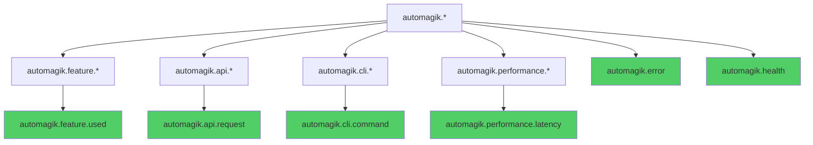

# Event Constants Reference

<p align="center">
  <strong>📊 Standard event names and naming conventions for consistent telemetry</strong><br>
  Use predefined constants to ensure data consistency across projects
</p>

---

## Table of Contents

- [Overview](#overview)
- [Standard Event Constants](#standard-event-constants)
- [Event Naming Conventions](#event-naming-conventions)
- [Usage Examples](#usage-examples)
- [Custom Events Best Practices](#custom-events-best-practices)
- [Event Attributes Guidelines](#event-attributes-guidelines)

---

## Overview

**Automagik Telemetry** provides a set of predefined event constants (`StandardEvents`) to ensure consistency across all Automagik projects. Using these constants helps:

- **Maintain consistency** across different projects and teams
- **Enable cross-project analytics** with standardized event names
- **Prevent typos** and naming inconsistencies
- **Improve discoverability** through IDE autocomplete
- **Simplify dashboard creation** with predictable event names

> **💡 Tip:** Always use `StandardEvents` constants instead of raw strings when tracking common operations.

---

## Standard Event Constants

### Available Constants

Both Python and TypeScript SDKs provide identical event constants:

| Constant | Event Name | Purpose | Common Attributes |
|----------|-----------|---------|-------------------|
| **`FEATURE_USED`** | `automagik.feature.used` | Track feature usage | `feature_name`, `feature_category`, `project` |
| **`API_REQUEST`** | `automagik.api.request` | Track API requests | `endpoint`, `method`, `status`, `project` |
| **`COMMAND_EXECUTED`** | `automagik.cli.command` | Track CLI commands | `command`, `subcommand`, `project` |
| **`OPERATION_LATENCY`** | `automagik.performance.latency` | Track operation performance | `operation_type`, `duration_ms`, `project` |
| **`ERROR_OCCURRED`** | `automagik.error` | Track errors | `error_code`, `error_category`, `severity`, `project` |
| **`SERVICE_HEALTH`** | `automagik.health` | Track service health checks | `service_name`, `status`, `project` |

### Event Hierarchy



---

## Event Naming Conventions

### General Rules

**✅ DO:**
- Use lowercase with dots as separators: `automagik.feature.used`
- Follow the hierarchy: `namespace.category.action`
- Use past tense for actions: `used`, `executed`, `occurred`
- Be descriptive but concise
- Include the `automagik` prefix for all standard events

**❌ DON'T:**
- Mix case: `automagik.Feature.Used` ❌
- Use underscores in event names: `automagik_feature_used` ❌
- Use camelCase in event names: `automagikFeatureUsed` ❌
- Omit the namespace: `feature.used` ❌
- Use present tense: `automagik.feature.use` ❌

### Naming Pattern

```
automagik.<category>.<action>
    │         │         │
    │         │         └── Action (past tense verb)
    │         └── Category (feature, api, cli, performance, error, health)
    └── Namespace (always "automagik")
```

### Examples

**Good Event Names:**
```
✅ automagik.feature.used
✅ automagik.api.request
✅ automagik.cli.command
✅ automagik.performance.latency
✅ automagik.error
✅ automagik.health
✅ automagik.user.created
✅ automagik.payment.processed
✅ automagik.file.uploaded
```

**Bad Event Names:**
```
❌ feature_used                    (missing namespace)
❌ automagik_feature_used          (using underscores)
❌ automagikFeatureUsed            (using camelCase)
❌ automagik.Feature.Used          (mixed case)
❌ automagik.feature.use           (present tense)
❌ automagik.features.used         (inconsistent plural)
❌ feature.use                     (missing namespace, wrong tense)
```

---

## Usage Examples

### Python SDK

```python
from automagik_telemetry import AutomagikTelemetry, StandardEvents

# Initialize client
telemetry = AutomagikTelemetry(
    project_name="omni",
    version="1.0.0"
)

# ✅ GOOD: Use StandardEvents constants
telemetry.track_event(StandardEvents.FEATURE_USED, {
    "feature_name": "list_contacts",
    "feature_category": "api_endpoint",
    "project": "omni"
})

telemetry.track_event(StandardEvents.API_REQUEST, {
    "endpoint": "/v1/contacts",
    "method": "GET",
    "status": 200,
    "project": "omni"
})

telemetry.track_event(StandardEvents.COMMAND_EXECUTED, {
    "command": "send",
    "subcommand": "message",
    "project": "omni"
})

# ❌ BAD: Don't use raw strings for standard events
telemetry.track_event("feature.used", {  # Missing namespace, typo risk
    "feature_name": "list_contacts"
})
```

### TypeScript SDK

```typescript
import { AutomagikTelemetry, StandardEvents } from 'automagik-telemetry';

// Initialize client
const telemetry = new AutomagikTelemetry({
    projectName: 'forge',
    version: '1.0.0'
});

// ✅ GOOD: Use StandardEvents constants
telemetry.trackEvent(StandardEvents.FEATURE_USED, {
    feature_name: 'compile_project',
    feature_category: 'build_system',
    project: 'forge'
});

telemetry.trackEvent(StandardEvents.API_REQUEST, {
    endpoint: '/api/build',
    method: 'POST',
    status: 201,
    project: 'forge'
});

telemetry.trackEvent(StandardEvents.COMMAND_EXECUTED, {
    command: 'build',
    subcommand: 'release',
    project: 'forge'
});

// ❌ BAD: Don't use raw strings for standard events
telemetry.trackEvent('feature.used', {  // Missing namespace, typo risk
    feature_name: 'compile_project'
});
```

### Performance Tracking

```python
# Python
import time
from automagik_telemetry import StandardEvents, MetricType

start = time.time()
# ... perform operation ...
duration_ms = (time.time() - start) * 1000

# Track as event
telemetry.track_event(StandardEvents.OPERATION_LATENCY, {
    "operation_type": "database_query",
    "duration_ms": duration_ms,
    "project": "omni"
})

# Or track as metric (recommended for performance data)
telemetry.track_metric(
    StandardEvents.OPERATION_LATENCY,
    value=duration_ms,
    metric_type=MetricType.HISTOGRAM,
    attributes={
        "operation_type": "database_query",
        "project": "omni"
    }
)
```

```typescript
// TypeScript
import { StandardEvents, MetricType } from 'automagik-telemetry';

const start = Date.now();
// ... perform operation ...
const durationMs = Date.now() - start;

// Track as event
telemetry.trackEvent(StandardEvents.OPERATION_LATENCY, {
    operation_type: 'api_call',
    duration_ms: durationMs,
    project: 'forge'
});

// Or track as metric (recommended for performance data)
telemetry.trackMetric(
    StandardEvents.OPERATION_LATENCY,
    durationMs,
    MetricType.HISTOGRAM,
    {
        operation_type: 'api_call',
        project: 'forge'
    }
);
```

### Error Tracking

```python
# Python
from automagik_telemetry import StandardEvents

try:
    risky_operation()
except Exception as e:
    telemetry.track_event(StandardEvents.ERROR_OCCURRED, {
        "error_code": "OMNI-1001",
        "error_category": "api_failure",
        "severity": "high",
        "project": "omni"
    })
```

```typescript
// TypeScript
import { StandardEvents } from 'automagik-telemetry';

try {
    riskyOperation();
} catch (error) {
    telemetry.trackEvent(StandardEvents.ERROR_OCCURRED, {
        error_code: 'FORGE-2001',
        error_category: 'build_failure',
        severity: 'medium',
        project: 'forge'
    });
}
```

---

## Custom Events Best Practices

### When to Create Custom Events

Create custom events when:
- **Domain-specific actions** not covered by `StandardEvents`
- **Business logic events** specific to your application
- **User interactions** unique to your product

### Custom Event Naming

Follow the same naming pattern as standard events:

```python
# ✅ GOOD: Custom events following conventions
telemetry.track_event("automagik.payment.processed", {
    "amount": 99.99,
    "currency": "USD",
    "project": "omni"
})

telemetry.track_event("automagik.user.registered", {
    "registration_method": "email",
    "project": "omni"
})

telemetry.track_event("automagik.file.uploaded", {
    "file_type": "pdf",
    "file_size_mb": 2.5,
    "project": "omni"
})
```

### Custom Event Categories

Organize custom events by category:

| Category | Pattern | Examples |
|----------|---------|----------|
| **User Actions** | `automagik.user.<action>` | `automagik.user.registered`, `automagik.user.login` |
| **Payment Events** | `automagik.payment.<action>` | `automagik.payment.processed`, `automagik.payment.failed` |
| **File Operations** | `automagik.file.<action>` | `automagik.file.uploaded`, `automagik.file.deleted` |
| **Workflow Events** | `automagik.workflow.<action>` | `automagik.workflow.started`, `automagik.workflow.completed` |
| **Integration Events** | `automagik.integration.<action>` | `automagik.integration.connected`, `automagik.integration.synced` |

---

## Event Attributes Guidelines

### Standard Attributes

Always include these attributes when applicable:

| Attribute | Type | Purpose | Example |
|-----------|------|---------|---------|
| **`project`** | `string` | Project identifier | `"omni"`, `"forge"`, `"hive"` |
| **`feature_name`** | `string` | Specific feature identifier | `"list_contacts"`, `"send_message"` |
| **`feature_category`** | `string` | Feature grouping | `"api_endpoint"`, `"cli_command"` |
| **`endpoint`** | `string` | API endpoint path | `"/v1/contacts"`, `"/api/users"` |
| **`method`** | `string` | HTTP method | `"GET"`, `"POST"`, `"PUT"`, `"DELETE"` |
| **`status`** | `number` | HTTP status code | `200`, `404`, `500` |
| **`command`** | `string` | CLI command name | `"send"`, `"list"`, `"build"` |
| **`subcommand`** | `string` | CLI subcommand | `"message"`, `"contacts"`, `"release"` |
| **`operation_type`** | `string` | Operation identifier | `"database_query"`, `"api_call"` |
| **`duration_ms`** | `number` | Operation duration | `125.3`, `1500.0` |
| **`error_code`** | `string` | Error identifier | `"OMNI-1001"`, `"FORGE-2001"` |
| **`error_category`** | `string` | Error classification | `"api_failure"`, `"validation_error"` |
| **`severity`** | `string` | Error severity | `"low"`, `"medium"`, `"high"`, `"critical"` |
| **`service_name`** | `string` | Service identifier | `"database"`, `"cache"`, `"api"` |

### Attribute Naming Conventions

**✅ DO:**
- Use `snake_case` for attribute names (both Python and TypeScript)
- Use descriptive names: `feature_name` instead of `name`
- Use consistent units: `duration_ms`, `size_bytes`, `count`
- Include the project name in attributes

**❌ DON'T:**
- Use camelCase for attribute names: `featureName` ❌
- Use abbreviations: `feat`, `dur`, `msg` ❌
- Mix naming styles within the same event
- Include PII (personally identifiable information)

### Attribute Examples

```python
# ✅ GOOD: Clear, consistent attribute names
telemetry.track_event(StandardEvents.FEATURE_USED, {
    "feature_name": "export_contacts",      # Descriptive
    "feature_category": "data_export",      # Clear category
    "export_format": "csv",                 # Specific detail
    "record_count": 1500,                   # With units implied
    "file_size_mb": 2.5,                    # With units explicit
    "project": "omni"                       # Always include project
})

# ❌ BAD: Unclear, inconsistent attribute names
telemetry.track_event("feature.used", {
    "name": "export",                       # Too vague
    "fmt": "csv",                           # Abbreviated
    "numRecords": 1500,                     # camelCase (wrong)
    "size": 2.5                             # No units
})
```

---

## Event vs Metric: When to Use Which

### Use Events (track_event) When:
- **Discrete actions** - Something happened: user logged in, API called, command executed
- **Categorical data** - Status, method, type classifications
- **Context-rich data** - Multiple attributes describing the event
- **Audit trail** - Need to see individual occurrences

### Use Metrics (track_metric) When:
- **Numeric measurements** - Performance, counts, gauges
- **Aggregatable data** - Sum, average, percentiles
- **Time-series data** - Trends over time
- **Resource usage** - CPU, memory, response time

### Hybrid Approach (Recommended)

For performance data, use both:

```python
# Track as event for context
telemetry.track_event(StandardEvents.OPERATION_LATENCY, {
    "operation_type": "database_query",
    "duration_ms": 125.3,
    "query_type": "SELECT",
    "project": "omni"
})

# Also track as metric for aggregation
from automagik_telemetry import MetricType

telemetry.track_metric(
    "db.query.latency",
    value=125.3,
    metric_type=MetricType.HISTOGRAM,
    attributes={
        "operation_type": "database_query",
        "query_type": "SELECT",
        "project": "omni"
    }
)
```

---

## Related Documentation

- **[API Reference](API_REFERENCE.md)** - Complete API documentation
- **[Configuration Guide](../USER_GUIDES/CONFIGURATION.md)** - Configuration options
- **[SDK Differences](../DEVELOPER_GUIDES/SDK_DIFFERENCES.md)** - Python vs TypeScript
- **[Privacy Guide](../USER_GUIDES/PRIVACY.md)** - Privacy-first design

---

<p align="center">
  <strong>Built with ❤️ by <a href="https://namastex.ai">Namastex Labs</a></strong><br>
  <em>Consistent event naming for better observability</em>
</p>
