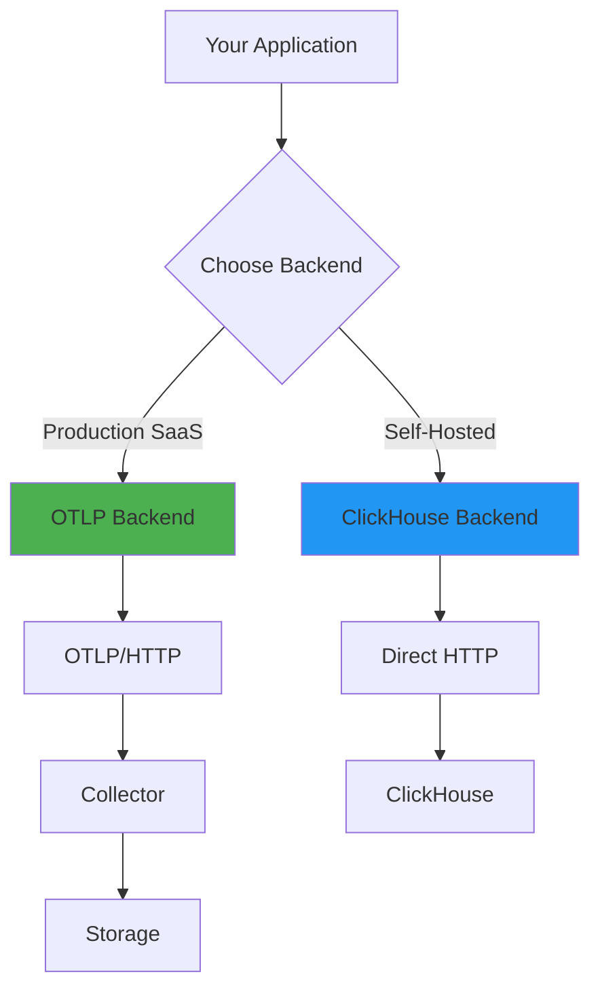
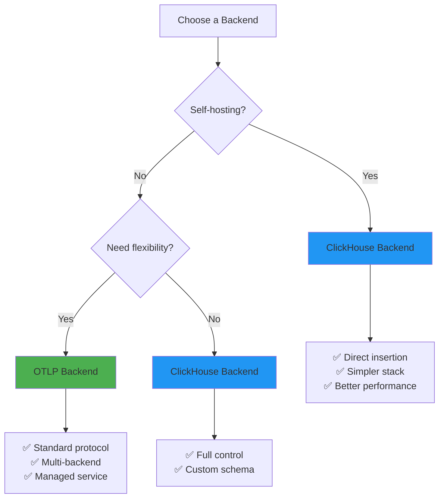
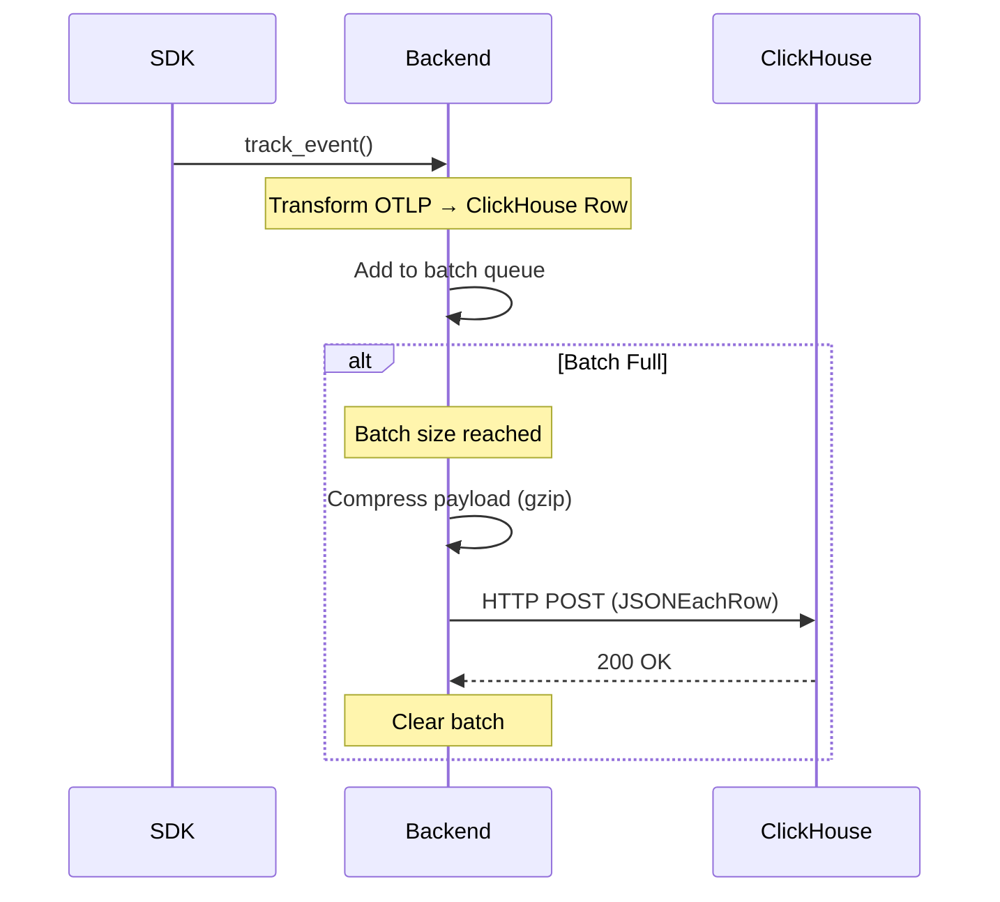
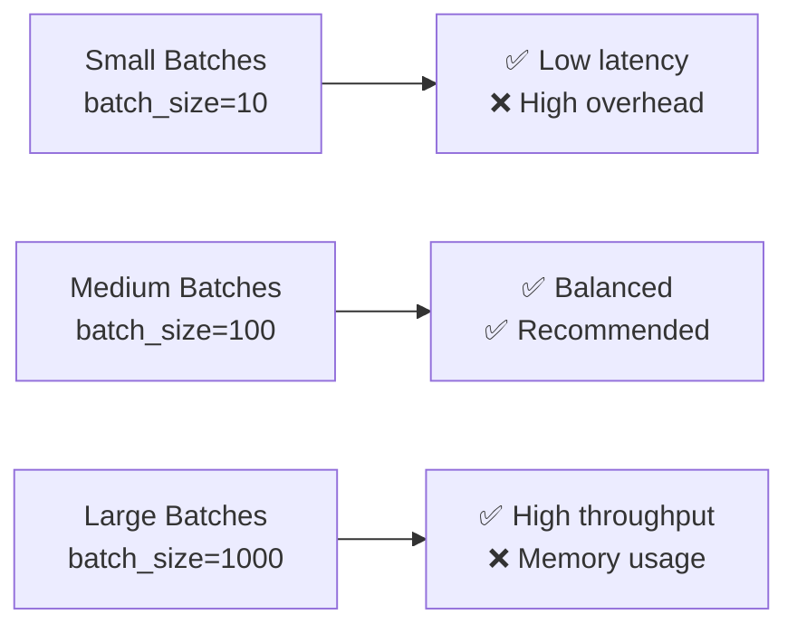

# 🔌 Backend Configuration Guide

> *Choose the right backend for your telemetry needs - OTLP or ClickHouse*

<p align="center">
  <strong>📡 Two powerful backends, one unified API</strong><br>
  From cloud-ready OTLP to self-hosted ClickHouse
</p>

---

## 📑 Table of Contents

- [🎯 Backend Overview](#-backend-overview)
- [⚖️ Backend Comparison](#️-backend-comparison)
- [📡 OTLP Backend](#-otlp-backend)
- [🗄️ ClickHouse Backend](#️-clickhouse-backend)
- [🔄 Migration Guide](#-migration-guide)
- [⚡ Performance Tuning](#-performance-tuning)
- [🐛 Troubleshooting](#-troubleshooting)

---

## 🎯 Backend Overview



### What Are Backends?

Backends are the **data destination** for your telemetry. The SDK supports two backends:

| Backend | Protocol | Best For |
|---------|----------|----------|
| **OTLP** | OpenTelemetry Protocol | ☁️ Production SaaS deployments |
| **ClickHouse** | Direct HTTP API | 🏗️ Self-hosted environments |

> **💡 Key Insight:** The API remains identical - only configuration changes!

---

## ⚖️ Backend Comparison

### Quick Decision Matrix



### Feature Comparison

<table>
<tr>
<th>Feature</th>
<th>🌐 OTLP Backend</th>
<th>🗄️ ClickHouse Backend</th>
</tr>
<tr>
<td><strong>Use Case</strong></td>
<td>Production SaaS</td>
<td>Self-hosted, Local development</td>
</tr>
<tr>
<td><strong>Protocol</strong></td>
<td>OTLP over HTTP</td>
<td>ClickHouse HTTP API</td>
</tr>
<tr>
<td><strong>Components</strong></td>
<td>SDK → Collector → Storage</td>
<td>SDK → ClickHouse (direct)</td>
</tr>
<tr>
<td><strong>Dependencies</strong></td>
<td>OpenTelemetry Collector</td>
<td>ClickHouse only</td>
</tr>
<tr>
<td><strong>Performance</strong></td>
<td>Standard (~45ms latency)</td>
<td>Optimized (~15ms latency)</td>
</tr>
<tr>
<td><strong>Setup Complexity</strong></td>
<td>Medium</td>
<td>Simple</td>
</tr>
<tr>
<td><strong>Data Control</strong></td>
<td>Collector-managed</td>
<td>Full control</td>
</tr>
<tr>
<td><strong>Vendor Lock-in</strong></td>
<td>None (standard)</td>
<td>ClickHouse-specific</td>
</tr>
</table>

### Architecture Comparison

<details>
<summary><strong>🏗️ Architecture Diagrams (Click to expand)</strong></summary>

**OTLP Backend Flow:**
```
┌─────────────┐
│   Your App  │
└──────┬──────┘
       │ OTLP/HTTP
       ↓
┌──────────────┐
│ OTLP         │
│ Collector    │
│ :4318 :4317  │
└──────┬───────┘
       │ Transform
       ↓
┌──────────────┐
│ ClickHouse/  │
│ Prometheus/  │
│ Any Backend  │
└──────┬───────┘
       │
       ↓
┌──────────────┐
│   Grafana    │
│   :3000      │
└──────────────┘

Total Latency: ~45ms per batch
```

**ClickHouse Backend Flow:**
```
┌─────────────┐
│   Your App  │
└──────┬──────┘
       │ Direct HTTP
       │ JSONEachRow
       ↓
┌──────────────┐
│ ClickHouse   │
│ :8123 :9000  │
└──────┬───────┘
       │
       ↓
┌──────────────┐
│   Grafana    │
│   :3000      │
└──────────────┘

Total Latency: ~15ms per batch (3x faster!)
```

</details>

---

## 📡 OTLP Backend

### Overview

The **OTLP (OpenTelemetry Protocol)** backend is the industry-standard protocol for telemetry data.

#### ✅ Advantages

- **🌍 Standard Protocol** - Works with any OTLP-compatible backend
- **🔄 Flexibility** - Easy to switch between different storage backends
- **☁️ Cloud-Ready** - Designed for managed services
- **🛡️ Battle-Tested** - Used by thousands of organizations

#### ⚠️ Trade-offs

- **🔧 More Components** - Requires OpenTelemetry Collector
- **⏱️ Higher Latency** - Extra hop through collector
- **📚 Learning Curve** - More complex architecture

### Quick Setup

<details>
<summary><strong>🚀 OTLP Backend Setup (Click to expand)</strong></summary>

**Python:**
```python
from automagik_telemetry import AutomagikTelemetry

client = AutomagikTelemetry(
    project_name="my-app",
    version="1.0.0",
    backend="otlp",  # Default
    endpoint="https://telemetry.namastex.ai/v1/traces"
)
```

**TypeScript:**
```typescript
import { AutomagikTelemetry } from '@automagik/telemetry';

const client = new AutomagikTelemetry({
    projectName: 'my-app',
    version: '1.0.0',
    backend: 'otlp',  // Default
    endpoint: 'https://telemetry.namastex.ai/v1/traces'
});
```

**Environment Variables:**
```bash
export AUTOMAGIK_TELEMETRY_BACKEND=otlp
export AUTOMAGIK_TELEMETRY_ENDPOINT=https://telemetry.namastex.ai/v1/traces
```

</details>

### OTLP Configuration Options

<table>
<tr>
<th>Option</th>
<th>Type</th>
<th>Default</th>
<th>Description</th>
</tr>
<tr>
<td><code>endpoint</code></td>
<td>string</td>
<td>Production URL</td>
<td>Main OTLP traces endpoint</td>
</tr>
<tr>
<td><code>metricsEndpoint</code></td>
<td>string</td>
<td>Derived from endpoint</td>
<td>OTLP metrics endpoint</td>
</tr>
<tr>
<td><code>logsEndpoint</code></td>
<td>string</td>
<td>Derived from endpoint</td>
<td>OTLP logs endpoint</td>
</tr>
<tr>
<td><code>timeout</code></td>
<td>int</td>
<td>5s / 5000ms</td>
<td>HTTP timeout</td>
</tr>
<tr>
<td><code>batchSize</code></td>
<td>int</td>
<td>100</td>
<td>Events per batch</td>
</tr>
<tr>
<td><code>compressionEnabled</code></td>
<td>bool</td>
<td>true</td>
<td>Enable gzip compression</td>
</tr>
</table>

### When to Use OTLP

<table>
<tr>
<th>✅ Perfect For</th>
<th>❌ Not Ideal For</th>
</tr>
<tr>
<td>

- Production SaaS applications
- Multi-cloud deployments
- Standard compliance requirements
- Managed telemetry services
- Teams familiar with OpenTelemetry

</td>
<td>

- Simple self-hosted setups
- Local development environments
- Custom schema requirements
- When you want direct control

</td>
</tr>
</table>

---

## 🗄️ ClickHouse Backend

### Overview

The **ClickHouse backend** bypasses the OpenTelemetry Collector and writes directly to ClickHouse via HTTP API.

#### ✅ Advantages

- **⚡ Better Performance** - 3x faster (15ms vs 45ms per batch)
- **🎯 Simpler Architecture** - Fewer components = fewer failure points
- **🔧 Full Control** - Direct access to your data
- **💾 Zero Dependencies** - Uses only stdlib
- **🚀 Easier Debugging** - Direct logs, no middleware black box

#### ⚠️ Trade-offs

- **🔒 Vendor Lock-in** - Tied to ClickHouse
- **🎨 Custom Schema** - You manage schema evolution
- **🏗️ Self-Hosted Only** - Requires your own ClickHouse

### Quick Setup

<details>
<summary><strong>🚀 ClickHouse Backend Setup (Click to expand)</strong></summary>

**1. Start ClickHouse (Docker):**
```bash
cd infra
make start
```

**2. Configure SDK:**

**Python:**
```python
from automagik_telemetry import AutomagikTelemetry

client = AutomagikTelemetry(
    project_name="my-app",
    version="1.0.0",
    backend="clickhouse",
    clickhouse_endpoint="http://localhost:8123",
    clickhouse_database="telemetry",
    clickhouse_username="telemetry",
    clickhouse_password="telemetry_password"
)
```

**TypeScript:**
```typescript
import { AutomagikTelemetry } from '@automagik/telemetry';

const client = new AutomagikTelemetry({
    projectName: 'my-app',
    version: '1.0.0',
    backend: 'clickhouse',
    clickhouseEndpoint: 'http://localhost:8123',
    clickhouseDatabase: 'telemetry',
    clickhouseUsername: 'telemetry',
    clickhousePassword: 'telemetry_password'
});
```

**Environment Variables:**
```bash
export AUTOMAGIK_TELEMETRY_BACKEND=clickhouse
export AUTOMAGIK_TELEMETRY_CLICKHOUSE_ENDPOINT=http://localhost:8123
export AUTOMAGIK_TELEMETRY_CLICKHOUSE_DATABASE=telemetry
export AUTOMAGIK_TELEMETRY_CLICKHOUSE_USERNAME=telemetry
export AUTOMAGIK_TELEMETRY_CLICKHOUSE_PASSWORD=telemetry_password
```

**3. Verify:**
```bash
# Check data arrived
curl "http://localhost:8123/?query=SELECT%20count()%20FROM%20telemetry.traces"
```

</details>

### ClickHouse Configuration Options

<table>
<tr>
<th>Option</th>
<th>Type</th>
<th>Default</th>
<th>Description</th>
</tr>
<tr>
<td><code>clickhouseEndpoint</code></td>
<td>string</td>
<td><code>http://localhost:8123</code></td>
<td>ClickHouse HTTP API endpoint</td>
</tr>
<tr>
<td><code>clickhouseDatabase</code></td>
<td>string</td>
<td><code>telemetry</code></td>
<td>Database name</td>
</tr>
<tr>
<td><code>clickhouseTable</code></td>
<td>string</td>
<td><code>traces</code></td>
<td>Table name</td>
</tr>
<tr>
<td><code>clickhouseUsername</code></td>
<td>string</td>
<td><code>default</code></td>
<td>Authentication username</td>
</tr>
<tr>
<td><code>clickhousePassword</code></td>
<td>string</td>
<td><code>""</code></td>
<td>Authentication password</td>
</tr>
<tr>
<td><code>batchSize</code></td>
<td>int</td>
<td>100</td>
<td>Rows per batch</td>
</tr>
<tr>
<td><code>compressionEnabled</code></td>
<td>bool</td>
<td>true</td>
<td>Enable gzip compression</td>
</tr>
<tr>
<td><code>timeout</code></td>
<td>int</td>
<td>5s / 5000ms</td>
<td>HTTP timeout</td>
</tr>
<tr>
<td><code>maxRetries</code></td>
<td>int</td>
<td>3</td>
<td>Retry attempts</td>
</tr>
</table>

### Data Transformation Flow



### When to Use ClickHouse

<table>
<tr>
<th>✅ Perfect For</th>
<th>❌ Not Ideal For</th>
</tr>
<tr>
<td>

- Self-hosted deployments
- Local development
- Custom schema needs
- High-performance requirements
- Direct data control
- Simple architecture preference

</td>
<td>

- Multi-cloud deployments
- Standard OTLP compliance
- Managed services
- When you don't want to manage ClickHouse

</td>
</tr>
</table>

---

## 🔄 Migration Guide

### Switching from OTLP to ClickHouse

> **💡 Good News:** No API changes required! Only configuration changes.

<details>
<summary><strong>📋 Migration Checklist (Click to expand)</strong></summary>

- [ ] ClickHouse server is running and accessible
- [ ] Database and table schema are created
- [ ] Authentication credentials are configured
- [ ] Code changes are ready (see below)
- [ ] Tests pass with ClickHouse backend
- [ ] Monitoring is updated (if needed)

</details>

#### Step 1: Update Configuration

**Before (OTLP):**
```python
client = AutomagikTelemetry(
    project_name="my-app",
    version="1.0.0",
    endpoint="https://telemetry.namastex.ai/v1/traces"  # OTLP
)
```

**After (ClickHouse):**
```python
client = AutomagikTelemetry(
    project_name="my-app",
    version="1.0.0",
    backend="clickhouse",                           # NEW
    clickhouse_endpoint="http://localhost:8123",    # NEW
    clickhouse_database="telemetry",                # NEW
    clickhouse_username="telemetry",                # NEW
    clickhouse_password="telemetry_password"        # NEW
)
```

#### Step 2: All Existing Code Works!

```python
# These work identically with both backends ✅
client.track_event("user.login", {"user_id": "123"})
client.track_metric("api.requests", value=1, metric_type=MetricType.COUNTER)
client.track_error(exception)
client.flush()
```

#### Step 3: Environment-Based Switching

```bash
# Development: Use ClickHouse
export AUTOMAGIK_TELEMETRY_BACKEND=clickhouse
export AUTOMAGIK_TELEMETRY_CLICKHOUSE_ENDPOINT=http://localhost:8123

# Production: Use OTLP
export AUTOMAGIK_TELEMETRY_BACKEND=otlp
export AUTOMAGIK_TELEMETRY_ENDPOINT=https://telemetry.namastex.ai/v1/traces
```

---

## ⚡ Performance Tuning

### Batch Size Optimization



<details>
<summary><strong>🎛️ Batch Size Tuning Guide (Click to expand)</strong></summary>

#### Real-Time Visibility (Small Batches)

```python
config = TelemetryConfig(
    backend="clickhouse",
    batch_size=10,  # Events appear quickly
    compression_enabled=False  # Skip compression overhead
)
# Good for: Development, debugging, low-volume apps
```

#### Balanced (Default)

```python
config = TelemetryConfig(
    backend="clickhouse",
    batch_size=100,  # Default
    compression_enabled=True
)
# Good for: Most production applications
```

#### High Throughput (Large Batches)

```python
config = TelemetryConfig(
    backend="clickhouse",
    batch_size=1000,  # Maximize throughput
    compression_enabled=True
)
# Good for: High-volume applications, batch processing
```

</details>

### Compression Settings

<table>
<tr>
<th>Setting</th>
<th>When to Use</th>
<th>Benefits</th>
</tr>
<tr>
<td><code>compression_enabled=True</code><br/><code>batch_size=500+</code></td>
<td>

- Production deployments
- Metered/slow networks
- Large attribute maps

</td>
<td>

- 70-90% bandwidth reduction
- Better for slow networks
- Efficient for large batches

</td>
</tr>
<tr>
<td><code>compression_enabled=False</code><br/><code>batch_size=10</code></td>
<td>

- Development/debugging
- Fast local networks
- Low-volume apps
- CPU-constrained environments

</td>
<td>

- Lower CPU usage
- Slightly lower latency
- Simpler debugging

</td>
</tr>
</table>

### Performance Benchmarks

<details>
<summary><strong>📊 Backend Performance Comparison (Click to expand)</strong></summary>

**ClickHouse Backend Performance:**

| Metric | Without Batching | With Batching (100 rows) | With Compression |
|--------|------------------|--------------------------|------------------|
| HTTP Requests | 1000 | 10 | 10 |
| Network Data | ~1MB | ~100KB | ~10KB |
| Typical Latency | ~1000ms | ~100ms | ~100ms |
| CPU Overhead | Low | Low | Medium |

**OTLP vs ClickHouse Direct:**

| Stage | OTLP Backend | ClickHouse Backend |
|-------|--------------|-------------------|
| SDK Serialize | ~5ms | ~5ms |
| Network (1st hop) | ~10ms | ~10ms |
| Collector Processing | ~20ms | N/A |
| Network (2nd hop) | ~10ms | N/A |
| **Total** | **~45ms** | **~15ms** ⚡ |

> **⚡ Result:** ClickHouse direct backend is **3x faster!**

</details>

---

## 🐛 Troubleshooting

### Common Issues

<details>
<summary><strong>❌ Connection Refused to ClickHouse</strong></summary>

**Symptoms:**
```
URLError: <urlopen error [Errno 111] Connection refused>
```

**Solutions:**

1. **Verify ClickHouse is running:**
```bash
docker ps | grep clickhouse
# OR
curl http://localhost:8123/ping
# Should return: Ok.
```

2. **Check endpoint configuration:**
```python
config = TelemetryConfig(
    clickhouse_endpoint="http://localhost:8123",  # Not https, not port 9000
)
```

3. **Test connectivity:**
```bash
curl http://localhost:8123
# Should return: Ok.
```

</details>

<details>
<summary><strong>🔒 Authentication Failed</strong></summary>

**Symptoms:**
```
HTTP 403: Password verification failed
```

**Solutions:**

1. **Verify credentials:**
```bash
curl -u username:password http://localhost:8123/?query=SELECT%201
```

2. **Check user exists:**
```sql
-- In clickhouse-client
SHOW USERS;
```

3. **Update configuration:**
```python
config = TelemetryConfig(
    clickhouse_username="telemetry",
    clickhouse_password="telemetry_password",  # Must match ClickHouse user
)
```

</details>

<details>
<summary><strong>📦 No Data Appearing in ClickHouse</strong></summary>

**Symptoms:**
- SDK sends without errors
- ClickHouse is running
- But `SELECT count() FROM traces` returns 0

**Solutions:**

1. **Force flush:**
```python
client.track_event("test", {})
client.flush()  # Important!
```

2. **Reduce batch size for testing:**
```python
config = TelemetryConfig(
    backend="clickhouse",
    batch_size=1,  # Immediate send
)
```

3. **Enable verbose logging:**
```python
import logging
logging.basicConfig(level=logging.DEBUG)

# Or via environment
export AUTOMAGIK_TELEMETRY_VERBOSE=true
```

</details>

### Debug Checklist

```mermaid
flowchart TD
    Start[Issue Detected] --> Check1{SDK Logs?}
    Check1 -->|No errors| Check2{ClickHouse Running?}
    Check1 -->|Errors| Fix1[Check configuration]

    Check2 -->|Yes| Check3{Credentials OK?}
    Check2 -->|No| Fix2[Start ClickHouse]

    Check3 -->|Yes| Check4{Table exists?}
    Check3 -->|No| Fix3[Update credentials]

    Check4 -->|Yes| Check5{Flush called?}
    Check4 -->|No| Fix4[Create table]

    Check5 -->|Yes| Fix5[Check logs]
    Check5 -->|No| Fix6[Call flush()]
```

---

## 🔗 Related Documentation

- ⚙️ [CONFIGURATION.md](./CONFIGURATION.md) - Complete configuration reference
- 🏗️ [SELF_HOSTING.md](./SELF_HOSTING.md) - Infrastructure setup guide
- 🔒 [PRIVACY.md](./PRIVACY.md) - Privacy policy and data handling
- ⚡ [QUICK_REFERENCE.md](./QUICK_REFERENCE.md) - Command cheat sheet

---

## 🆘 Support

For questions or issues:
- **GitHub Issues**: [github.com/namastexlabs/automagik-telemetry/issues](https://github.com/namastexlabs/automagik-telemetry/issues)
- **Discord**: [discord.gg/xcW8c7fF3R](https://discord.gg/xcW8c7fF3R)
- **Documentation**: [DeepWiki](https://deepwiki.com/namastexlabs/automagik-telemetry)

---

<p align="center">
  <strong>Built with ❤️ by <a href="https://namastex.ai">Namastex Labs</a></strong><br>
  <em>Choose your backend, keep your API</em>
</p>
