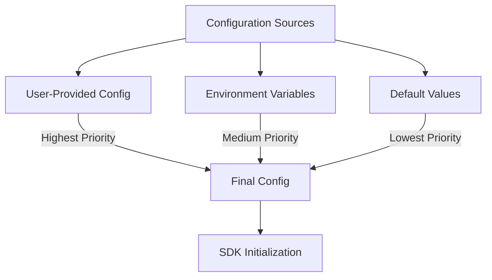
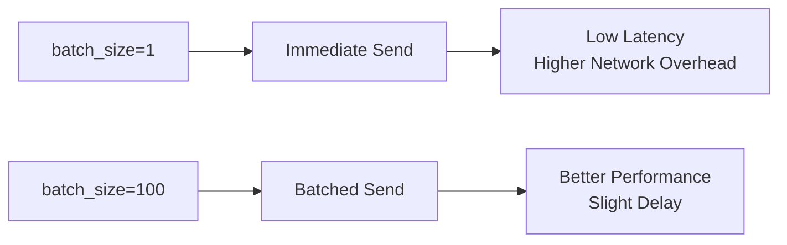
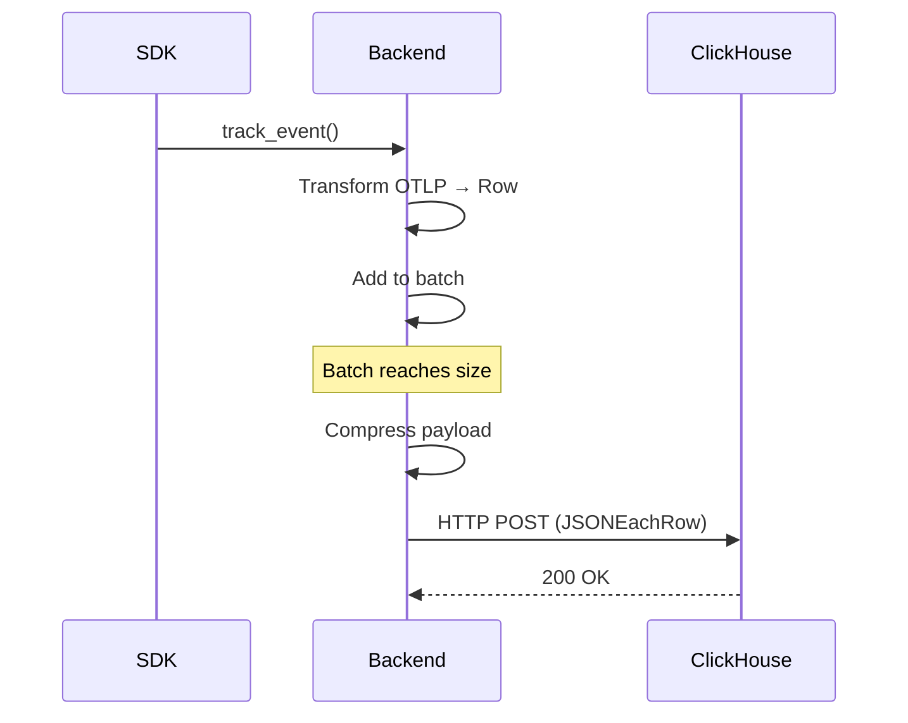

# ⚙️ Configuration Guide

> *Complete configuration reference for Automagik Telemetry SDK - Python & TypeScript*

<p align="center">
  <strong>🎯 Master every configuration option</strong><br>
  From quick starts to advanced production setups
</p>

---

## 📑 Table of Contents

- [🚀 Quick Start](#-quick-start)
- [🔧 Configuration Overview](#-configuration-overview)
- [🌍 Common Configuration](#-common-configuration)
- [📡 OTLP Backend Configuration](#-otlp-backend-configuration)
- [🗄️ ClickHouse Backend Configuration](#️-clickhouse-backend-configuration)
- [🔐 Environment Variables](#-environment-variables)
- [💼 Configuration Examples](#-configuration-examples)
- [✅ Validation Rules](#-validation-rules)

---

## 🚀 Quick Start

<details open>
<summary><strong>💡 Essential Configuration (Click to expand)</strong></summary>

### Minimum Required Configuration

| Option | Required | Default | Description |
|--------|----------|---------|-------------|
| `projectName` / `project_name` | ✅ Yes | None | Name of your project |
| `version` | ✅ Yes | None | Project version |
| `backend` | ❌ No | `"otlp"` | Backend type: `"otlp"` or `"clickhouse"` |

**Python - Minimal Setup:**
```python
from automagik_telemetry import AutomagikTelemetry

telemetry = AutomagikTelemetry(
    project_name="my-app",
    version="1.0.0"
)
```

**TypeScript - Minimal Setup:**
```typescript
import { AutomagikTelemetry } from '@automagik/telemetry';

const telemetry = new AutomagikTelemetry({
    projectName: 'my-app',
    version: '1.0.0'
});
```

</details>

---

## 🔧 Configuration Overview



### Configuration Priority

Configuration values are resolved in the following order (highest to lowest priority):

1. **🎯 User-provided config** - Values passed directly to the SDK constructor
2. **🌍 Environment variables** - `AUTOMAGIK_TELEMETRY_*` variables
3. **⚙️ Default values** - Built-in SDK defaults

### When to Use What

<table>
<tr>
<th>📝 Config Object</th>
<th>🌍 Environment Variables</th>
</tr>
<tr>
<td>

- Application-specific settings
- Version-controlled values
- Development defaults

</td>
<td>

- Deployment-specific overrides
- Secrets (credentials, passwords)
- CI/CD pipelines
- Quick enable/disable toggles

</td>
</tr>
</table>

---

## 🌍 Common Configuration

> Options that apply to both OTLP and ClickHouse backends

### 📌 Required Fields

#### `projectName` / `project_name`

<table>
<tr><td><strong>Type</strong></td><td><code>string</code></td></tr>
<tr><td><strong>Required</strong></td><td>✅ Yes</td></tr>
<tr><td><strong>Description</strong></td><td>Name of your Automagik project (e.g., "omni", "hive", "forge")</td></tr>
</table>

<details>
<summary><strong>📖 Examples</strong></summary>

**Python:**
```python
telemetry = AutomagikTelemetry(
    project_name="my-app",
    version="1.0.0"
)
```

**TypeScript:**
```typescript
const telemetry = new AutomagikTelemetry({
    projectName: 'my-app',
    version: '1.0.0'
});
```

> **💡 Tip:** Cannot be empty or whitespace-only. Used in resource attributes (`service.name`).

</details>

---

#### `version`

<table>
<tr><td><strong>Type</strong></td><td><code>string</code></td></tr>
<tr><td><strong>Required</strong></td><td>✅ Yes</td></tr>
<tr><td><strong>Description</strong></td><td>Version of your project (e.g., "1.0.0", "2.3.1-beta")</td></tr>
</table>

<details>
<summary><strong>📖 Examples</strong></summary>

**Python:**
```python
telemetry = AutomagikTelemetry(
    project_name="my-app",
    version="1.0.0"
)
```

**TypeScript:**
```typescript
const telemetry = new AutomagikTelemetry({
    projectName: 'my-app',
    version: '1.0.0'
});
```

> **📌 Note:** Used in resource attributes (`service.version`)

</details>

---

### 🔄 Optional Fields

#### `backend`

<table>
<tr><td><strong>Type</strong></td><td><code>string</code></td></tr>
<tr><td><strong>Default</strong></td><td><code>"otlp"</code></td></tr>
<tr><td><strong>Options</strong></td><td><code>"otlp"</code> | <code>"clickhouse"</code></td></tr>
<tr><td><strong>Environment Variable</strong></td><td><code>AUTOMAGIK_TELEMETRY_BACKEND</code></td></tr>
</table>

<details>
<summary><strong>🔀 Backend Comparison</strong></summary>

| Feature | OTLP Backend | ClickHouse Backend |
|---------|--------------|-------------------|
| **Use Case** | Production SaaS | Self-hosted, Local dev |
| **Protocol** | OTLP over HTTP | ClickHouse HTTP API |
| **Components** | SDK → Collector → Storage | SDK → ClickHouse (direct) |
| **Setup** | Medium | Simple |
| **Performance** | Standard | Optimized |

**Python - OTLP:**
```python
telemetry = AutomagikTelemetry(
    project_name="my-app",
    version="1.0.0",
    backend="otlp"
)
```

**Python - ClickHouse:**
```python
telemetry = AutomagikTelemetry(
    project_name="my-app",
    version="1.0.0",
    backend="clickhouse"
)
```

**Via Environment Variable:**
```bash
export AUTOMAGIK_TELEMETRY_BACKEND=clickhouse
```

</details>

---

#### `organization`

<table>
<tr><td><strong>Type</strong></td><td><code>string</code></td></tr>
<tr><td><strong>Default</strong></td><td><code>"namastex"</code></td></tr>
<tr><td><strong>Description</strong></td><td>Organization name for grouping telemetry data</td></tr>
</table>

<details>
<summary><strong>📖 Examples</strong></summary>

**Python:**
```python
telemetry = AutomagikTelemetry(
    project_name="my-app",
    version="1.0.0",
    organization="acme-corp"
)
```

**TypeScript:**
```typescript
const telemetry = new AutomagikTelemetry({
    projectName: 'my-app',
    version: '1.0.0',
    organization: 'acme-corp'
});
```

> **⚠️ Warning:** Cannot be empty or whitespace-only if provided

</details>

---

#### `timeout`

<table>
<tr><td><strong>Type</strong></td><td><code>int</code> (seconds for both SDKs)</td></tr>
<tr><td><strong>Default</strong></td><td><code>5</code> seconds (TypeScript converts to milliseconds internally)</td></tr>
<tr><td><strong>Environment Variable</strong></td><td><code>AUTOMAGIK_TELEMETRY_TIMEOUT</code></td></tr>
</table>

<details>
<summary><strong>⏱️ Timeout Configuration</strong></summary>

**Python:**
```python
telemetry = AutomagikTelemetry(
    project_name="my-app",
    version="1.0.0",
    timeout=10  # 10 seconds
)
```

**TypeScript:**
```typescript
const telemetry = new AutomagikTelemetry({
    projectName: 'my-app',
    version: '1.0.0',
    timeout: 10  // 10 seconds
});
```

> **💡 Best Practice:** Should not exceed 60 seconds

</details>

---

#### `batchSize` / `batch_size`

<table>
<tr><td><strong>Type</strong></td><td><code>int</code></td></tr>
<tr><td><strong>Default</strong></td><td>Python: <code>1</code> (immediate) | TypeScript: <code>100</code> (batched)</td></tr>
<tr><td><strong>Description</strong></td><td>Number of events to batch before sending</td></tr>
</table>

<details>
<summary><strong>📦 Batching Strategies</strong></summary>



**Python - Enable Batching:**
```python
from automagik_telemetry import TelemetryConfig

config = TelemetryConfig(
    project_name="my-app",
    version="1.0.0",
    batch_size=100  # Send every 100 events
)
telemetry = AutomagikTelemetry(config=config)
```

**TypeScript - Disable Batching:**
```typescript
const telemetry = new AutomagikTelemetry({
    projectName: 'my-app',
    version: '1.0.0',
    batchSize: 1  // Send immediately
});
```

> **🎯 Recommendation:**
> - Use `batch_size=1` for debugging and low-volume apps
> - Use `batch_size=100+` for production high-throughput apps

</details>

---

#### `compressionEnabled` / `compression_enabled`

<table>
<tr><td><strong>Type</strong></td><td><code>bool</code></td></tr>
<tr><td><strong>Default</strong></td><td><code>true</code></td></tr>
<tr><td><strong>Description</strong></td><td>Enable gzip compression for payloads</td></tr>
</table>

<details>
<summary><strong>🗜️ Compression Benefits</strong></summary>

**Performance Impact:**
- 🔽 Reduces network bandwidth by ~70-80%
- ⚡ Minimal CPU overhead
- ✅ Recommended for production

**Python:**
```python
config = TelemetryConfig(
    project_name="my-app",
    version="1.0.0",
    compression_enabled=True
)
```

**TypeScript:**
```typescript
const telemetry = new AutomagikTelemetry({
    projectName: 'my-app',
    version: '1.0.0',
    compressionEnabled: true
});
```

</details>

---

#### `compressionThreshold` / `compression_threshold`

<table>
<tr><td><strong>Type</strong></td><td><code>int</code></td></tr>
<tr><td><strong>Default</strong></td><td><code>1024</code> bytes (1 KB)</td></tr>
<tr><td><strong>Description</strong></td><td>Minimum payload size in bytes before compression is applied</td></tr>
</table>

<details>
<summary><strong>⚙️ Compression Threshold Configuration</strong></summary>

**When to Adjust:**
- Lower threshold (e.g., 512 bytes): More aggressive compression, saves bandwidth
- Higher threshold (e.g., 2048 bytes): Less compression overhead for small payloads

**Python:**
```python
config = TelemetryConfig(
    project_name="my-app",
    version="1.0.0",
    compression_enabled=True,
    compression_threshold=512  # Compress payloads > 512 bytes
)
```

**TypeScript:**
```typescript
const telemetry = new AutomagikTelemetry({
    projectName: 'my-app',
    version: '1.0.0',
    compressionEnabled: true,
    compressionThreshold: 512  // Compress payloads > 512 bytes
});
```

> **💡 Tip:** Small payloads may not benefit from compression due to overhead

</details>

---

#### `flushInterval` / `flush_interval`

<table>
<tr><td><strong>Type</strong></td><td><code>float</code> (Python: seconds) | <code>number</code> (TypeScript: milliseconds)</td></tr>
<tr><td><strong>Default</strong></td><td>Python: <code>5.0</code> seconds | TypeScript: <code>5000</code> milliseconds</td></tr>
<tr><td><strong>Description</strong></td><td>Interval for automatically flushing queued events</td></tr>
</table>

<details>
<summary><strong>⏱️ Flush Interval Configuration</strong></summary>

**Python:**
```python
config = TelemetryConfig(
    project_name="my-app",
    version="1.0.0",
    batch_size=100,
    flush_interval=10.0  # Flush every 10 seconds
)
```

**TypeScript:**
```typescript
const telemetry = new AutomagikTelemetry({
    projectName: 'my-app',
    version: '1.0.0',
    batchSize: 100,
    flushInterval: 10000  // Flush every 10 seconds
});
```

> **🎯 Recommendation:**
> - High-frequency apps: 2-5 seconds
> - Low-frequency apps: 10-30 seconds

</details>

---

#### `maxRetries` / `max_retries`

<table>
<tr><td><strong>Type</strong></td><td><code>int</code></td></tr>
<tr><td><strong>Default</strong></td><td><code>3</code></td></tr>
<tr><td><strong>Description</strong></td><td>Maximum number of retry attempts for failed requests</td></tr>
</table>

<details>
<summary><strong>🔄 Retry Configuration</strong></summary>

**Python:**
```python
config = TelemetryConfig(
    project_name="my-app",
    version="1.0.0",
    max_retries=5  # Retry up to 5 times
)
```

**TypeScript:**
```typescript
const telemetry = new AutomagikTelemetry({
    projectName: 'my-app',
    version: '1.0.0',
    maxRetries: 5  // Retry up to 5 times
});
```

> **⚠️ Note:** Retries only occur for network errors and 5xx server errors

</details>

---

#### `retryBackoffBase` / `retry_backoff_base`

<table>
<tr><td><strong>Type</strong></td><td><code>float</code> (Python: seconds) | <code>number</code> (TypeScript: milliseconds)</td></tr>
<tr><td><strong>Default</strong></td><td>Python: <code>1.0</code> second | TypeScript: <code>1000</code> milliseconds</td></tr>
<tr><td><strong>Description</strong></td><td>Base time for exponential backoff between retry attempts</td></tr>
</table>

<details>
<summary><strong>⏳ Exponential Backoff</strong></summary>

**How it Works:**
- Attempt 1: Wait `retry_backoff_base * 2^0` = base time
- Attempt 2: Wait `retry_backoff_base * 2^1` = 2x base time
- Attempt 3: Wait `retry_backoff_base * 2^2` = 4x base time

**Python:**
```python
config = TelemetryConfig(
    project_name="my-app",
    version="1.0.0",
    max_retries=3,
    retry_backoff_base=0.5  # Start with 0.5 second backoff
)
# Retry delays: 0.5s, 1s, 2s
```

**TypeScript:**
```typescript
const telemetry = new AutomagikTelemetry({
    projectName: 'my-app',
    version: '1.0.0',
    maxRetries: 3,
    retryBackoffBase: 500  // Start with 500ms backoff
});
// Retry delays: 500ms, 1000ms, 2000ms
```

</details>

---

#### `metricsEndpoint` / `metrics_endpoint`

<table>
<tr><td><strong>Type</strong></td><td><code>string</code></td></tr>
<tr><td><strong>Default</strong></td><td>Auto-derived from base endpoint (<code>/v1/metrics</code>)</td></tr>
<tr><td><strong>Description</strong></td><td>Custom endpoint for metrics (OTLP metrics signal)</td></tr>
</table>

<details>
<summary><strong>📊 Custom Metrics Endpoint</strong></summary>

**Python:**
```python
config = TelemetryConfig(
    project_name="my-app",
    version="1.0.0",
    endpoint="https://telemetry.example.com/v1/traces",
    metrics_endpoint="https://metrics.example.com/v1/metrics"  # Separate endpoint
)
```

**TypeScript:**
```typescript
const telemetry = new AutomagikTelemetry({
    projectName: 'my-app',
    version: '1.0.0',
    endpoint: 'https://telemetry.example.com/v1/traces',
    metricsEndpoint: 'https://metrics.example.com/v1/metrics'  // Separate endpoint
});
```

> **💡 Use Case:** Route metrics to dedicated Prometheus/Grafana instance

</details>

---

#### `logsEndpoint` / `logs_endpoint`

<table>
<tr><td><strong>Type</strong></td><td><code>string</code></td></tr>
<tr><td><strong>Default</strong></td><td>Auto-derived from base endpoint (<code>/v1/logs</code>)</td></tr>
<tr><td><strong>Description</strong></td><td>Custom endpoint for logs (OTLP logs signal)</td></tr>
</table>

<details>
<summary><strong>📝 Custom Logs Endpoint</strong></summary>

**Python:**
```python
config = TelemetryConfig(
    project_name="my-app",
    version="1.0.0",
    endpoint="https://telemetry.example.com/v1/traces",
    logs_endpoint="https://logs.example.com/v1/logs"  # Separate endpoint
)
```

**TypeScript:**
```typescript
const telemetry = new AutomagikTelemetry({
    projectName: 'my-app',
    version: '1.0.0',
    endpoint: 'https://telemetry.example.com/v1/traces',
    logsEndpoint: 'https://logs.example.com/v1/logs'  // Separate endpoint
});
```

> **💡 Use Case:** Route logs to dedicated Loki or Elasticsearch instance

</details>

---

## 📡 OTLP Backend Configuration

> Configuration specific to the OpenTelemetry Protocol (OTLP) backend

### `endpoint`

<table>
<tr><td><strong>Type</strong></td><td><code>string</code></td></tr>
<tr><td><strong>Default</strong></td><td><code>"https://telemetry.namastex.ai/v1/traces"</code></td></tr>
<tr><td><strong>Environment Variable</strong></td><td><code>AUTOMAGIK_TELEMETRY_ENDPOINT</code></td></tr>
</table>

<details>
<summary><strong>🌐 Endpoint Configuration</strong></summary>

**Python:**
```python
telemetry = AutomagikTelemetry(
    project_name="my-app",
    version="1.0.0",
    endpoint="https://custom-collector.example.com/v1/traces"
)
```

**TypeScript:**
```typescript
const telemetry = new AutomagikTelemetry({
    projectName: 'my-app',
    version: '1.0.0',
    endpoint: 'https://custom-collector.example.com/v1/traces'
});
```

**Via Environment Variable:**
```bash
export AUTOMAGIK_TELEMETRY_ENDPOINT=https://custom-collector.example.com/v1/traces
```

> **✅ Validation:**
> - Must be a valid HTTP or HTTPS URL
> - Must include protocol (`http://` or `https://`)
> - Must have a hostname

</details>

---

## 🗄️ ClickHouse Backend Configuration

> Configuration specific to the direct ClickHouse backend

### Overview



### `clickhouseEndpoint` / `clickhouse_endpoint`

<table>
<tr><td><strong>Type</strong></td><td><code>string</code></td></tr>
<tr><td><strong>Default</strong></td><td><code>"http://localhost:8123"</code></td></tr>
<tr><td><strong>Environment Variable</strong></td><td><code>AUTOMAGIK_TELEMETRY_CLICKHOUSE_ENDPOINT</code></td></tr>
</table>

<details>
<summary><strong>🔌 ClickHouse Connection</strong></summary>

**Python:**
```python
config = TelemetryConfig(
    project_name="my-app",
    version="1.0.0",
    backend="clickhouse",
    clickhouse_endpoint="http://clickhouse.example.com:8123"
)
```

**TypeScript:**
```typescript
const telemetry = new AutomagikTelemetry({
    projectName: 'my-app',
    version: '1.0.0',
    backend: 'clickhouse',
    clickhouseEndpoint: 'http://clickhouse.example.com:8123'
});
```

> **📌 Note:** Default port for ClickHouse HTTP interface is `8123`

</details>

---

### Complete ClickHouse Configuration

<details>
<summary><strong>⚙️ All ClickHouse Options (Click to expand)</strong></summary>

**Python:**
```python
from automagik_telemetry import TelemetryConfig

config = TelemetryConfig(
    project_name="my-app",
    version="1.0.0",
    backend="clickhouse",

    # Connection
    clickhouse_endpoint="http://localhost:8123",
    clickhouse_database="telemetry",
    clickhouse_table="traces",

    # Authentication
    clickhouse_username="telemetry_user",
    clickhouse_password="secure_password",

    # Performance
    batch_size=100,
    timeout=5,
    compression_enabled=True,

    # Reliability
    max_retries=3
)
```

**TypeScript:**
```typescript
import { AutomagikTelemetry } from '@automagik/telemetry';

const telemetry = new AutomagikTelemetry({
    projectName: 'my-app',
    version: '1.0.0',
    backend: 'clickhouse',

    // Connection
    clickhouseEndpoint: 'http://localhost:8123',
    clickhouseDatabase: 'telemetry',
    clickhouseTable: 'traces',

    // Authentication
    clickhouseUsername: 'telemetry_user',
    clickhousePassword: 'secure_password',

    // Performance
    batchSize: 100,
    timeout: 5,  // seconds (internally converted to 5000ms)
    compressionEnabled: true,

    // Reliability
    maxRetries: 3
});
```

</details>

---

## 🔐 Environment Variables

### Complete Reference

| Variable | Type | Default | Description |
|----------|------|---------|-------------|
| `AUTOMAGIK_TELEMETRY_ENABLED` | boolean | `false` | Enable/disable telemetry |
| `AUTOMAGIK_TELEMETRY_VERBOSE` | boolean | `false` | Enable verbose debug logging |
| `AUTOMAGIK_TELEMETRY_BACKEND` | string | `"otlp"` | Backend type: `"otlp"` or `"clickhouse"` |
| `AUTOMAGIK_TELEMETRY_ENDPOINT` | string | Production URL | Main OTLP endpoint |
| `AUTOMAGIK_TELEMETRY_TIMEOUT` | int | `5` | HTTP timeout (seconds) |

### ClickHouse Environment Variables

| Variable | Default | Description |
|----------|---------|-------------|
| `AUTOMAGIK_TELEMETRY_CLICKHOUSE_ENDPOINT` | `http://localhost:8123` | ClickHouse HTTP endpoint |
| `AUTOMAGIK_TELEMETRY_CLICKHOUSE_DATABASE` | `telemetry` | Database name |
| `AUTOMAGIK_TELEMETRY_CLICKHOUSE_TABLE` | `traces` | Table name |
| `AUTOMAGIK_TELEMETRY_CLICKHOUSE_USERNAME` | `default` | Username |
| `AUTOMAGIK_TELEMETRY_CLICKHOUSE_PASSWORD` | `""` | Password |

### Auto-Disable Environments

> **⚙️ Telemetry automatically disables in:**

<table>
<tr>
<th>🔧 CI Environments</th>
<th>🛠️ Development Indicators</th>
</tr>
<tr>
<td>

- `CI=true`
- `GITHUB_ACTIONS=true`
- `TRAVIS=true`
- `JENKINS=true`
- `GITLAB_CI=true`
- `CIRCLECI=true`

</td>
<td>

- `ENVIRONMENT=development`
- `ENVIRONMENT=dev`
- `ENVIRONMENT=test`
- `ENVIRONMENT=testing`
- File: `~/.automagik-no-telemetry`

</td>
</tr>
</table>

---

## 💼 Configuration Examples

### 🚀 Development Setup

<details>
<summary><strong>Local development with minimal config</strong></summary>

**Python:**
```python
from automagik_telemetry import AutomagikTelemetry

# Minimal development setup
telemetry = AutomagikTelemetry(
    project_name="my-app",
    version="1.0.0-dev"
)

# Telemetry automatically disabled in development
# Set AUTOMAGIK_TELEMETRY_ENABLED=true to override
```

**Environment:**
```bash
export ENVIRONMENT=development
# Telemetry disabled by default
```

</details>

---

### 🏭 Production Setup (OTLP)

<details>
<summary><strong>Full production configuration with batching and compression</strong></summary>

**Python:**
```python
from automagik_telemetry import AutomagikTelemetry, TelemetryConfig

config = TelemetryConfig(
    project_name="my-app",
    version="1.0.0",
    organization="acme-corp",
    endpoint="https://collector.prod.example.com/v1/traces",
    timeout=10,
    batch_size=100,
    flush_interval=5.0,
    compression_enabled=True,
    max_retries=5
)

telemetry = AutomagikTelemetry(config=config)
```

**TypeScript:**
```typescript
import { AutomagikTelemetry } from '@automagik/telemetry';

const telemetry = new AutomagikTelemetry({
    projectName: 'my-app',
    version: '1.0.0',
    organization: 'acme-corp',
    endpoint: 'https://collector.prod.example.com/v1/traces',
    timeout: 10,  // seconds (internally converted to 10000ms)
    batchSize: 100,
    flushInterval: 5000,  // milliseconds
    compressionEnabled: true,
    maxRetries: 5
});
```

**Environment:**
```bash
export ENVIRONMENT=production
export AUTOMAGIK_TELEMETRY_ENABLED=true
export AUTOMAGIK_TELEMETRY_ENDPOINT=https://collector.prod.example.com/v1/traces
```

</details>

---

### 🏗️ Self-Hosted (ClickHouse)

<details>
<summary><strong>Production ClickHouse with authentication and security</strong></summary>

**Python:**
```python
from automagik_telemetry import AutomagikTelemetry, TelemetryConfig
import os

config = TelemetryConfig(
    project_name="my-app",
    version="1.0.0",
    backend="clickhouse",
    organization="acme-corp",
    clickhouse_endpoint="https://clickhouse.prod.example.com:8443",
    clickhouse_database="production_telemetry",
    clickhouse_table="traces",
    clickhouse_username="telemetry_user",
    clickhouse_password=os.getenv("CLICKHOUSE_PASSWORD"),
    batch_size=500,
    compression_enabled=True,
    max_retries=5
)

telemetry = AutomagikTelemetry(config=config)
```

**Environment:**
```bash
export ENVIRONMENT=production
export AUTOMAGIK_TELEMETRY_ENABLED=true
export AUTOMAGIK_TELEMETRY_BACKEND=clickhouse
export AUTOMAGIK_TELEMETRY_CLICKHOUSE_ENDPOINT=https://clickhouse.prod.example.com:8443
export AUTOMAGIK_TELEMETRY_CLICKHOUSE_PASSWORD=secret123
```

</details>

---

### ⚡ High-Performance Setup

<details>
<summary><strong>Optimized for high-throughput applications</strong></summary>

**Python:**
```python
from automagik_telemetry import AutomagikTelemetry, TelemetryConfig

# Optimized for high-throughput applications
config = TelemetryConfig(
    project_name="high-traffic-app",
    version="1.0.0",
    batch_size=1000,              # Larger batches
    flush_interval=10.0,          # Less frequent flushes
    compression_enabled=True,
    compression_threshold=512,    # Compress more aggressively
    max_retries=2,                # Fewer retries
    retry_backoff_base=0.5        # Faster retries
)

telemetry = AutomagikTelemetry(config=config)
```

**TypeScript:**
```typescript
import { AutomagikTelemetry } from '@automagik/telemetry';

const telemetry = new AutomagikTelemetry({
    projectName: 'high-traffic-app',
    version: '1.0.0',
    batchSize: 1000,
    flushInterval: 10000,
    compressionEnabled: true,
    compressionThreshold: 512,
    maxRetries: 2,
    retryBackoffBase: 500
});
```

</details>

---

## ✅ Validation Rules

### Required Field Validation

<table>
<tr>
<th>Field</th>
<th>Rules</th>
<th>Error Message</th>
</tr>
<tr>
<td><code>projectName</code></td>
<td>

- ✅ Cannot be empty
- ✅ Cannot be whitespace-only

</td>
<td><code>TelemetryConfig: project_name is required and cannot be empty</code></td>
</tr>
<tr>
<td><code>version</code></td>
<td>

- ✅ Cannot be empty
- ✅ Cannot be whitespace-only

</td>
<td><code>TelemetryConfig: version is required and cannot be empty</code></td>
</tr>
</table>

### URL Validation

<details>
<summary><strong>📋 Valid vs Invalid URLs</strong></summary>

**✅ Valid URLs:**
```python
"http://localhost:4318"
"https://collector.example.com/v1/traces"
"http://192.168.1.100:8123"
```

**❌ Invalid URLs:**
```python
"not-a-url"                    # Missing protocol
"ftp://example.com"            # Wrong protocol
"http://"                      # No hostname
"ws://example.com"             # Wrong protocol
```

**Error Messages:**
```
TelemetryConfig: endpoint must use http or https protocol
TelemetryConfig: endpoint must be a valid URL (got: {value})
```

</details>

---

## 🔗 Related Documentation

- 📖 [README.md](../../README.md) - Project overview and quick start
- 🗄️ [BACKENDS.md](./BACKENDS.md) - Backend comparison and setup
- 🔒 [PRIVACY.md](./PRIVACY.md) - Privacy policy and data handling
- 🏗️ [SELF_HOSTING.md](./SELF_HOSTING.md) - Infrastructure and deployment
- ⚡ [QUICK_REFERENCE.md](./QUICK_REFERENCE.md) - Command cheat sheet

---

## 🆘 Support

For questions or issues:
- **GitHub Issues**: [github.com/namastexlabs/automagik-telemetry/issues](https://github.com/namastexlabs/automagik-telemetry/issues)
- **Discord**: [discord.gg/xcW8c7fF3R](https://discord.gg/xcW8c7fF3R)
- **Documentation**: [DeepWiki](https://deepwiki.com/namastexlabs/automagik-telemetry)

---

<p align="center">
  <strong>Built with ❤️ by <a href="https://namastex.ai">Namastex Labs</a></strong><br>
  <em>Privacy-first telemetry for modern applications</em>
</p>
