# 🔒 Privacy Policy

> *Privacy-first telemetry you can trust*

<p align="center">
  
  
  
</p>

<p align="center">
  <strong>🎯 Transparent. Opt-in. Anonymous. Secure.</strong><br>
  We built this SDK with privacy as the foundation, not an afterthought.
</p>

---

## 📋 Quick Overview

| Aspect | Status |
|--------|--------|
| **Default State** | ✅ Disabled (opt-in required) |
| **Data Collection** | ✅ Anonymous metrics only |
| **PII Collection** | ❌ Never collected |
| **Opt-out Method** | ✅ One environment variable |
| **Self-hostable** | ✅ Full control over data |
| **Open Source** | ✅ Audit the code yourself |

**Effective Date:** October 21, 2025
**Last Updated:** October 21, 2025

---

## 🎮 Your Control

```mermaid
flowchart TD
    Start[Telemetry Status] --> Q1{AUTOMAGIK_TELEMETRY_ENABLED?}
    Q1 -->|Not Set| Disabled1[❌ Disabled]
    Q1 -->|false| Disabled2[❌ Disabled]
    Q1 -->|true| Q2{CI Environment?}
    Q2 -->|Yes| Disabled3[❌ Auto-disabled]
    Q2 -->|No| Q3{Development Mode?}
    Q3 -->|Yes| Disabled4[❌ Auto-disabled]
    Q3 -->|No| Enabled[✅ Enabled]

    style Enabled fill:#4CAF50
    style Disabled1 fill:#F44336
    style Disabled2 fill:#F44336
    style Disabled3 fill:#F44336
    style Disabled4 fill:#F44336
```



### 🟢 Opt-In by Default

Telemetry is **disabled by default**. You must explicitly enable it:

<details>
<summary><strong>💡 How to Enable Telemetry</strong></summary>

**Via Environment Variable:**
```bash
export AUTOMAGIK_TELEMETRY_ENABLED=true
```

**Via Configuration:**
```python
# Python
from automagik_telemetry import AutomagikTelemetry

telemetry = AutomagikTelemetry(
    project_name="my-app",
    version="1.0.0",
    disabled=False  # Explicit enable
)
```

</details>

---

### 🔴 Easy Opt-Out

Disable telemetry anytime with multiple methods:

<table>
<tr>
<th>Method</th>
<th>Command</th>
<th>Scope</th>
</tr>
<tr>
<td>🌍 <strong>Global</strong></td>
<td><code>export AUTOMAGIK_TELEMETRY_ENABLED=false</code></td>
<td>All applications</td>
</tr>
<tr>
<td>📄 <strong>Per-Command</strong></td>
<td><code>AUTOMAGIK_TELEMETRY_ENABLED=false your-app</code></td>
<td>Single execution</td>
</tr>
<tr>
<td>🚫 <strong>Permanent</strong></td>
<td><code>touch ~/.automagik-no-telemetry</code></td>
<td>All applications, forever</td>
</tr>
</table>

---

### 🤖 Auto-Disabled Environments

Telemetry is **automatically disabled** in:

<details open>
<summary><strong>🔧 CI/CD Environments</strong></summary>

- `CI=true`
- `GITHUB_ACTIONS=true`
- `TRAVIS=true`
- `JENKINS=true`
- `GITLAB_CI=true`
- `CIRCLECI=true`

</details>

<details open>
<summary><strong>🛠️ Development Environments</strong></summary>

- `ENVIRONMENT=development`
- `ENVIRONMENT=dev`
- `ENVIRONMENT=test`
- `ENVIRONMENT=testing`

</details>

<details open>
<summary><strong>📁 File-Based Opt-Out</strong></summary>

- Presence of `~/.automagik-no-telemetry` file

</details>

---

## 📊 What We Collect

### ✅ We **DO** Collect

<table>
<tr>
<th>Category</th>
<th>Examples</th>
<th>Purpose</th>
</tr>
<tr>
<td>🎯 <strong>Feature Usage</strong></td>
<td>

- Command name: `track_event`
- API endpoint: `GET /contacts`
- Feature flag: `batching_enabled`

</td>
<td>Understand which features are most valuable</td>
</tr>
<tr>
<td>⚡ <strong>Performance Metrics</strong></td>
<td>

- Command execution time: `125ms`
- API response latency: `50ms`
- Error rate: `0.1%`

</td>
<td>Optimize performance and reliability</td>
</tr>
<tr>
<td>🐛 <strong>Error Information</strong></td>
<td>

- Error code: `TELEMETRY-1001`
- Error category: `network_timeout`
- Stack trace (PII removed)

</td>
<td>Identify and fix bugs</td>
</tr>
<tr>
<td>💻 <strong>System Information</strong></td>
<td>

- Operating system: `Linux`
- Python version: `3.12.0`
- SDK version: `1.0.0`

</td>
<td>Test compatibility</td>
</tr>
</table>

#### Example Event

```json
{
  "event": "automagik.feature.used",
  "project": "omni",
  "feature_name": "track_event",
  "os": "Linux",
  "timestamp": "2025-10-22T12:00:00Z",
  "anonymous_user_id": "abc123...def"
}
```

> **🔒 Privacy Note:** The `anonymous_user_id` is a hash that cannot be traced back to you.

---

### ❌ We **DO NOT** Collect

<details open>
<summary><strong>🚫 What's NEVER Collected</strong></summary>

<table>
<tr>
<td>

- ❌ **Message content** - Your conversations are private
- ❌ **Phone numbers** - Not collected or always hashed
- ❌ **Email addresses** - Not collected or always hashed
- ❌ **API keys or credentials** - Never logged
- ❌ **File contents** - Your code/data stays private
- ❌ **User identities** - Everything is anonymized
- ❌ **IP addresses** - Not stored or tracked
- ❌ **Location data** - Not collected
- ❌ **Personal information** - No PII ever

</td>
</tr>
</table>

</details>

---

## 🔐 Data Flow Diagram


---

## 🎯 How We Use Data

### Improving Automagik

<table>
<tr>
<th>Goal</th>
<th>How Data Helps</th>
</tr>
<tr>
<td>✨ <strong>Feature Development</strong></td>
<td>Identify which features are most valuable to prioritize development</td>
</tr>
<tr>
<td>🐛 <strong>Bug Discovery</strong></td>
<td>Discover pain points and bugs users encounter in production</td>
</tr>
<tr>
<td>⚡ <strong>Performance Optimization</strong></td>
<td>Optimize performance based on real usage patterns</td>
</tr>
<tr>
<td>📊 <strong>Roadmap Planning</strong></td>
<td>Prioritize development based on actual user needs</td>
</tr>
</table>

### What We DON'T Do

<details open>
<summary><strong>🚫 Our Commitments</strong></summary>

- ❌ **Sell your data** - We don't collect personal data to sell
- ❌ **Share with third parties** - Except infrastructure providers (AWS, ClickHouse)
- ❌ **Track individuals** - All data is anonymous
- ❌ **Build user profiles** - Impossible with anonymous data
- ❌ **Use for advertising** - No ad targeting ever
- ❌ **Correlate across products** - Each project is isolated

</details>

---

## 🏗️ Data Storage & Security

### Infrastructure

<table>
<tr>
<th>Aspect</th>
<th>Details</th>
</tr>
<tr>
<td>📍 <strong>Storage Location</strong></td>
<td><code>telemetry.namastex.ai</code> (self-hostable)</td>
</tr>
<tr>
<td>⏱️ <strong>Retention</strong></td>
<td>30 days for detailed logs, 1 year for aggregates</td>
</tr>
<tr>
<td>🔒 <strong>Encryption</strong></td>
<td>TLS 1.3 in transit, AES-256 at rest</td>
</tr>
<tr>
<td>👥 <strong>Access</strong></td>
<td>Limited to core maintainers only (< 5 people)</td>
</tr>
<tr>
<td>🛡️ <strong>Compliance</strong></td>
<td>GDPR, CCPA, SOC 2 Type II (in progress)</td>
</tr>
</table>

### Data Lifecycle


### Self-Hosting

> **💡 Want full control?** Host your own telemetry infrastructure!

<details>
<summary><strong>🏗️ Self-Hosting Guide (Click to expand)</strong></summary>

**Quick Start:**
```bash
cd infra
make start

# Point SDK to your server
export AUTOMAGIK_TELEMETRY_BACKEND=clickhouse
export AUTOMAGIK_TELEMETRY_CLICKHOUSE_ENDPOINT=http://your-server:8123
```

**Benefits:**
- ✅ **Full data ownership** - Your infrastructure, your data
- ✅ **Network isolation** - Data never leaves your network
- ✅ **Custom retention** - Keep data as long as you need
- ✅ **Compliance** - Meet specific regulatory requirements

See [SELF_HOSTING.md](./SELF_HOSTING.md) for complete guide.

</details>

---

## 🔍 Transparency

### Open Source

> **📖 Don't trust, verify!**

<details open>
<summary><strong>🔎 Audit the Code Yourself</strong></summary>

- **Source Code**: [github.com/namastexlabs/automagik-telemetry](https://github.com/namastexlabs/automagik-telemetry)
- **Python SDK**: `python/src/automagik_telemetry/`
- **TypeScript SDK**: `typescript/src/`
- **Backend Implementation**: Check both `backends/` directories
- **100% Test Coverage**: All code is tested and auditable

**Key Files to Review:**
- Privacy checks: `client.py` / `client.ts`
- Data sanitization: `utils.py` / `utils.ts`
- Backend communication: `backends/`

</details>

---

### Verbose Mode

See exactly what's being sent in real-time:

<details>
<summary><strong>🔊 Enable Verbose Logging</strong></summary>

**Via Environment Variable:**
```bash
AUTOMAGIK_TELEMETRY_VERBOSE=true your-app
```

**Via Code:**
```python
# Python
import logging
logging.basicConfig(level=logging.DEBUG)

from automagik_telemetry import AutomagikTelemetry
client = AutomagikTelemetry(...)
```

**Example Output:**
```
[Telemetry] Sending event: automagik.feature.used
{
  "project": "my-app",
  "feature_name": "track_event",
  "anonymous_user_id": "abc123...",
  "timestamp": "2025-10-22T12:00:00Z"
}
```

> **💡 Tip:** Use verbose mode to verify no PII is being sent!

</details>

---

## 👤 Data Subject Rights

Under GDPR, CCPA, and similar regulations, you have rights regarding your data.

### Access Your Data

<details>
<summary><strong>📖 How to Access</strong></summary>

Since all data is **anonymous**, we cannot identify "your" data. However:

1. **Real-time visibility**: Use `--telemetry-verbose` to see what's sent
2. **Self-hosting**: Host your own infrastructure for full access
3. **Request aggregates**: Contact us for aggregate statistics

</details>

### Delete Your Data

<details>
<summary><strong>🗑️ How to Delete</strong></summary>

**Stop Future Collection:**
```bash
# Global disable
export AUTOMAGIK_TELEMETRY_ENABLED=false

# Permanent opt-out
touch ~/.automagik-no-telemetry
```

**Existing Data:**
- Anonymous data cannot be tied back to you
- Data is automatically deleted after 30 days (detailed) or 1 year (aggregates)
- Contact us to expedite deletion: privacy@namastex.ai

</details>

### Data Portability

<details>
<summary><strong>📦 Export Your Data</strong></summary>

All telemetry uses **OpenTelemetry standard format (OTLP)**:

- **Self-host**: Keep all data in your infrastructure
- **Export**: Use standard OTLP tools to export data
- **Portable**: Switch backends anytime without vendor lock-in

</details>

---

## 🌍 International Compliance

### GDPR (European Union)

<table>
<tr>
<th>Requirement</th>
<th>How We Comply</th>
</tr>
<tr>
<td>🔒 <strong>Data Minimization</strong></td>
<td>Collect only anonymous metrics, no personal data</td>
</tr>
<tr>
<td>✅ <strong>Consent</strong></td>
<td>Opt-in by default, explicit enable required</td>
</tr>
<tr>
<td>🔐 <strong>Data Security</strong></td>
<td>TLS 1.3 in transit, AES-256 at rest</td>
</tr>
<tr>
<td>⏱️ <strong>Data Retention</strong></td>
<td>30 days detailed, 1 year aggregates</td>
</tr>
<tr>
<td>👤 <strong>Subject Rights</strong></td>
<td>Access, deletion, portability supported</td>
</tr>
</table>

### CCPA (California)

<table>
<tr>
<th>Right</th>
<th>How We Support</th>
</tr>
<tr>
<td>📖 <strong>Right to Know</strong></td>
<td>Verbose mode shows all data in real-time</td>
</tr>
<tr>
<td>🗑️ <strong>Right to Delete</strong></td>
<td>Disable telemetry + automatic deletion</td>
</tr>
<tr>
<td>🚫 <strong>Right to Opt-Out</strong></td>
<td>One command: <code>export AUTOMAGIK_TELEMETRY_ENABLED=false</code></td>
</tr>
<tr>
<td>⚖️ <strong>Non-Discrimination</strong></td>
<td>Full functionality regardless of telemetry status</td>
</tr>
</table>

---

## 📧 Contact Us

<table>
<tr>
<th>Purpose</th>
<th>Contact</th>
</tr>
<tr>
<td>🔒 <strong>Privacy Questions</strong></td>
<td><a href="mailto:privacy@namastex.ai">privacy@namastex.ai</a></td>
</tr>
<tr>
<td>🛡️ <strong>Data Protection Officer</strong></td>
<td><a href="mailto:dpo@namastex.ai">dpo@namastex.ai</a></td>
</tr>
<tr>
<td>💬 <strong>General Support</strong></td>
<td><a href="https://github.com/namastexlabs/automagik-telemetry/discussions">GitHub Discussions</a></td>
</tr>
<tr>
<td>🐛 <strong>Security Issues</strong></td>
<td><a href="mailto:security@namastex.ai">security@namastex.ai</a></td>
</tr>
</table>

---

## 📜 Changes to This Policy

We may update this privacy policy. When we do:

- 📢 **Posted** on this page
- 📣 **Announced** in project releases
- ⏰ **Effective** 30 days after posting

Continued use after changes means acceptance.

---

## 📋 Summary (TL;DR)

<table>
<tr>
<td>

### ✅ We DO
- Opt-in by default
- Collect anonymous data only
- Provide transparent logging
- Support self-hosting
- Open source everything
- Respect your privacy

</td>
<td>

### ❌ We DON'T
- Collect personal info
- Sell your data
- Track individuals
- Require telemetry
- Hide what we collect
- Store data indefinitely

</td>
</tr>
</table>

---

## 🔗 Related Documentation

- ⚙️ [CONFIGURATION.md](./CONFIGURATION.md) - Configuration options
- 🔌 [BACKENDS.md](./BACKENDS.md) - Backend setup and comparison
- 🏗️ [SELF_HOSTING.md](./SELF_HOSTING.md) - Host your own infrastructure
- ⚡ [QUICK_REFERENCE.md](./QUICK_REFERENCE.md) - Command reference

---

<p align="center">
  <strong>Built with ❤️ and 🔒 by <a href="https://namastex.ai">Namastex Labs</a></strong><br>
  <em>Privacy-first telemetry. Because your trust matters.</em>
</p>
