# 🏗️ Self-Hosting Guide

> *Run your own telemetry infrastructure - Complete control, zero vendor lock-in*

<p align="center">
  <strong>🎯 Deploy production-ready telemetry in minutes</strong><br>
  From Docker Compose to Kubernetes, we've got you covered
</p>

---

## 📑 Table of Contents

- [🚀 Quick Start](#-quick-start)
- [🏛️ Architecture](#️-architecture)
- [🔧 Configuration](#-configuration)
- [📊 Monitoring](#-monitoring)
- [🔒 Security](#-security)
- [📈 Scaling](#-scaling)
- [🐛 Troubleshooting](#-troubleshooting)

---

## 🚀 Quick Start

### Prerequisites

<table>
<tr>
<td>

- ✅ Docker & Docker Compose
- ✅ 4GB+ RAM recommended
- ✅ Ports available: 3000, 4317, 4318, 8123, 9000

</td>
</tr>
</table>

### One-Command Setup

```bash
cd infra
make start
```

That's it! Services start in the background.

### Access Services

| Service | URL | Credentials |
|---------|-----|-------------|
| 📊 **Grafana** | http://localhost:3000 | admin / admin |
| 🗄️ **ClickHouse** | http://localhost:8123 | telemetry / telemetry_password |
| 📡 **OTLP Collector** | http://localhost:4318 | - |

### Verify Installation

```bash
# Check services are running
make status

# Send test data
make test

# View in Grafana
make dashboard
```

---

## 🏛️ Architecture

### Component Overview


### Two Deployment Paths

<details>
<summary><strong>📡 Path 1: OTLP Backend (Production Standard)</strong></summary>

```
Your App → OTLP/HTTP → Collector → ClickHouse → Grafana
          (standard)   (buffers)   (storage)    (viz)
```

**When to use:**
- Production SaaS deployments
- Standard OTLP compliance
- Multi-backend flexibility
- Managed infrastructure

</details>

<details>
<summary><strong>🗄️ Path 2: ClickHouse Direct (Self-Hosted)</strong></summary>

```
Your App → Direct HTTP → ClickHouse → Grafana
          (fast)        (storage)    (viz)
```

**When to use:**
- Self-hosted environments
- Local development
- Simpler architecture
- Better performance (3x faster)

</details>

### Components Deep Dive

<table>
<tr>
<th>Component</th>
<th>Port</th>
<th>Purpose</th>
</tr>
<tr>
<td>🗄️ <strong>ClickHouse</strong></td>
<td>8123, 9000</td>
<td>

- High-performance OLAP database
- Stores all telemetry data
- 90-day retention (configurable)
- Optimized for analytics

</td>
</tr>
<tr>
<td>📡 <strong>OTLP Collector</strong></td>
<td>4318, 4317</td>
<td>

- Receives OTLP telemetry
- Batches and processes events
- Exports to ClickHouse
- Optional (use direct backend to skip)

</td>
</tr>
<tr>
<td>📊 <strong>Grafana</strong></td>
<td>3000</td>
<td>

- Visualization dashboards
- Pre-configured datasources
- Custom dashboard support
- Works with both backends

</td>
</tr>
</table>

---

## 🔧 Configuration

### Environment Variables

<details>
<summary><strong>⚙️ Create .env file (Click to expand)</strong></summary>

Create `infra/.env`:

```bash
# ClickHouse
CLICKHOUSE_PASSWORD=your_secure_password
CLICKHOUSE_DATABASE=telemetry

# Collector
ENVIRONMENT=production

# Grafana
GF_SECURITY_ADMIN_PASSWORD=your_admin_password
GF_SERVER_ROOT_URL=https://grafana.yourdomain.com
```

</details>

### Backend Configuration

<details open>
<summary><strong>🎯 Choose Your Backend</strong></summary>

**OTLP Backend (Default):**
```bash
export AUTOMAGIK_TELEMETRY_BACKEND=otlp
export AUTOMAGIK_TELEMETRY_ENDPOINT=http://localhost:4318/v1/traces
```

**ClickHouse Direct Backend:**
```bash
export AUTOMAGIK_TELEMETRY_BACKEND=clickhouse
export AUTOMAGIK_TELEMETRY_CLICKHOUSE_ENDPOINT=http://localhost:8123
export AUTOMAGIK_TELEMETRY_CLICKHOUSE_DATABASE=telemetry
export AUTOMAGIK_TELEMETRY_CLICKHOUSE_USERNAME=telemetry
export AUTOMAGIK_TELEMETRY_CLICKHOUSE_PASSWORD=telemetry_password
```

</details>

### Application Configuration

<details>
<summary><strong>🔌 Connect Your App (Click to expand)</strong></summary>

**Python - OTLP:**
```python
from automagik_telemetry import AutomagikTelemetry

client = AutomagikTelemetry(
    project_name="my-app",
    version="1.0.0",
    endpoint="http://localhost:4318/v1/traces"
)
```

**Python - ClickHouse Direct:**
```python
client = AutomagikTelemetry(
    project_name="my-app",
    version="1.0.0",
    backend="clickhouse",
    clickhouse_endpoint="http://localhost:8123",
    clickhouse_database="telemetry",
    clickhouse_username="telemetry",
    clickhouse_password="telemetry_password"
)
```

</details>

---

## 📊 Monitoring

### Available Commands

```bash
make help              # Show all commands
make start             # Start all services
make stop              # Stop all services
make restart           # Restart all services
make logs              # View logs from all services
make status            # Show service status
make health            # Check service health
make dashboard         # Open Grafana
make test              # Send test data
make query-traces      # Show recent traces
make query-stats       # Show statistics
```

### Grafana Dashboards

<details>
<summary><strong>📈 Pre-configured Dashboards</strong></summary>

1. **Open Grafana**: `make dashboard` or http://localhost:3000
2. **Login**: admin / admin (change on first login)
3. **Navigate**: Dashboards → Browse
4. **Available Dashboards**:
   - 📊 **Automagik Telemetry Overview** - Main dashboard
   - 📈 **Performance Metrics** - Response times, latency
   - 🐛 **Error Tracking** - Error rates, exceptions
   - 💻 **System Metrics** - CPU, memory, disk

</details>

### Custom Queries

<details>
<summary><strong>🔍 Example ClickHouse Queries</strong></summary>

**Events over time:**
```sql
SELECT
  toStartOfInterval(timestamp, INTERVAL 1 minute) as time,
  count() as events
FROM telemetry.traces
WHERE timestamp > now() - INTERVAL 1 HOUR
GROUP BY time
ORDER BY time
```

**Top events:**
```sql
SELECT
  span_name,
  count() as count,
  avg(duration_ms) as avg_duration
FROM telemetry.traces
WHERE timestamp > now() - INTERVAL 24 HOUR
GROUP BY span_name
ORDER BY count DESC
LIMIT 10
```

**Error rate:**
```sql
SELECT
  toStartOfHour(timestamp) as time,
  countIf(status_code = 'ERROR') / count() * 100 as error_rate
FROM telemetry.traces
WHERE timestamp > now() - INTERVAL 24 HOUR
GROUP BY time
ORDER BY time
```

</details>

---

## 🔒 Security

### Production Checklist

<details open>
<summary><strong>✅ Security Hardening Steps</strong></summary>

- [ ] **Change default passwords** in `.env`
- [ ] **Enable TLS** for all services
- [ ] **Configure firewall** rules
- [ ] **Use authentication** for ClickHouse and Grafana
- [ ] **Set up backups**: `make backup`
- [ ] **Rotate credentials** regularly
- [ ] **Enable audit logging**
- [ ] **Restrict network access** to internal only

</details>

### TLS Configuration

<details>
<summary><strong>🔐 Enable HTTPS (Click to expand)</strong></summary>

**1. Generate certificates:**
```bash
# Using Let's Encrypt
certbot certonly --standalone -d telemetry.yourdomain.com
```

**2. Configure Grafana:**
```bash
# In .env
GF_SERVER_PROTOCOL=https
GF_SERVER_CERT_FILE=/etc/grafana/ssl/cert.pem
GF_SERVER_CERT_KEY=/etc/grafana/ssl/key.pem
```

**3. Configure ClickHouse:**
```xml
<!-- config.xml -->
<clickhouse>
    <openSSL>
        <server>
            <certificateFile>/etc/clickhouse-server/server.crt</certificateFile>
            <privateKeyFile>/etc/clickhouse-server/server.key</privateKeyFile>
        </server>
    </openSSL>
</clickhouse>
```

</details>

### Network Security

<details>
<summary><strong>🛡️ Firewall Configuration</strong></summary>

```bash
# Allow only internal network
ufw allow from 10.0.0.0/8 to any port 4318  # OTLP HTTP
ufw allow from 10.0.0.0/8 to any port 8123  # ClickHouse HTTP
ufw allow from 10.0.0.0/8 to any port 3000  # Grafana

# Deny external access
ufw deny 4318
ufw deny 8123
ufw deny 3000
```

</details>

### Authentication

<details>
<summary><strong>🔑 ClickHouse User Management</strong></summary>

```sql
-- Create dedicated user
CREATE USER telemetry_writer
IDENTIFIED WITH plaintext_password BY 'secure_password';

-- Grant minimal permissions
GRANT INSERT ON telemetry.traces TO telemetry_writer;

-- Verify
SHOW GRANTS FOR telemetry_writer;
```

</details>

---

## 📈 Scaling

### Vertical Scaling

<details>
<summary><strong>⬆️ Increase Resources (Click to expand)</strong></summary>

Edit `docker-compose.yml`:

```yaml
services:
  clickhouse:
    deploy:
      resources:
        limits:
          cpus: '8'
          memory: 32G
        reservations:
          cpus: '4'
          memory: 16G
```

</details>

### Horizontal Scaling

<details>
<summary><strong>➡️ Distributed Setup (Click to expand)</strong></summary>

**ClickHouse Cluster:**
```xml
<!-- config.xml -->
<clickhouse>
    <remote_servers>
        <telemetry_cluster>
            <shard>
                <replica>
                    <host>clickhouse1</host>
                    <port>9000</port>
                </replica>
                <replica>
                    <host>clickhouse2</host>
                    <port>9000</port>
                </replica>
            </shard>
        </telemetry_cluster>
    </remote_servers>
</clickhouse>
```

**Distributed Table:**
```sql
CREATE TABLE telemetry.traces_distributed AS telemetry.traces
ENGINE = Distributed(telemetry_cluster, telemetry, traces, rand());
```

</details>

### Performance Optimization

<table>
<tr>
<th>Scenario</th>
<th>Configuration</th>
</tr>
<tr>
<td><strong>High Throughput</strong></td>
<td>

```python
config = TelemetryConfig(
    batch_size=1000,
    compression_enabled=True,
    timeout=10
)
```

</td>
</tr>
<tr>
<td><strong>Low Latency</strong></td>
<td>

```python
config = TelemetryConfig(
    batch_size=10,
    compression_enabled=False,
    timeout=2
)
```

</td>
</tr>
<tr>
<td><strong>Cost Optimized</strong></td>
<td>

```python
config = TelemetryConfig(
    batch_size=500,
    compression_enabled=True,
    timeout=5
)
```

</td>
</tr>
</table>

---

## 🐛 Troubleshooting

### Common Issues

<details>
<summary><strong>❌ Services won't start</strong></summary>

**Check logs:**
```bash
make logs

# Or specific service:
docker logs automagik-clickhouse
docker logs automagik-collector
docker logs automagik-grafana
```

**Common fixes:**
- Port already in use: Edit ports in `docker-compose.yml`
- Insufficient memory: Increase Docker memory limit
- Permissions: `sudo chown -R $(whoami) infra/data/`

</details>

<details>
<summary><strong>📊 No data in Grafana</strong></summary>

1. **Check collector is receiving data:**
```bash
make logs-collector
```

2. **Check ClickHouse has data:**
```bash
make query-traces
```

3. **Send test data:**
```bash
make test
```

4. **Verify datasource connection:**
```bash
curl -u admin:admin http://localhost:3000/api/datasources
```

</details>

<details>
<summary><strong>🗄️ ClickHouse issues</strong></summary>

**Connection refused:**
```bash
# Test connectivity
curl http://localhost:8123/ping
# Should return: Ok.
```

**Authentication failed:**
```bash
# Test credentials
curl -u telemetry:telemetry_password \
  "http://localhost:8123/?query=SELECT%201"
```

**Table doesn't exist:**
```bash
# Reinitialize database
make restart
```

</details>

### Debug Checklist

```mermaid
flowchart TD
    Start[Issue] --> Q1{Services Running?}
    Q1 -->|No| Fix1[Run: make start]
    Q1 -->|Yes| Q2{Logs Show Errors?}

    Q2 -->|Yes| Fix2[Check: make logs]
    Q2 -->|No| Q3{Data Arriving?}

    Q3 -->|No| Fix3[Run: make test]
    Q3 -->|Yes| Q4{Grafana Shows Data?}

    Q4 -->|No| Fix4[Refresh Dashboard]
    Q4 -->|Yes| Success[✅ Working!]

    style Success fill:#4CAF50
```



---

## 🚀 Production Deployment

### Docker Swarm

```bash
docker stack deploy -c docker-compose.yml telemetry
```

### Kubernetes

<details>
<summary><strong>☸️ Kubernetes Deployment (Click to expand)</strong></summary>

**Convert using Kompose:**
```bash
kompose convert -f docker-compose.yml
```

**Or use Helm (coming soon):**
```bash
helm repo add automagik https://charts.namastex.ai
helm install telemetry automagik/telemetry
```

</details>

### Cloud Providers

<table>
<tr>
<th>Provider</th>
<th>Recommended Services</th>
</tr>
<tr>
<td>☁️ <strong>AWS</strong></td>
<td>

- **ClickHouse**: RDS or EC2 with EBS
- **Collector**: ECS/EKS
- **Load Balancer**: ALB

</td>
</tr>
<tr>
<td>🌥️ <strong>GCP</strong></td>
<td>

- **ClickHouse**: Cloud SQL or GCE
- **Collector**: GKE
- **Load Balancer**: Cloud Load Balancer

</td>
</tr>
<tr>
<td>☁️ <strong>Azure</strong></td>
<td>

- **ClickHouse**: Azure Database or VMs
- **Collector**: AKS
- **Load Balancer**: Azure Load Balancer

</td>
</tr>
</table>

---

## 🔗 Related Documentation

- ⚙️ [CONFIGURATION.md](./CONFIGURATION.md) - Configuration options
- 🔌 [BACKENDS.md](./BACKENDS.md) - Backend comparison
- 🔒 [PRIVACY.md](./PRIVACY.md) - Privacy and compliance
- ⚡ [QUICK_REFERENCE.md](./QUICK_REFERENCE.md) - Command reference

---

## 🆘 Support

For questions or issues:
- **GitHub Issues**: [github.com/namastexlabs/automagik-telemetry/issues](https://github.com/namastexlabs/automagik-telemetry/issues)
- **Discord**: [discord.gg/xcW8c7fF3R](https://discord.gg/xcW8c7fF3R)
- **Documentation**: [DeepWiki](https://deepwiki.com/namastexlabs/automagik-telemetry)

---

<p align="center">
  <strong>Built with ❤️ by <a href="https://namastex.ai">Namastex Labs</a></strong><br>
  <em>Self-host with confidence. Own your data.</em>
</p>
